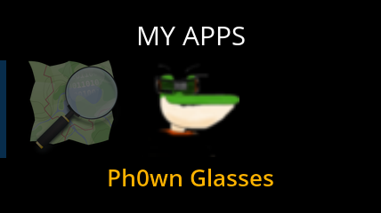
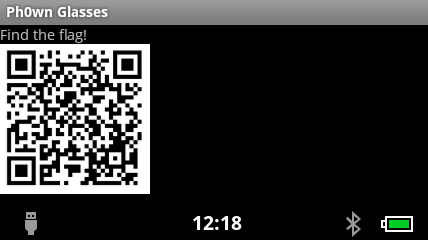
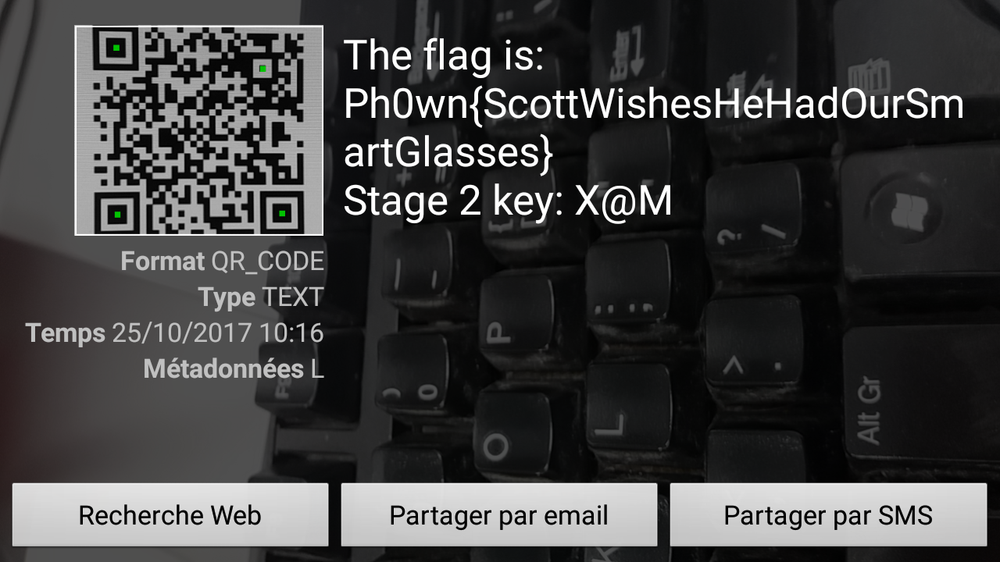
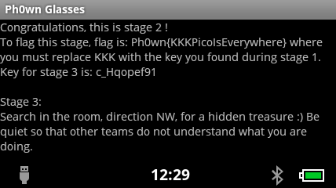
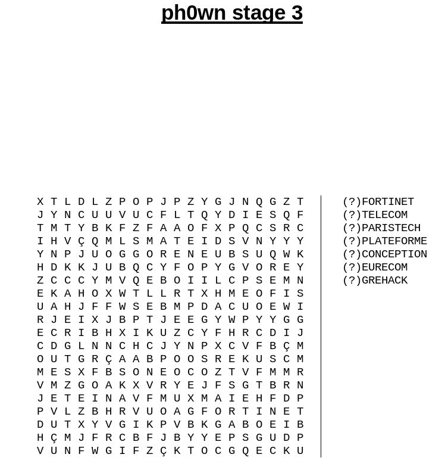
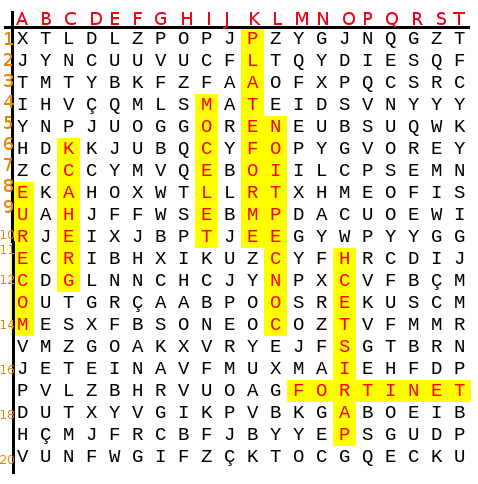

# Solution

This is a ReconJet (smart glasses) based challenge.
It consists of two parts.

## Stage 1: solution

First, participants should try the glasses on and notice that there is an app named `Ph0wn glasses` in My apps.




When they launch the app, they will see a QR code. They need to read that QR code. It is not difficult in theory, but what's going to be slightly difficult is to retrieve image.

There are three solutions I foresee:

1. People take a screenshot using adb
2. People get the app and retrieve the image from the app
3. People take a picture of what they see in the glasses somehow (difficult!)

### Solution 1: Screenshot on the glasses

When the QR code is displayed, connect to the glasses via adb

Connect to the glasses:

```bash
$ adb devices
List of devices attached 
291052171	device

$ adb shell screencap -p /sdcard/stage1.png
$ adb pull /sdcard/stage1.png .
```

### Solution 2: Retrieving the application

```bash
$ adb shell
$ pm list packages -f
...
package:/data/app/ph0wn.reconjet-1.apk=ph0wn.reconjet
```

Retrieve the application:
```bash
$ adb pull /data/app/ph0wn.reconjet-1.apk .
469 KB/s (47185 bytes in 0.098s)
```

Unzip the application and find the PNG in the assets:

```bash
$ unzip ph0wn.reconjet-1.apk -d ph0wn
Archive:  ph0wn.reconjet-1.apk
  inflating: ph0wn/AndroidManifest.xml  
 extracting: ph0wn/assets/qrcode.png  
...
```

### Scanning the QR code

Scan this QR code, and you will see the message `The flag is: Ph0wn{ScottWishesHeHadOurSmartGlasses} Stage 2 key: X@M`



So, we can flag stage 1 with `Ph0wn{ScottWishesHeHadOurSmartGlasses}`

## Stage 2

There is more to find in the Android application.
If participants haven't done so yet (see solution 2 retrieving the app), they will now need to do so.

Then, a basic run of `apktool` reveals there is a hidden activity:

```bash
$ java -jar ~/softs/apktool_2.3.0.jar d ph0wn.reconjet-1.apk 
I: Using Apktool 2.3.0 on ph0wn.reconjet-1.apk
I: Loading resource table...
I: Decoding AndroidManifest.xml with resources...
S: WARNING: Could not write to (/home/axelle/.local/share/apktool/framework), using /tmp instead...
S: Please be aware this is a volatile directory and frameworks could go missing, please utilize --frame-path if the default storage directory is unavailable
I: Loading resource table from file: /tmp/1.apk
I: Regular manifest package...
I: Decoding file-resources...
I: Decoding values */* XMLs...
I: Baksmaling classes.dex...
I: Copying assets and libs...
I: Copying unknown files...
I: Copying original files...
```

Show AndroidManifest.xml. There is a hidden activity, called `HiddenActivity`.

```xml
<?xml version="1.0" encoding="utf-8" standalone="no"?><manifest xmlns:android="http://schemas.android.com/apk/res/android" package="ph0wn.reconjet" platformBuildVersionCode="16" platformBuildVersionName="4.1.2-1425332">
    <application android:debuggable="true" android:icon="@drawable/ic_launcher" android:label="@string/app_name">
        <activity android:label="@string/app_name" android:name="MainActivity">
            <intent-filter>
                <action android:name="android.intent.action.MAIN"/>
                <category android:name="android.intent.category.LAUNCHER"/>
            </intent-filter>
        </activity>
        <activity android:exported="true" android:name="HiddenActivity"/>
    </application>
</manifest>
```

### Viewing and scrolling the activity

We can display it on the smart glasses with the command:

```
$ adb shell am start -n ph0wn.reconjet/.HiddenActivity
Starting: Intent { cmp=ph0wn.reconjet/.HiddenActivity }
```




The screen is scrollable.
The text says the flag's format is `Ph0wn{KKKPicoIsEverywhere}` where KKK is the key we found at stage 1: `X@M`
So, the flag is: `Ph0wn{X@MPicoIsEverywhere}`.

### Alternative solution: Disassembling the application

For example, use unzip, baksmali and then [procyon decompiler](https://bitbucket.org/mstrobel/procyon/wiki/Java%20Decompiler) to get Java sources of the hidden activity.

```
unzip ph0wn.reconjet-1.apk -d
~/softs/dex2jar-0.0.9.16-SNAPSHOT/dex2jar.sh classes.dex
java -jar ~/softs/procyon-decompiler-0.5.30.jar --output-directory procyon classes_dex2jar.jar
```

We get this:

```java
// 
// Decompiled by Procyon v0.5.30
// 

package ph0wn.reconjet;

import android.text.method.MovementMethod;
import android.text.method.ScrollingMovementMethod;
import android.os.Bundle;
import android.widget.TextView;
import android.app.Activity;

public class HiddenActivity extends Activity
{
    public TextView txtView;
    
    public HiddenActivity() {
        this.txtView = null;
    }
    
    public void onCreate(final Bundle bundle) {
        super.onCreate(bundle);
        this.setContentView(2130903040);
        (this.txtView = (TextView)this.findViewById(2131034112)).setMovementMethod((MovementMethod)new ScrollingMovementMethod());
        final int[] array = { 67, 111, 110, 103... };
        final StringBuffer sb = new StringBuffer();
        for (int i = 0; i < array.length; ++i) {
            sb.append((char)array[i]);
        }
        this.txtView.setText((CharSequence)sb.toString());
    }
}
```

Let's modify it a bit to run it standalone.

```java
// 
// Decompiled by Procyon v0.5.30
// 

public class StandaloneHiddenActivity
{
    public static void main(String args[]) {
        final int[] array = { 67, 111, 110, 103, .. }; // fill in rest here
        final StringBuffer sb = new StringBuffer();
        for (int i = 0; i < array.length; ++i) {
            sb.append((char)array[i]);
        }
        System.out.println(sb.toString());
    }
}
```

Then compile and run:
```bash
$ javac StandaloneHiddenActivity.java
$ java StandaloneHiddenActivity
Congratulations, this is stage 2 !
To flag this stage, flag is: Ph0wn{KKKPicoIsEverywhere} where you must replace KKK with the key you found during stage 1.
Key for stage 3 is: c_Hqopef91

Stage 3:
Search in the room, direction NW, for a hidden treasure :) Be quiet so that other teams do not understand what you are doing.
To flag this stage, flag format is: Ph0wn{KKKKKKKKKKAAABBBCCCDDDEEEFFFGGG}.
Where KKKKKKKKKK is the key you found during stage 1.
- AAA is the coordinates of the first lettter of word FORTINET is the treasure. First letter is column (A, B, C...). Second letter is row (1,2,3...). Third letter is word direction: H for horizontal, V for vertical. So, if FORTINET starts at row A, column 3, horizontally, we will have A3H.
- BBB is the coordinates for TELECOM,
- CCC for PARISTECH,
- DDD for PLATEFORME,
- EEE for CONCEPTION,
- FFF for EURECOM
- and GGG for GREHACK.
Good luck.
```

## Stage 3

Use ReconJet's compass (or any other compass you might have) to head NW.
You will find mixed words such as:



We need to search for all words.



Now, let's construct the flag. Ph0wn{KKKKKKKKKKAAABBBCCCDDDEEEFFFGGG}.

- KKKKKKKKKK: c_Hqopef91
- AAA (FORTINET): M17H
- BBB (TELECOM): I10V
- CCC (PARISTECH): O19V
- DDD (PLATEFORME): K1V
- EEE (CONCEPTION): L14V
- FFF (EURECOM): A8V
- GGG (GREHACK): C12V

So the flag is: `Ph0wn{c_Hqopef91M17HI10VO19VK1VL14VA8VC12V}`.

Errata: if row > 10, you will have 4 letters to encode the coordinates. For example G17V means column G, row 17 and vertical.
