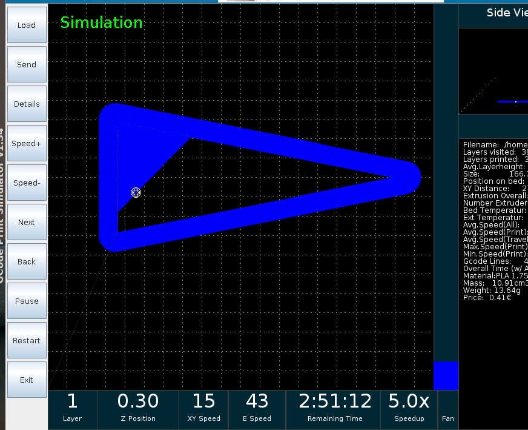
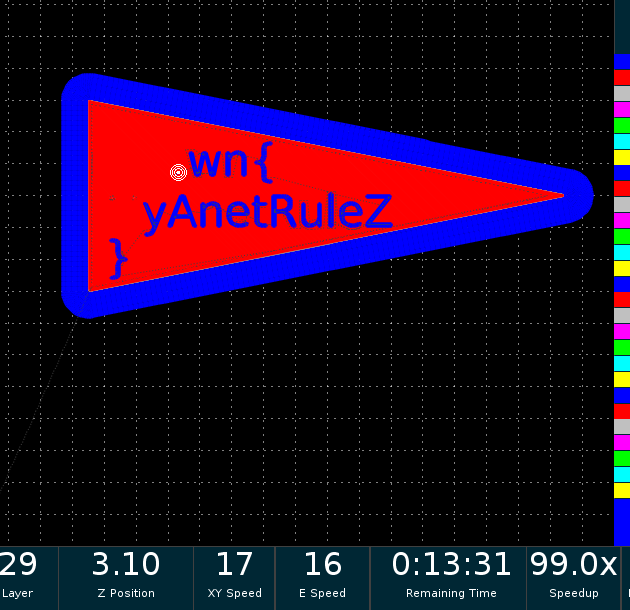
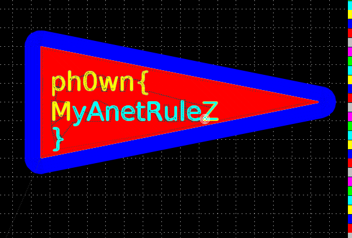

# Solution

Download [GCode simulator](https://www.thingiverse.com/thing:44286). Load the Gcode file, sit back and wait for the object to appear...

It is going to be very long to print (3 hours) if you don't speed up the print. There is a "Speed +" button. You can speed up to 99 times.

# Other tools

Also said to work with https://ncviewer.com/
