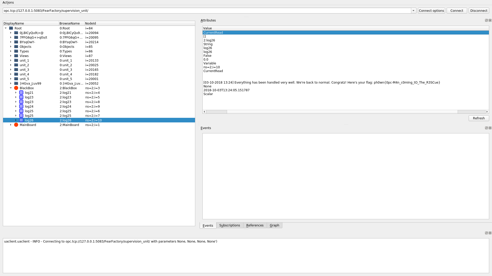

# Save the Factory:
## First Method:
* *Testing out the provided script* `client_example.py`: 

We use IPython to interact with the server easily. On connection, we receive an alert from the Main Board, as we're already subscribed to it:


In case we run the script too late, we won't receive the notification because the server would have published the event before we subscribed to the MainBoard (corresponding node), but luckily everything is logged in the black box.
Let's check the logs.


* *First problem:*

It says that the temperature is too high and that the cooling system is not responding. We start by exploring the namespace starting from the root.

We see that the unit\_3 is there, we explore that sub-tree. One of the children nodes has an interesting name, that must be room/department facing problems.


We try to see the state of the cooling system. It is OFF  while the temperature is above critical value, the hacker  has clearly messed with it. Normally, we shouldn't be able to do this, but let's try toggling it ON manually.


For some reason we have write permission on that node. It worked.


* *Second problem:*

Now, a second problem arose, it's the pressure regulaor of `unit_1` under `Stash` that is not responding. We have less time to solve this this time.
We adopt the same strategy; inspecting node names, their children and their values.

Let's try to write into that node and control the regulator remotely.


It has worked indeed. Now it's time to check the logs as we were told in the challenge description.


We retreive te first flag.
Flag: `ph0wn{0pc-M4n\_c0m1ing\_t0\_The\_R3SCue}`


## Second Method:
We do the same thing, follow the same logic, but we solve it on an OPC-UA client GUI instead of writing python commands. we copy the server's URL a click on connect.
We start by susbscribing to the MainBoard: Right click, then click on the `Subscribe to events` option. To display them, we select `Events` in the right box at the middle (Next to Subscriptions, Regerences). 

Then we proceed in the same way we have done in the first method above.


We receive a warning, we go to the corresponding node and change its value to 16. As we can see on the node's attributes, its access level is: CurrentRead, CurrentWrite which means it is writable.


After a few seconds, we receive a second warning from the MainBoard.


We do the same thing for the node of cooling system and we turn it off.


Afterwards, we check the logs. And we retrieve our Flag.



# Track the Hacker:
The hacker has apparently hid some information there. But where could he possibly have put it?

Under the root node, we see some weirdly named nodes (`7PFG6qG+\>qtlx/t`, `BYsqOwY-`, `0J,BICyQu9\>@`, `}HGva\_J;uv99`). It looks fishy, let's see what's inside them.


Let's look at the node names, and their values.


Many numbered nodes with values that look like hexadecimal, also it doesn't look like any node name (number) gets repeated in the four folders/subtrees.

Let's order these node's values according to their names and see what we'll get, could it be a file?:

We will use the following lines of code:
```Python
containers = []
for name in ["7PFG6qG+>qtlx/t", "BYsqOwY-", "0J,BICyQu9\>@", "}HGva_J;uv99"]:
    containers.append(root.get_child(name))

sortedNodes = []
for cont in containers:
    sortedNodes += cont.get_children()
sortedNodes.sort(key=lambda x: int(x.get_browse_name().Name[4:]))

sortedFragments = [frgNode.get_value() for frgNode in sortedNodes]

xFile = open("exfiltratedFile", "a+")
for word in sortedFragments:
    xFile.write(struct.pack(">L", int(word, 16)))
xFile.close()
```

Looks like a zip file:


Flag: `ph0wn{0pc-U4_1s_L1t!}`

