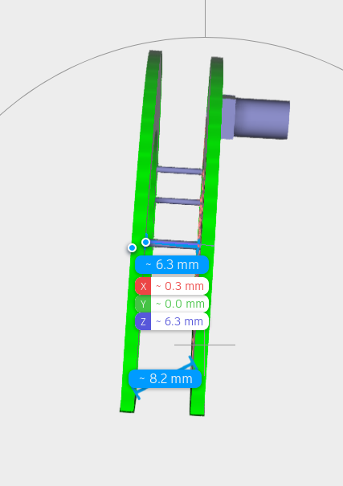

# AntMaker (partial solution)

This challenge was solved by 16 teams

## Description

To receive the signal, you have to fabricate a RHCP antenna at 868MHz.

Use the 3D_ant file as a model to mount the antenna. Collect your PCBs and use some tools and a soldering iron.

Once your are ready, register on list to test if your prototype can receive the signal. 3 teams will make the test each 30mn.

The Master of the Chamber, Fabien, will guide you to the anechoic room.


## Partial solution


Open 3D_ant and copy paste the beginning in a search engine:

```
ISO-10303-21;
HEADER;
FILE_DESCRIPTION(('STEP AP214'),'1');
```

You find it is a STEP file, with usual extension `.stp`.

Add the extension, and open it online on `https://viewer.autodesk.com`

We can measure that the distance between the 2 plates is 6.1mm.
Another measure shows 6.3mm.



-- @cryptax
