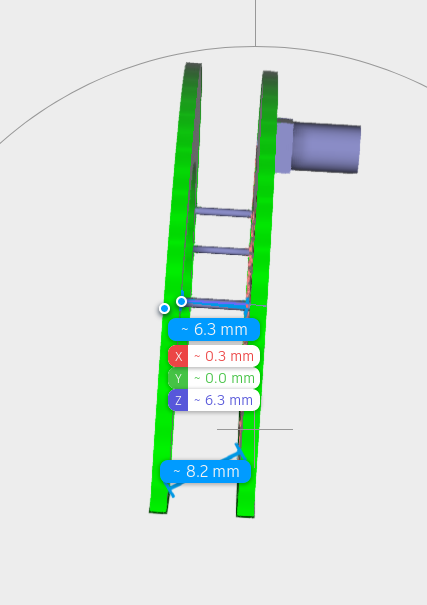

Open 3D_ant and copy paste the beginning in a search engine:

```
ISO-10303-21;
HEADER;
FILE_DESCRIPTION(('STEP AP214'),'1');
```

You find it is a STEP file, with usual extension `.stp`.

Add the extension, and open it online on `https://viewer.autodesk.com`

We can measure that the distance between the 2 plates is 6.1mm.
Another measure shows 6.3mm.


