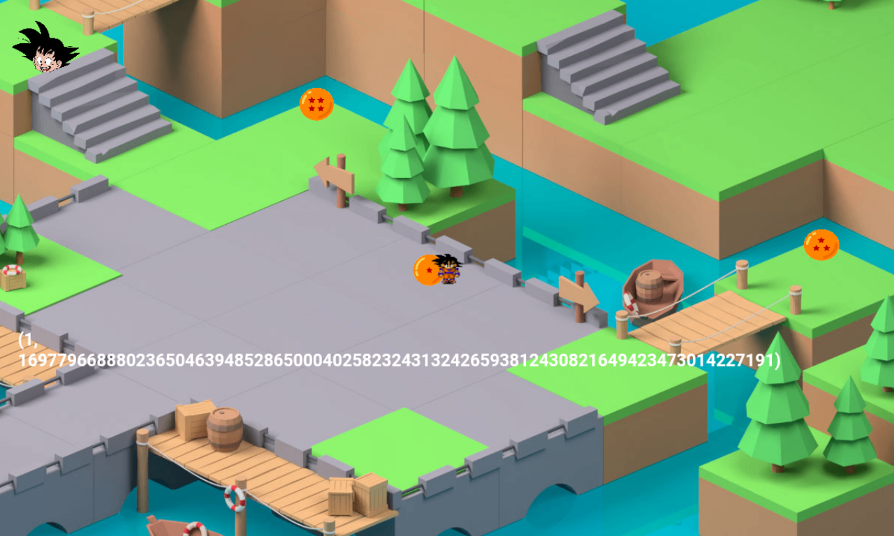

# Shamir Quest

This challenge was solved 10 times.

Each time we hit a dragon ball, we see a string.



Those strings are stored in `assets/www/data.js`.


(7, 86280222218758143060577039723423036819702949921689517334729056400620503262863)
(6, 64853486060730513615551322784573665580194031012367687584714706161521361565423)
(5, 33814200739788654257795508969553514400370233867365839951719667470054751133890)
(4, 31566639759828849253104354287777292258537243784043419234402145787553977170879)
(3, 54008062481679211386368408327065859783198766778147014402616411673289639152699)
(2, 84515091397950443810021067510975505753043639566495880186943378404018469002849)
(1, 16977966888023650463948528650004025823243132426593812430821649423473014227191)

Then, we know this is Shamir secret sharing.
So we get an implementation from [here](https://github.com/blockstack/secret-sharing) and install it in python 2.7 virtual environment. Note this implementation does not work in python 3.

Finally, we use the implementation to recover the secret:

```python
from secretsharing import secret_int_to_points, points_to_secret_int

shares = [ (1, 16977966888023650463948528650004025823243132426593812430821649423473014227191), (2, 84515091397950443810021067510975505753043639566495880186943378404018469002849), (3, 54008062481679211386368408327065859783198766778147014402616411673289639152699), (4, 31566639759828849253104354287777292258537243784043419234402145787553977170879), (5, 33814200739788654257795508969553514400370233867365839951719667470054751133890), (6, 64853486060730513615551322784573665580194031012367687584714706161521361565423), (7, 86280222218758143060577039723423036819702949921689517334729056400620503262863) ]

secret = points_to_secret_int(shares)
print hex(secret)
print '706830776e7b5368346d31725f346e645f47306b755f503472747974316d657d'.decode('hex')
```

The solution is `ph0wn{Sh4m1r_4nd_G0ku_P4rtyt1me}`

-- @cryptax
