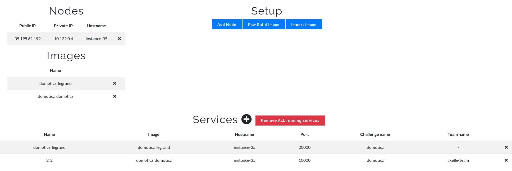

# Challenge domoticz

## Setup

We have:

1. A **customized Domoticz container per team**. This container is separate for each team, so that what they modify on the Domoticz server does not affect other teams. Otherwise, they could easily remove the Legrand EcoCompteur...  Each Docker container will be running on our challenge server, with a different port, ports being assigned to a given team. The target port for this image is 8080, but each container will publish a different port.

2. A **(fake) Legrand EcoCompteur container**. This one is global (shared by all teams) and answers on port 20000. It will be running on our challenge server.

## Automated deployment using Roman's Docker CTFd plugin

1. Build the images on the swarm manager: `docker-compose up -d --build`. This will create 2 images, `domoticz_legrand:latest` and `domoticz_domoticz:latest`

2. Import the images in the Docker plugin with names ``domoticz_legrand` and `domoticz_domoticz`

3. Create a service for the Legrand EcoCompteur

- name: `domoticz_legrand`
- image name: `domoticz_legrand`
- hostname: put a known hostname of the Docker plugin e.g. `instance-35`
- published port: `20000`
- target port: `20000`
- challenge name: `domoticz`

4. Create the Domotics challenge. It is a challenge of type `docker`

- Challenge Type: docker
- Name: `domoticz`
- Category: `Misc`
- In the description, fix LEGRAND-IP-ADDRESS and PORT.
- Value: 300
- Image name: `domoticz_domoticz`
- Access: `web`
- Credentials: No
- Hostname: put a known hostname of the Docker plugin e.g. `instance-35`
- Target port: `8080`

## Files

- legrand.py must be kept secret as it contains the flag ;-)
- Dockerfile.domoticz: to create the custom Domoticz server
- Dockerfile.legrand: to create the fake Legrand EcoCompteur
- docker-compose.yml
- FLAG: to keep secret ;-)
- Ph0wn_Domoticz.db: database save of our custom Domoticz server

## Troubleshooting

- Docker compose option. `docker-compose up -d --build domoticz` (remove --build if the container is already built)
- Dockerfile option. Build the image: `docker build -t ph0wn-domoticz -f Dockerfile.domoticz .` and then run the container: `docker run -d -p xxxx:8080 --name domoticz-teamX ph0wn-domoticz`
- Docker compose option. `docker-compose up -d --build legrand` (remove --build if the container is already built)
- Dockerfile option. Build the image: `docker build -t ph0wn-legrand -f Dockerfile.legrand .` and then run the container: `docker run -d -p 20000:20000 --name ph0wn-legrand ph0wn-legrand`
- `sudo ./domoticz.sh stop`
- Floor plan: `./var/lib/domoticz/www/images/floorplans/example.jpg`
- [Legrand Doc](http://www.admin.legrandoc.com/files/documents/LE07197AD.pdf)
- http://www.legrandoc.com/412000
- [Catalogue Legrand](https://www.legrand.fr/pro/catalogue/31736-ecocompteurs-ip/ecocompteur-modulaire-ip-pour-mesure-consommation-sur-6-postes-110v-a-230v-6-modules)
