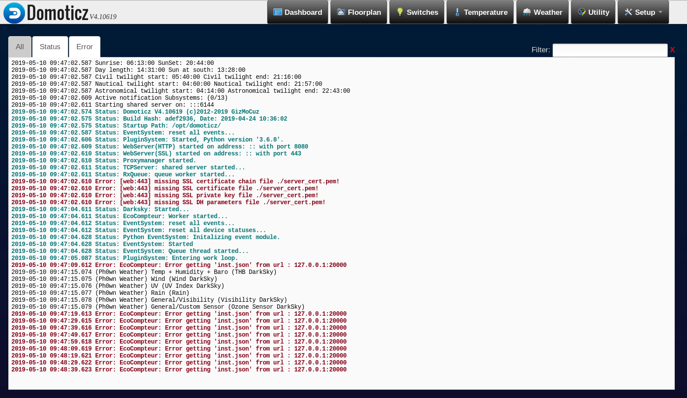
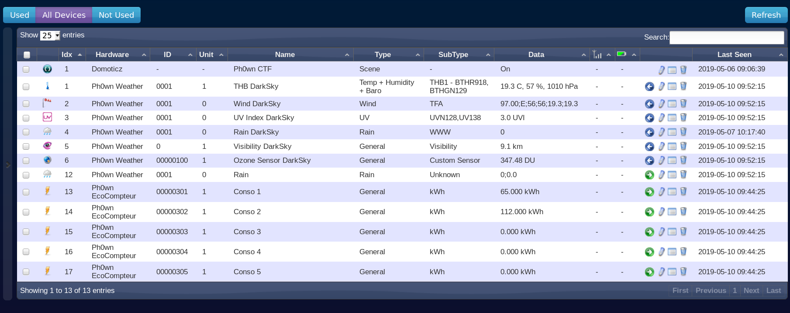
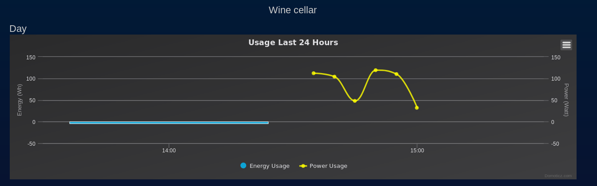
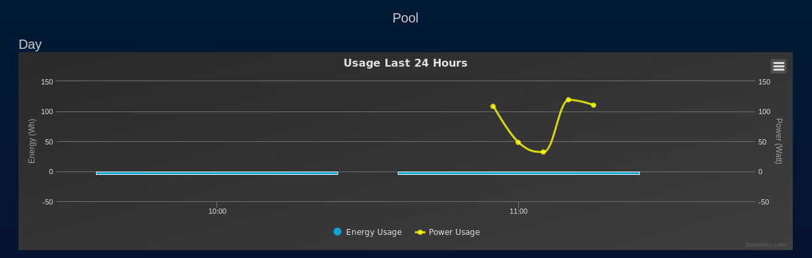

# Domoticz

## Spot the error in the logs

We go to the Domoticz server. In *Setup > Log*, we see the following error log for EcoCompteur:

```
2019-05-10 09:47:19.613 Error: EcoCompteur: Error getting 'inst.json' from url : 127.0.0.1:20000
```



So, apparently, Domoticz is looking for a file named `inst.json` on http://127.0.0.1:20000. This is not the correct IP address for the Legrand EcoCompteur, so it is quite normal Domoticz cannot reach it.

## Configure EcoCompteur

In *Setup > Hardware*, a bug in the current version of Domoticz prevents to Update Ph0wn EcoCompteur with the appropriate IP address. So, we simply delete it, and create a new one:

- Type: EcoCompteur Legrand with LAN interface
- Data Timeout: Disabled
- Remote Address: XXXX:20000 (note there is a bug in Domoticz currently and the port must be specified here, but this will be fixed in newer versions)
- Port: 20000
- Enabled: Yes

Then, in *Setup > Devices*, you will notice 5 new devices for the EcoCompteur.



We rename "Conso 1" to "Wine Cellar" (click on the small pen) and "Conso 2" to "Pool". Actually, this step is fully optional.

Click on the green arrow for *Wine Cellar* and *Pool*. This adds the device to the *Utility* tab.

In the Utility tab, you can view the current power consumption for the cellar and the pool. Have a look at the logs.

Note that the error log should no longer be appearing.

## Graphs

Be patient and wait ~20 minutes for data to appear on the graph for our wine cellar and pool: **Utility > xxx > Log**:

- Wine cellar shows values: 112, 104, 48, 119, 110, 32...
- Pool values show other values: 102, 48, ...




We notice that all values are within ASCII range.

In particular, the values of the wine cellar convert to 'p', 'h', '0', 'w', 'n', which can't be a coincidence ;-)

## EcoCompteur Legrand

We know we have an "EcoCompteur Legrand with LAN interface". This hardware is supported by Domoticz with [this source code](https://github.com/domoticz/domoticz/blob/development/hardware/EcoCompteur.cpp).

Interesting, in `GetScript()` we see that there is an instantaneous wattage report (`inst.json` - the one we noticed earlier in the logs) and a so-called hourly report (`log2.csv`):

```c++
// Download instantaneous wattage
	std::stringstream szURL;
	szURL << m_url << ":" << m_port << "/inst.json";
	if (!HTTPClient::GET(szURL.str(), sInst))
	{
		_log.Log(LOG_ERROR, "EcoCompteur: Error getting 'inst.json' from url : " + m_url);
		return;
	}

	// Download hourly report
	std::stringstream szLogURL;
	szLogURL << m_url << ":" << m_port << "/log2.csv";
	if (!HTTPClient::GET(szLogURL.str(), sLog2))
	{
		_log.Log(LOG_ERROR, "EcoCompteur: Error getting 'log2.csv' from url : " + m_url);
		return;
}
```

The format for those 2 files is included at the end of the source code:

```c++
/* log2.csv
0	jour
1	mois
2	annee
3	heure
4	minute
5	energie_tele_info
6	prix_tele_info
7	energie_circuit1
8	prix_circuit1
...
*/

/* inst.json
"data1":0.000000,		Puissance circuit 1
"data2":1436.000000,	Puissance circuit 2
"data3":1216.000000,	Puissance circuit 3
...
*/
```

Let's try and retrieve those files from our Legrand EcoCompteur:

`$ curl http://10.210.17.66:20000/inst.json`:

```json
{"data1" : 65, "data2" : 102, "data3": 30.0, "data4": 40.0, "data5": 50.0, "data6": 60.0, "data6m3":0.0, "data7": 70.0, "data7m3": 0.0, "heure": 11, "minute" : 20, "Date_Time" : 1575372016.378617}
```

We see the consumption for data1 (wine cellar) and data2 (pool).

Let's inspect `log2.csv`: `$ curl http://10.210.17.66:20000/log2.csv`:

```
12;2019;13;33;0;0;112;14.4144;112;14.4144;0;0;0;0;0;0;0;0;0;0;0;0;0;0;0;0;0;0;0;0;0;0;0;0;0
3;12;2019;13;34;0;0;112;14.4144;104;13.3848;0;0;0;0;0;0;0;0;0;0;0;0;0;0;0;0;0;0;0;0;0;0;0;0;0
3;12;2019;13;34;0;0;112;14.4144;48;6.1776;0;0;0;0;0;0;0;0;0;0;0;0;0;0;0;0;0;0;0;0;0;0;0;0;0
3;12;2019;13;34;0;0;112;14.4144;119;15.3153;0;0;0;0;0;0;0;0;0;0;0;0;0;0;0;0;0;0;0;0;0;0;0;0;0
3;12;2019;13;34;0;0;112;14.4144;110;14.157000000000002;0;0;0;0;0;0;0;0;0;0;0;0;0;0;0;0;0;0;0;0;0;0;0;0;0
3;12;2019;13;34;0;0;112;14.4144;32;4.1184;0;0;0;0;0;0;0;0;0;0;0;0;0;0;0;0;0;0;0;0;0;0;0;0;0
3;12;2019;13;34;0;0;112;14.4144;102;13.127400000000002;0;0;0;0;0;0;0;0;0;0;0;0;0;0;0;0;0;0;0;0;0;0;0;0;0
3;12;2019;13;35;0;0;112;14.4144;108;13.899600000000001;0;0;0;0;0;0;0;0;0;0;0;0;0;0;0;0;0;0;0;0;0;0;0;0;0
3;12;2019;13;35;0;0;104;13.3848;97;12.4839;0;0;0;0;0;0;0;0;0;0;0;0;0;0;0;0;0;0;0;0;0;0;0;0;0
```

Data 1 is the 8th field, and Data 2 is the 10th field.
We confirm that both data 1 and data2 are within ASCII ranges.

Let's try and print what they say:

`curl --silent http://10.210.17.66:20000/log2.csv |  cut -d\; -f 8 |  awk '{printf("%c",$1)}'`

We get:

```
pppppppphhhhhhhhhhhhhhhhhhhhhhhhhhhhhh000000000000000000000000000000wwwwwwwwwwwwwwwwwwwwwwwwwwwwwwnnnnnnnnnnnnnnnnnnnnnnnnnnnnnn                              ffffffffffffffffffffffffffffffllllllllllll
```

We see there are many repeated characters.

Let's try for data2: `curl --silent http://10.210.17.66:20000/log2.csv |  cut -d\; -f 10 |  awk '{printf("%c",$1)}'`

```
ph0wn flag at http://10.210.17.66:20000/n1ceflag ph0wn flag at http://10.210.17.66:20000/n1ceflag ph0wn flag at http://10.210.17.66:20000/n1ceflag ph0wn flag at http://10.210.17.66:20000/n1ceflag ph0wn fla
```

The message says *"ph0wn flag at http://10.210.17.66:20000/n1ceflag"*. Let's go there `http://10.210.17.66:20000/n1ceflag`:

```html
<html><body>flag1: ph0wn{h0w_about_using_a_candle_instead}</body></html>
```
