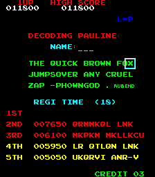
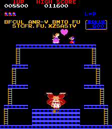

# Message from Pauline

This is a Donkey Kong ROM for MAME, a hacked version of US Set 1.
To run it on mame, specifiy ROM path: `mame -rompath ROMPATH dkong.zip`

In MAME,

- F5 to add coins
- F1 to play
- F12 to take a screenshot. The screenshot then goes in the `~/.mame` subpath
- Launch with option `-debug` to use the debugger in MAME (though I did not use this to solve)

## Important Links

- [Memory mapping for Donkey Kong in MAME](https://github.com/mamedev/mame/blob/master/src/mame/drivers/dkong.cpp)
- [Donkey Kong disassembled, with comments](https://github.com/furrykef/dkdasm/blob/master/dkong.asm). This is very helpful.

## Message from Pauline 1

Solved by 7 teams

Stage 1 can be solved by playing the game and (nearly) no coding.

As soon as you manage to do a high score (which is quite easy, because first few scores are very low), the game asks for your name and displays the high score table.

We quickly notice that high scores are "encrypted": `QRMMKQL LNK MKPKM MKLLKCU LR QTLQN LNK UKQRVI ANR-V`.
The coding table is given by a message `THE QUI CK  BROWN FOX  JUMP  SOLVER ANY CRUEL ZAG --PH0WN GOD`.
Each time you select a letter for your name, the encoded letter is displayed. Consequently, we have the decoding table for the message.

Rather than actually decoding each letter to get the corresponding decoded character, I used an [online substitution decrypt service](https://quipqiup.com/). It quickly yields the answer. To get all symbols correct is perhaps slightly more difficult without the substitution table, but we don't care at this stage.

`COLLECT THE LEVEL LETTERS TO CATCH THE SECOND PH0WN FLAGY. PAULINE`

So, this is a hint for stage 2.

For stage 1, we have to win the second table of level 1. As I am a Donkey Kong n00b, this took me at least 50 minutes, but I am certain many experienced players will do this quickly. At the end of the second table, we get another message: `BFCUL ANR-V BMTO FU STCFR.FU.XZSASTV`

We can get most characters from [quipqiup](https://quipqiup.com/), it is just useful to get the decoding of `.` which is `-`. So, the decoded message is `FIRST PH0WN FLAG IS MARIO-IS-JUMPMAN`.

-- @cryptax
