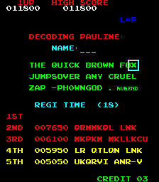
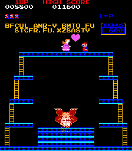
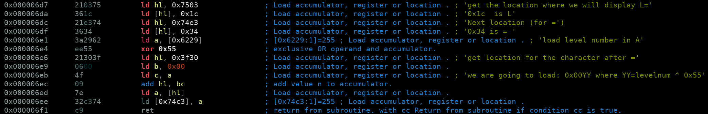

# Message from Pauline

This is a Donkey Kong ROM for MAME, a hacked version of US Set 1.
To run it on mame, specifiy ROM path: `mame -rompath ROMPATH dkong.zip`

In MAME,

- F5 to add coins
- F1 to play
- F12 to take a screenshot. The screenshot then goes in the `~/.mame` subpath
- Launch with option `-debug` to use the debugger in MAME (though I did not use this to solve)

## Important Links

- [Memory mapping for Donkey Kong in MAME](https://github.com/mamedev/mame/blob/master/src/mame/drivers/dkong.cpp)
- [Donkey Kong disassembled, with comments](https://github.com/furrykef/dkdasm/blob/master/dkong.asm). This is very helpful.

## Message from Pauline 1

Solved by 7 teams

Stage 1 can be solved by playing the game and (nearly) no coding.

As soon as you manage to do a high score (which is quite easy, because first few scores are very low), the game asks for your name and displays the high score table.



We quickly notice that high scores are "encrypted": `QRMMKQL LNK MKPKM MKLLKCU LR QTLQN LNK UKQRVI ANR-V`.
The coding table is given by a message `THE QUI CK  BROWN FOX  JUMP  SOLVER ANY CRUEL ZAG --PH0WN GOD`.
Each time you select a letter for your name, the encoded letter is displayed. Consequently, we have the decoding table for the message.

Rather than actually decoding each letter to get the corresponding decoded character, I used an [online substitution decrypt service](https://quipqiup.com/). It quickly yields the answer. To get all symbols correct is perhaps slightly more difficult without the substitution table, but we don't care at this stage.

`COLLECT THE LEVEL LETTERS TO CATCH THE SECOND PH0WN FLAGY. PAULINE`

So, this is a hint for stage 2.

For stage 1, we have to win the second table of level 1. As I am a Donkey Kong n00b, this took me at least 50 minutes, but I am certain many experienced players will do this quickly. At the end of the second table, we get another message: `BFCUL ANR-V BMTO FU STCFR.FU.XZSASTV`



We can get most characters from [quipqiup](https://quipqiup.com/), it is just useful to get the decoding of `.` which is `-`. So, the decoded message is `FIRST PH0WN FLAG IS MARIO-IS-JUMPMAN`.

## Message from Pauline 2

*Solved by 0 team*

We retrieve the official US Set 1 Donkey Kong ROM to spot the hacks. The differences are in the following files. 

- c_5at_g.bin
- c_5ct_g.bin
- c_5et_g.bin
- v_3pt.bin
- v_5h_b.bin

With [MAME driver for donkey kong](https://github.com/mamedev/mame/blob/master/src/mame/drivers/dkong.cpp) we see the following mapping:

```
ROM_REGION( 0x10000, "maincpu", 0 )
ROM_LOAD( "c_5et_g.bin",  0x0000, 0x1000, CRC(ba70b88b) SHA1(d76ebecfea1af098d843ee7e578e480cd658ac1a) )
ROM_LOAD( "c_5ct_g.bin",  0x1000, 0x1000, CRC(5ec461ec) SHA1(acb11a8fbdbb3ab46068385fe465f681e3c824bd) )
ROM_LOAD( "c_5at_g.bin",  0x3000, 0x1000, CRC(b9005ac0) SHA1(3fe3599f6fa7c496f782053ddf7bacb453d197c4) )
...
ROM_REGION( 0x1000, "gfx1", 0 )
ROM_LOAD( "v_5h_b.bin",   0x0000, 0x0800, CRC(12c8c95d) SHA1(a57ff5a231c45252a63b354137c920a1379b70a3) )
ROM_LOAD( "v_3pt.bin",    0x0800, 0x0800, CRC(15e9c5e9) SHA1(976eb1e18c74018193a35aa86cff482ebfc5cc4e) )
```

The first 3 files are ROM, with potential z80 code. The last 2 are video ROMs.

The hint in stage 1 tells us to `collect the level letters`. Indeed, at each level, we notice a letter instead of the level number. For example, below, instead of level 1, we have: `L=P`. Quite likely the beginning of `PH0WN`.


We locate in the dkong.asm the part of the code which displays this level number. See lines 2313-2319:

```
06D7  210375    LD      HL,#7503        ; load HL with screen location for "L="
06DA  361C      LD      (HL),#1C        ; draw "L"
06DC  21E374    LD      HL,#74E3        ; next location
06DF  3634      LD      (HL),#34        ; draw "="
06E1  3A2962    LD      A,(#6229)       ; load A with level #
06E4  fe64      CP      #64             ; level < #64 (100 decimal) ?
06E6  3805      JR      c,#06Ed         ; yes, skip next 2 steps
```

This code is around 0x6d7, so it is probably located in `c_5et_g.bin` which is loaded from offset 0x0000.
We have a look at the corresponding assembly code in the hacked version, and find interesting differences:



We are not writing the level number, but writing the character which is at 0x3f30 + level number XOR 0x55.


```
[0x00000f70]> px 60
- offset -   0 1  2 3  4 5  6 7  8 9  A B  C D  E F  0123456789ABCDEF
0x00000f70  1f1e 2024 1813 2319 151e 2b3b 2511 191c  .. $..#...+;%...
0x00000f80  1e27 162c 202b 0018 203c 1115 111c 3417  .'., +.. <....4.
0x00000f90  494b 4547 414d 4920 434f 2e20 4c49 4d2e  IKEGAMI CO. LIM.
0x00000fa0  cda6 3fc3 5f0d 3e02 f706 0221            ..?._.>....!
```

The 0x3000 range is handled by `c_5at_g.bin`. So, we go and have a look at data there, around 0xf30 + level number XOR 0x55 = 0xf84.
At that location, we have 0x20. In Donkey Kong, 0x20 is `P`. This matches the character we see. So, we write a short program to decode the level letters for each level.

We write the message to decode:

```python
# this is the 'encoded' content of the hacked _et.bin at 0xf70
memory = [ 0x1f, 0x1e, 0x20, 0x24, 0x18, 0x13, 0x23, 0x19, 0x15, 0x1e, 0x2b, 0x3b, 0x25, 0x11, 0x19, 0x1c, 0x1e, 0x27, 0x16, 0x2c, 0x20, 0x2b, 0x00, 0x18, 0x20, 0x3c, 0x11, 0x15, 0x11, 0x1c, 0x34, 0x17, 0x49, 0x4b, 0x45, 0x47, 0x41, 0x4d ]
```

We build the Donkey Kong character table

```python
# decode table for Donkey Kong characters
# see https://github.com/furrykef/dkdasm/blob/master/dkong.asm lines 818 - 905
table = []

for i in range(0, 10):
    table.append('%d' % (i))

for i in range(10, 0x10):
    table.append('UNKNOWN')

table.append(' ')

for i in range(ord('A'), ord('Z') +1):
    table.append(chr(i))
...
```

Then, we simply decode each character of the memory:

```python
# decode flag from memory
try: 
    for i in range(1, 32):
        offset=0x30+(i^0x55)-0x70
        print "Level={0} offset=0x{1:02X} memory=0x{2:02X} decoded={3}".format(i, offset, memory[offset], table[memory[offset]])
except IndexError:
    print "Offset=",hex(offset)
    print memory[offset]
```

We get the following message: `PH0WN-FLAG="PEACHISNOTPAULINE"`

## Misc info

### Where is Collect the level letters?

In `c_5at_g.bin`

From above, we know this ROM is loaded in memory at offset 0x3000.
We have several modifications at 0x574-0x57E, 0x589-0x5A0 etc, so those will be at address 0x3574-etc.
See dkong.asm around line 10422: this is not a code area, but data - dummy data in that case.
Our hacked version replaces it by `21 22 1D 1D 1B 21 1C 10 1C 1E 1B`.

Character encoding for Donkey Kong is shown in dkong.asm at lines 820-880.
So, typically, we have 0x21=Q, 0x22=R, 0x1D=M : this is the beginning of Pauline's hint `QRMMKQL LNK...` and we already know it decrypts to `COLLECT THE LEVEL LETTERS` from stage 1.

