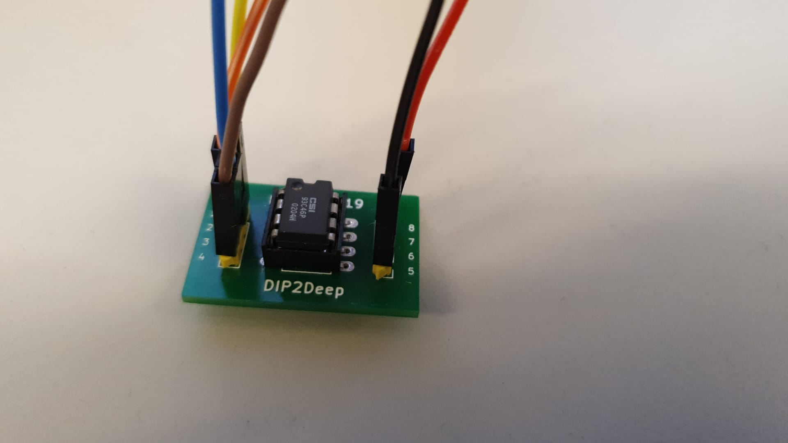
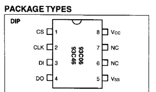
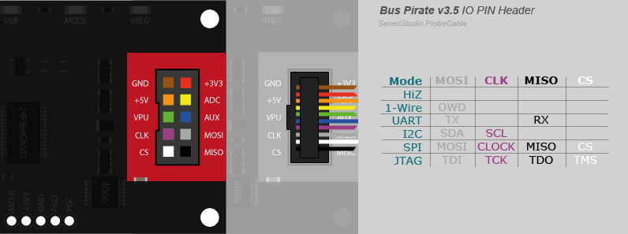

# Solution



With good eyes (or a magnifying glass), we read it is written on the chip ["CSI 93C46P 0204H"](https://www.jotrin.com/product/parts/93C46P). The manufacturer is **CSI**. The package is **DIP-8**.

We find the datasheet for this [EEPROM here](https://www.futurlec.com/Memory/93C46a.shtml) or [here](https://4donline.ihs.com/images/VipMasterIC/IC/MCHP/MCHPS04459/MCHPS04459-1.pdf).

We read it is a **3-Wire 5V** EEPROM, with 64x16-bit memory.
The pinout is the following:



We connect a [Bus Pirate **v3.a**](http://dangerousprototypes.com/docs/Bus_Pirate_v3a). 

```
screen /dev/ttyUSB0 115200
>i
Bus Pirate v3.a
Community Firmware v7.1 - goo.gl/gCzQnW [HiZ 1-WIRE UART I2C SPI 2WIRE 3WIRE PIC DIO] Bootloader v4.4
DEVID:0x0447 REVID:0x3046 (24FJ64GA00 2 B8)
http://dangerousprototypes.com
```

In our case, the bus pirate initially had an old firmware (not v7.1), that did not support the 3-Wire protocol, so we had to update the bus pirate. [How to build the firmware and flash it is explained here](http://dangerousprototypes.com/docs/Compile_the_Bus_Pirate_firmware). 


The pinout is described [here](http://dangerousprototypes.com/docs/images/b/be/Bp-cable-color-hk.png).

.

- 5V of bus pirate to Vcc
- GND of bus pirate to Vss (ground)
- CLK to CLK
- CS to CS
- MOSI of bus pirate to DI
- MISO of bus pirate to DO

Our bus pirate is connected to `/dev/ttyUSB0`. Press enter to get the prompt. Then, choose 3-Wire protocol.

```
screen /dev/ttyUSB0 115200

HiZ>m
1. HiZ
2. 1-WIRE
3. UART
4. I2C
5. SPI
6. 2WIRE
7. 3WIRE
8. PIC
9. DIO
x. exit(without change)

(1)>7
Set speed:
 1. ~5KHz
 2. ~50KHz
 3. ~100KHz
 4. ~400KHz
(1)>2
```

For CS, use the default option:

```
CS:
 1. CS
 2. /CS *default
(2)>
```

For the output type, you actually need to use the **Normal 3.3V** although it is a 5V chip.

```
Select output type:
 1. Open drain (H=Hi-Z, L=GND)
 2. Normal (H=3.3V, L=GND)
(1)>2
Clutch disengaged!!!
```

It is now time to send commands to the EEPROM.
The datasheet details the instruction set for the EEPROM. We read that to perform a READ, we must:

1. Activate CS
2. Send the start bit: 1
3. The opcode for READ is: 10
4. We will attempt to read at address 000000 (6 bits)
5. Data out should answer 16 bits


With Bus Pirate, the [commands for 3-Wire are detailed here](http://dangerousprototypes.com/docs/Raw_3-wire).

We power the EEPROM:

```
3WIRE>W
POWER SUPPLIES ON
Clutch engaged!!!
```

Then, we basically have 9 bits to send: `1 10 000 000 `. This will be 0x01 0x80.

```
3WIRE>[ 0x01 0x80 r:32 ]
CS ENABLED
WRITE: 0x01 
WRITE: 0x80 
READ: 0x70 0x68 0x30 0x77 0x6E 0x7B 0x4D 0x40 0x73 0x74 0x33 0x72 0x30 0x66 0x33 0x77 0x69 0x72 0x65 0x4D 0x65 0x6D 0x30 0x72 0x79 0x21 0xFF 0xFF 0xFF 0xFF 0xFF 0xFF 
/CS DISABLED
```

That looks like ASCII!

```python
a = [0x70, 0x68, 0x30, 0x77, 0x6E, 0x7B, 0x4D, 0x40, 0x73, 0x74, 0x33, 0x72, 0x30, 0x66, 0x33, 0x77, 0x69, 0x72, 0x65, 0x4D, 0x65, 0x6D, 0x30, 0x72, 0x79, 0x21 ]
[ chr(i) for i in a ]
```

Outputs: `['p', 'h', '0', 'w', 'n', '{', 'M', '@', 's', 't', '3', 'r', '0', 'f', '3', 'w', 'i', 'r', 'e', 'M', 'e', 'm', '0', 'r', 'y', '!']`

