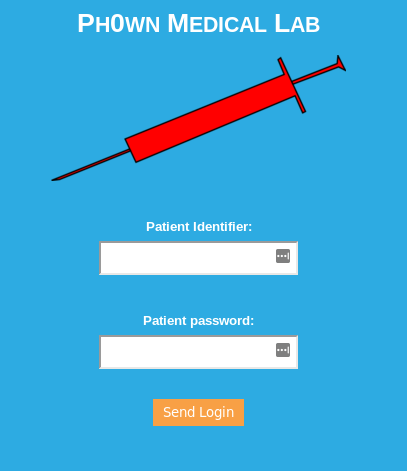

# Compromised sensor

This challenge was solved by *20 teams*.

See [another write-up here](https://swisskyrepo.github.io/Ph0wnCTF/index.html)

1. Use a smartphone which supports NFC ISO 15693
2. Install a NFC app such as **NXP Tag Info**
3. Perform a full scan of the sensor with the app
4. You get log in creds for another server


We go to `http://10.210.17.66:21345`



We enter the credentials: `pico` and `19990401`. This tells us to download lab results.
When we open it, we spot the word polyglot with mention to Ange Albertini's work.

See: https://twitter.com/neuracr/status/1205675295052902401


A polyglot is a file valid for several formats. The lab results are a PDF file, but it turns out to be also a valid ZIP file:

```
$ unzip lab-results.pdf
Archive:  lab-results.pdf
  inflating: thezip/blah             
  inflating: thezip/FLAG
```

We read the flag from `thezip/FLAG` file.

