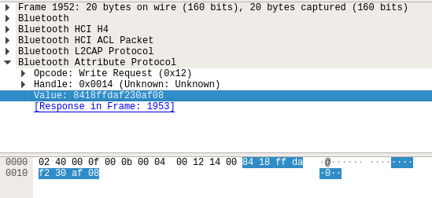
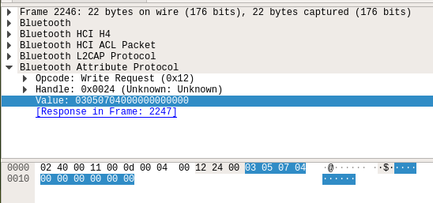

# Solution (spoiler)

- Me Want Coffee 1: 17 solves
- Me Want Coffee 2: 1 solve
- Me Want Exactly 90 mL: 0 solve

## Abstract

We download the Nespresso App for Android and  try to brew a coffee. We see that the application pairs with the coffee machine.

With the smartphone and an app such as nRF Connect, we scan the coffee machine, find its MAC address and connect. We see several services, but only few characteristics are readable.

We reverse the Nespresso app, and find that actually to read/write most characteristics you need to send an authorization code. Without reversing, it is possible to sniff BLE packets on a smartphone during the activity of the Nespresso app, and then inspect those BLE packets.
()
Then, using the Nespresso app again, we locate some characteristics which help configure the size of coffee cups. There are three different cups: ristretto, espresso and lungo. With default sizes. We modify, for example, a Lungo and specify its volume will be 70mL.
Then we brew a coffee and the challenge is solved!

## Details

### Initial BLE investigation

The coffee machine uses Bluetooth Low Energy to communicate. So we scan it and quickly get its MAC address:

```
$ sudo hcitool lescan
D2:A7:4C:76:F3:E0 (unknown)
D2:A7:4C:76:F3:E0 Prodigio_D2A74C76F3E0
```

We enumerate BLE services and characteristics. There are several ways to do that, one of the easiest being to use an Android app such as *nRF Connect*. Otherwise, you can use **gatttool** (officially deprecated but good), **bluetoothctl**, **btgatt-client**, [mirage](http://homepages.laas.fr/rcayre/mirage-documentation/index.html). The first three are included in BlueZ.

Also, the Bluetooth stack has several bugs and we recommend you install the latest version of BlueZ from sources.

For example, we use `gatttool`. We connect to the coffee machine, and list all services (primary), then all characteristics (characteristics):

```
$ gatttool -b d2:a7:4c:76:f3:e0 -I -t random
[d2:a7:4c:76:f3:e0][LE]> connect
Attempting to connect to d2:a7:4c:76:f3:e0
Connection successful
[d2:a7:4c:76:f3:e0][LE]> primary
attr handle: 0x0001, end grp handle: 0x0007 uuid: 00001800-0000-1000-8000-00805f9b34fb
attr handle: 0x0008, end grp handle: 0x000b uuid: 00001801-0000-1000-8000-00805f9b34fb
attr handle: 0x000c, end grp handle: 0x0019 uuid: 06aa1910-f22a-11e3-9daa-0002a5d5c51b
attr handle: 0x001a, end grp handle: 0x0027 uuid: 06aa1920-f22a-11e3-9daa-0002a5d5c51b
attr handle: 0x0028, end grp handle: 0x002d uuid: 06aa1930-f22a-11e3-9daa-0002a5d5c51b
attr handle: 0x002e, end grp handle: 0x0039 uuid: 06aa1940-f22a-11e3-9daa-0002a5d5c51b
attr handle: 0x003a, end grp handle: 0xffff uuid: 06aa1950-f22a-11e3-9daa-0002a5d5c51b
[d2:a7:4c:76:f3:e0][LE]> characteristics
handle: 0x0002, char properties: 0x02, char value handle: 0x0003, uuid: 00002a00-0000-1000-8000-00805f9b34fb
handle: 0x0004, char properties: 0x02, char value handle: 0x0005, uuid: 00002a01-0000-1000-8000-00805f9b34fb
handle: 0x0006, char properties: 0x02, char value handle: 0x0007, uuid: 00002a04-0000-1000-8000-00805f9b34fb
handle: 0x0009, char properties: 0x20, char value handle: 0x000a, uuid: 00002a05-0000-1000-8000-00805f9b34fb
...
```

Only few characteristics are readable (e.g. coffee machine serial number). The others require authentication.

```
[d2:a7:4c:76:f3:e0][LE]> char-read-hnd 0x0012
Characteristic value/descriptor: 31 36 30 36 39 44 37 30 70 31 33 30 33 36 38 32 30 4e 4a
[d2:a7:4c:76:f3:e0][LE]> char-read-hnd 0x001c
Error: Characteristic value/descriptor read failed: Attribute requires authentication before read/write
```

This means, we need to **pair** the device. We initiate pairing with `gatttool` with option `--sec-level=high`.
It is better, but now, the coffee machine complains about a missing authorization:

```
[d2:a7:4c:76:f3:e0][LE]> char-read-hnd 0x001c
Error: Characteristic value/descriptor read failed: Attribute requires authorization before read/write
```

### Getting the authorization

To get the authorization code, we capture BLE traffic between the legitimate smartphone app and the coffee machine.

First, enable [Bluetooth HCI snoop log](https://www.bluetooth.com/blog/debugging-bluetooth-with-an-android-app/) on your smartphone. On Ph0wn's smartphone, this step was already done, but on Samsung phones, the Bluetooth log file is located in `/data/log/bt`.

Then, brew a coffee with the Nespresso app and collect the Bluetooth log file on your computer via adb. Open the logfile with Wireshark. The interesting packets to look up are with protocol ATT. First, we see several packets which are enumerating characteristics on the device.

Then, we notice a Read Request on handle 0x0016 which returns `02`.
After that, we have a Write Request on handle 0x0014 for `8418ffdaf230af08`.



Either this is some settings (would be strange), or command to brew, or ... the authorization code. We guess it is the authorization code.

We go back to `gatttool` and try our authorization code. It works! Now we can read more characteristics :)

```
$ sudo gatttool -b d2:a7:4c:76:f3:e0 -I -t random --sec-level=high
[d2:a7:4c:76:f3:e0][LE]> connect
Attempting to connect to d2:a7:4c:76:f3:e0
Connection successful
[d2:a7:4c:76:f3:e0][LE]>char-write-req 0x0014 8418FFDAF230AF08
Characteristic value was written successfully
[d2:a7:4c:76:f3:e0][LE]> char-read-hnd 0x001c
Characteristic value/descriptor: 40 09 01 cc 00 00 0f 41
```

Note. The authorization code changes after each factory reset. You may have had a different authorization code.

### Understand how to brew

If we continue to inspect our BLE log, we see there is after that authorization code:

- Several Read Requests. Those cannot convey a command to brew, we need something to write.
- We have Write Requests on handle 0x0020 and 0x001d. But those are Client Characteristic Configuration, i.e those are characteristics to set notifications (be automatically notified when a given characteristic changes). This is not where we'll have a command to brew either.
- Finally, we get a Write Request (on handle 0x0024) with value `03050704...` which is interesting.



The easiest way to work out what this packet means is to connect again to the coffee machine with the smartphone app and ask for another coffee: a Ristretto, an Espresso, a Lungo... Again, get the logs and compare the packet. We quickly understand that:

- `0305070400...00` is for a Ristretto
- `0305070400...01` is for an Espresso
- `0305070400...02` is for a Lungo

At this step, we can validate our finding and try to brew a coffee using gatttool:

1. `sudo gatttool -b d2:a7:4c:76:f3:e0 -I -t random --sec-level=high`
2. Connect
3. Send authorization code: `char-write-req 0x0014 8418FFDAF230AF08`
3. Brew a Ristretto: `char-write-req 0x0024 03050704000000000000`

It works! (Note: it won't work if you haven't opened the slider, inserted a capsule (optional), and closed the slider).

### 90 mL

According to the manual, a normal Ristretto is 25 mL, an Espresso is 40 mL and a Lungo is 110 mL. No obvious way to make a 90 mL coffee.

We get the smartphone application and disassemble it. We locate a class named `CharacteristicDescription`. It is used by all BLE characteristics. One of those classes has a promising name: `CupSizeOperations`. 

We see there are actually two characteristics from the "Coffee Machine Service" with partial UUID 0x3A14 and 0x3A24.

```java
CupSizeOperations.UUID_TEMPLATE = new UuidTemplate(CoffeeMachineModule.COFFEE_MACHINE_SERVICE_UUID);
CupSizeOperations.SERVICE_UUID = CupSizeOperations.UUID_TEMPLATE.evaluate(0x1940L);
CupSizeOperations.WRITE_CUPE_SIZE_TARGET_CHARACTERISTIC_DESCRIPTION = new CharacteristicDescription(CupSizeOperations.SERVICE_UUID, CupSizeOperations.UUID_TEMPLATE.evaluate(0x3A14L));
CupSizeOperations.VOLUME_CHARACTERISTIC_DESCRIPTION = new CharacteristicDescription(CupSizeOperations.SERVICE_UUID, CupSizeOperations.UUID_TEMPLATE.evaluate(0x3A24L));
```

There are two write methods, one named `writeCupSizeTarget` and the other `writeCupSizeVolume`, which indicate that 0x3A14 if for cup size target, and 0x3A24 is for cup size volume.

`writeCupSizeTarget` calls `getCupSizeKindByteBuffer` which is clearly something like RISTRETTO, ESPRESSO, LUNGO...
`writeCupSizeVolume` calls `getCupSizeVolumeData` which writes a volume on 2 bytes (short), and then 0xFF.

```
ByteBuffer getCupSizeVolumeData(int volume) {
        ByteBuffer v0 = ByteBuffer.allocate(4);
        v0.put(ByteConversion.toByteBuffer(((short)volume)));
        v0.put(ByteConversion.toByteBuffer(-1));
        return v0;
}
```

Is the volume in mL? We find several indications in the code that it is the case. For example, searching for "volume" we find a class named `CupSizeVolume` (com.nespresso.connect.model) which shows the following ranges, obviously in mL:

```java
 CupSizeVolume.RISTRETTO_VOLUME_RANGE = Range.open(15, 30);
 CupSizeVolume.ESPRESSO_VOLUME_RANGE = Range.open(30, 70);
 CupSizeVolume.ESPRESSO_VTP2_VOLUME_RANGE = Range.open(20, 70);
 CupSizeVolume.LUNGO_VOLUME_RANGE = Range.open(70, 130);
 ...
 ```

If we want a 90 mL, given the ranges, we should be able to configure a Lungo cup size.
We will first set the cup size target to 2 (Lungo), then specify cup size volume of 90 mL.
From `getCupSizekindData()` in `CupSizeOperations`, we see we have to send `2 as a short, to `00 02`.

```java
 private ByteBuffer getCupSizekindData(int coffeeType) {
        ByteBuffer buf = ByteBuffer.allocate(2);
        buf.put(ByteConversion.toByteBuffer(((short)coffeeType)));
        return buf;
}
```

As for cup size volume, we should send `00 5A FF FF`.

We are going to use gatttool again. We locate our characteristics 0x3A14 and 0x3A24. They have handles 0x0030 and 0x0032.

```
handle: 0x0030, uuid: 06aa3a14-f22a-11e3-9daa-0002a5d5c51b
handle: 0x0031, uuid: 00002803-0000-1000-8000-00805f9b34fb
handle: 0x0032, uuid: 06aa3a24-f22a-11e3-9daa-0002a5d5c51b
```

We do this:

1. `gatttool -b $address -I -t random --sec-level=high`
2. Connect
3. Send authorization code
4. Write cup size type: `char-write-req 0x0030 0002`
5. Write cup size volume: `char-write-req 0x0032 005affff`

Then, we brew a Lungo:

6a. Open/close slider
6b. Brew Lungo: `char-write-req 0x0024 03050704000000000002`

We get a **90 mL** Lungo, and the flag at the organizer's desk!

PS. To revert back to normal 110 mL Lungo, we need to configure cup size to `00 6d ff ff`.

