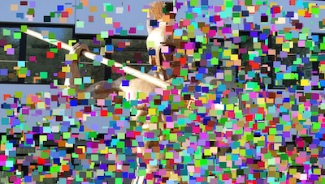
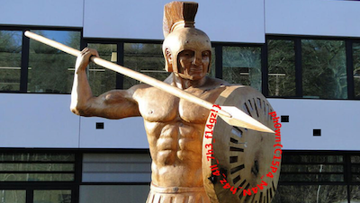

# CispaMan

This challenge consisted of an Android mobile application that displays an image.  
When running the application, an obfuscated image (a spartan soldier) is displayed:  

<div align="center">
    
</div>

According to the statement, the flag is located on the shield. So, our goal would be to deobfuscated the image and check if there is the flag on what seems to be a spartan soldier. In order to do that, we open the apk file with `jadx-gui`. It appears to be a great way to start as there are no code obfuscation nor native code.  

A first pass on the code, allows us to understand that the displayed image is built at runtime by drawing a canvas object. This canvas is built from a ArrayList of `Paper.java` objects which is instanciated from an asset file.  
We can also identify some code smells such as: 
- An asset file used to instanciate an ArrayList of `Paper` objects: `cm.dat`,
- `PrivacyView.java`, and more precisely the methods `onDraw()` and `getItems()` that draws the image at runtime,
- `resources.arsc`, resource file that indexes a lot of drawables named using the following convnetion `dxxxxxx.png`,
- `res/drawable/dxxxxxx.png`, whole bunch of small png files indexed in `resources.arsc` that seems to be the small rectangles that build and/or obfuscate the displayed image. Our assumption is that the solid color rectangles are the ones that obfuscate the image.

A quick and dirty (CTF) solution is to create a new `ToolBox` class with a static method that takes a Bitmap as a parameter and returns whether it is a solid color bitmap or not. The idea is to iterate through all the pixels and check if there is a color difference between the current one and the previous one if so, it is not a solid color Bitmap as the color should never change. You'll find below the used piece of code:

```
import android.graphics.Bitmap;

public class ToolBox {

    public static boolean isUniformBitmap(Bitmap image) {
        final int DELTA = 0;
        int[] prev = getPixelARGB(image.getPixel(0, 0));

        int w = image.getWidth();
        int h = image.getHeight();

        for (int i = 0; i < h; i++) {
            for (int j = 0; j < w; j++) {

                int pixel = image.getPixel(j, i);
                int[] current = getPixelARGB(pixel);

                for (int z = 0; z < 4; z++) {
                    if (Math.abs(current[z] - prev[z]) > DELTA) {
                        return false;
                    }
                }


            }
        }
        return true;
    }

    public static int[] getPixelARGB(int pixel) {
        int alpha = (pixel >> 24) & 0xff;
        int red = (pixel >> 16) & 0xff;
        int green = (pixel >> 8) & 0xff;
        int blue = (pixel) & 0xff;
        int[] tab = {alpha, red, green, blue};

        //System.out.println("a: " + alpha + "r: " + red + "g: " + green + "b: " + blue);
        return tab;
    }

}
```

The advantage of adding a class is that we then only have to slightly modify the `PrivacyView.onDraw()` method in order to perform the changes:

```
    /* access modifiers changed from: protected */
    public void onDraw(Canvas canvas) {
        canvas.drawColor(ViewCompat.MEASURED_STATE_MASK);
        Iterator it = this.papers.iterator();
        while (it.hasNext()) {
            Paper paper = (Paper) it.next();

            /* BEGIN - ADDED CODE */
            Bitmap decodeResource = BitmapFactory.decodeResource(getResources(), paper.citations);
            boolean uniform = ToolBox.isUniformBitmap(decodeResource);
            Log.e("CISPAMAN", "Bitmap resource: " + paper.citations);
            Log.e("CISPAMAN", "Bitmap isUniform: " + uniform);

            if (decodeResource != null) {
                if (!uniform) {
                    canvas.drawBitmap(decodeResource, null, new Rect(paper.title, paper.authors, paper.conf, paper.year), this.blackPaint);
                }
            }
            /* END - ADDED CODE */

        }
    }
```

And here's the flag! `ph0wn{C15P4_M4N_h4z_4ll_7h3_fl4gz!}`  

<div align="center">
    
</div>

## Do's and Dont's:
### Do's 
* Create a new Android project and copy/paste the java code in it
* Add the `cm.dat` file and the drawables in the assets folder
* Add the "solver" Java code in it
### Dont's 
* Add the code as Smali and recompile the apk with it (working but painful)
* Repack, sign and reinstall the app at each modification (working but painful)
* Try to write the Java code without Android librairies (e.g. image below). We did not manage to make this work during the CTF and did not spend more time trying to solve it. Our guts feeling was that this is due to the difference between the Java/Android librairies (`java.awt.image.BufferedImage` vs. `android.graphics.Bitmap`)

<div align="center">
    
</div>

-- Natan TALON, Titouan VEAUVY
