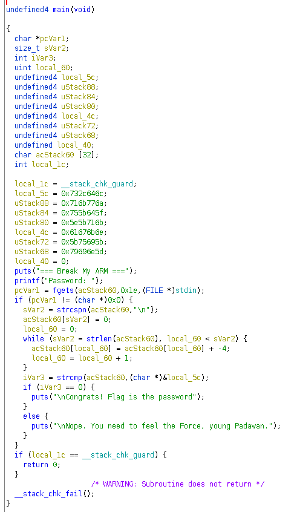
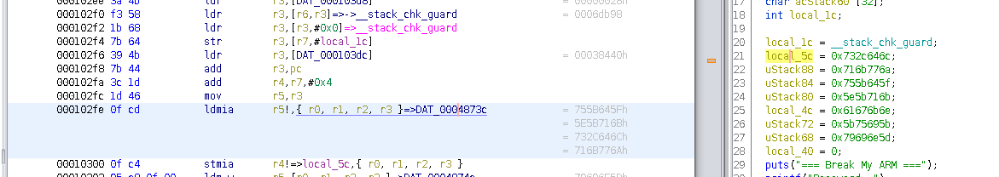
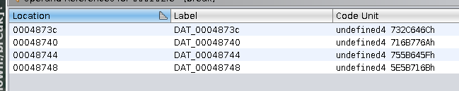
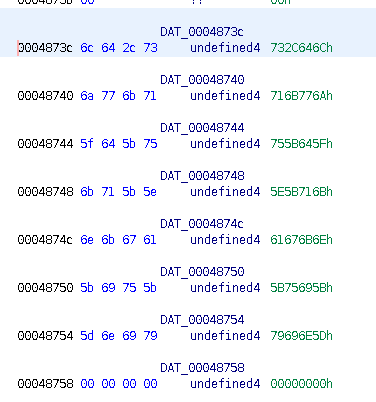

# Break my ARM

- 20 solves
- 28 points

## Description

Want to become a real h4ck3r ? Well, they reverse binaries for breakfast.

Go on, prove us you can break my ARM.

Download file: [break](./break) (sha256sum: `8e334708f6ae104e7b793f80245d52650067de9c84bab548fcac409ffb38cb28`)

## Solution

### Ghidra

Use Ghidra and decompile the binary:



Then, understand the decompiled code. First, the program displays greeting and asks for a password.

```c
puts("=== Break My ARM ===");
printf("Password: ");
```

The input is stored in `acStack60`:

```c
pcVar1 = fgets(acStack60, 0x1e, (FILE*) stdin);
```

Then, there is a loop. Each character of the input is modified with its ASCII value minus 4. The loop parses each character of the input, from first character (0) to the end of the string.

```c
local_60 = 0;
while (sVar2 = strlen(acStack60), local_60) < sVar2) {
  acStack60[local_60] = acStack60[local_60] + - 4;
  local_60 = local_60 +1;
}
```

We notice the resulting modified input is compared to a hard coded string `local_5c`. If it is the same, then we have entered the correct password.

The hard coded string `local_5c` is initialized at the beginning of the program.



Follow to the data values:




The hard coded string is `6c642c736a776b715f645b756b715b5e6e6b67615b69755b5d6e6979`.
The program is substracting 4 to each character of the input. So let's add 4 to each character of the hard coded string, and we'll get the the password.

```python
#!/usr/bin/env python3

hardcoded = list(bytes.fromhex('6c642c736a776b715f645b756b715b5e6e6b67615b69755b5d6e6979'))
print("Decoded password: ", ''.join([ chr(x+4) for x in hardcoded ]))
```

You get the flag: `ph0wn{ouch_you_broke_my_arm}`


