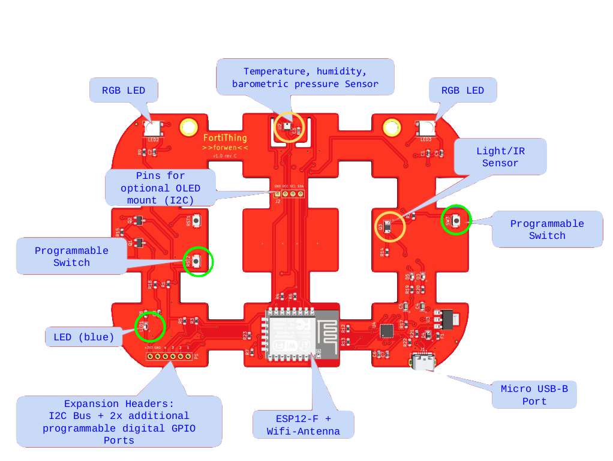

# Guide to participants



In order to be able to run the challenges on the FortiThing, you need to install **picocom**, using the following command: `sudo apt-get install picocom`

On some OS, you may need to install the **Silabs CP2102N Drivers** of the board, which are present at this [link](https://www.silabs.com/products/development-tools/software/usb-to-uart-bridge-vcp-drivers).

## Establish a communication with the board

To establish a communication with the board, type on the shell:

```
picocom /dev/ttyUSB0 -b115200
```

This command will open a **REPL** shell.
    
Please note: `dev/ttyUSB0` is the port which the board usually connects to. Check if it is, otherwise specify your port\,(you can use the command `dmesg`.  You can upload or download scripts on the board by means of **ampy**:

```
pip3 install adafruit-ampy
ampy -p /dev/ttyUSB0 put my_script.py
ampy -p /dev/ttyUSB0 get board_script.py
```

## Launch the challenge

Launch the challenge:  Press **Button SW3** to launch the Melting Point challenge.

## Restart

To restart the board after that a challenge began, you can press **RST1** or type **CTRL+D** in the REPL shell.

