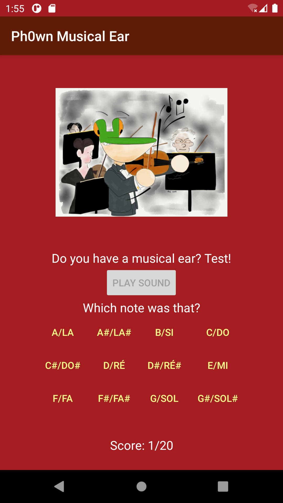
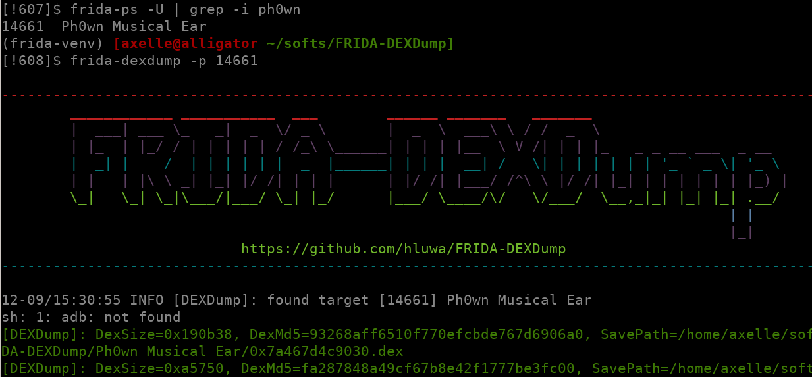
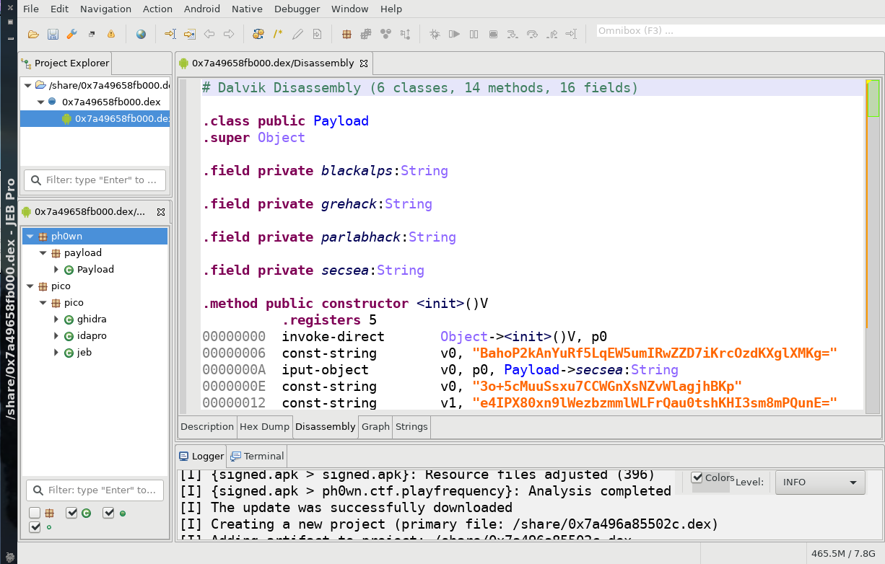

# Musical Ear

- Category: Reverse
- Author: cryptax
- Author of this write-up: cryptax
- Points: 340
- Solved by *5* teams

## Description

A musical ear is a special ability some people have (musicians or not) where they can intuitively recognize notes and say "oh, this is a C!" etc (and impress their friends).

So, do have the required skillZ? ;P

NB. This app is not malicious, you can safely install it on your smartphone or on an Android emulator. It requires at least Android 8.0 (SDK 26).

SHA256: `ac9cdedeaa92b7be3fd9635f29cf3da087707ecee7ede7bf10c1d0212634ea7f`

Attached: [signed.apk](./signed.apk)

## The app

This app plays a note and asks you which note this is (A, B, C...). If you are correct, you get one additional point, if not a point is substracted. The goal is apparently to achieve *20/20*.

{ width=60% }

As my ear isn't good enough, we'll have to find another way.

Note: it is convenient to run the Android app in an emulator. The easiest install option is through [Android Studio](https://developer.android.com/studio), although actually only the SDK is necessary.

## Reversing the app

The app is obvisously obfuscated, but we easily recognized the *MainActivity*.
With JEB, we spot this interesting piece of code:

```java
int v0_1 = this.score;
if(v0_1 == 20) {
  this.hints.HurryUp("congrats");
  String v0_2 = this.getString(0x7F0B0028);  // string:funcname "displayFlag"
  a v3 = this.hints;
  String v5 = this.pattern;
  v3.CanYouWin.getMethod(v0_2, Context.class, String.class).invoke(v3.CanYouWin.newInstance(), v3.WeLovePh0wn, v5);
}
```

Apparently, something happens when we get score 20. It calls a method named `displayFlag` (very promising) using reflection, providing 3 parameters: an instance of `CanYouWin`, a context, and a pattern.

Note: several decompilers exist such as JADX. I am personally using **JEB Pro**. It is paid software, but gives excellent results...

## Cheat to get 20/20

In method `guess()` of the `MainActivity`, the code :

- Selects a random integer up to 24 (24 notes)
- Plays the corresponding note
- Adds the note's name to the *pattern*
- Displays a debug message containing `Playing` followed by the note's name:

```java
StringBuilder v1_1 = a.a.a.a.a.HurryUp("Playing ");
v1_1.append(PlayFrequency.getLongName(PlayFrequency.notes[MainActivity.this.currentIndex]));
MainActivity.this.debug_log(v1_1.toString());
```

The decompiled `debug_log` prints the message if a file named `cheatfile` exists:

```java
public void debug_log(String arg4) {
        if(new File(this.ctx.getFilesDir(), "cheatfile").exists()) {
            Log.d("ph0wn", arg4);
        }
    }
```

So, we need to create `cheatfile` and watch system logs.

```
adb shell
generic_x86_64_arm64:/ # cd /data/data/ph0wn.ctf.playfrequency/files
generic_x86_64_arm64:/data/data/ph0wn.ctf.playfrequency/files # touch cheatfile
generic_x86_64_arm64:/data/data/ph0wn.ctf.playfrequency/files # logcat -s ph0wn
generic_x86_64_arm64:/data/data/ph0wn.ctf.playfrequency # logcat -s ph0wn
--------- beginning of kernel
--------- beginning of system
--------- beginning of main
12-09 14:25:55.016  6155  6155 D ph0wn   : Score: 0
12-09 14:25:58.507  6155  6155 D ph0wn   : Playing D5 - Re
```

NB. There are several ways to cheat. Using a Frida hook would work too for example.

It is now very easy to get the good notes. Sometimes, a hint is displayed, and the logs also show that:

```
12-09 14:26:58.874  6155  6155 D ph0wn   : Playing F5 - Fa
12-09 14:27:03.137  6155  6155 D ph0wn   : func hint1() called
12-09 14:27:03.137  6155  6155 D ph0wn   : Score: 2
```

The decompiled code shows the log line in `HurryUp` for class `a()` (obfuscated names).

```java
public void HurryUp(String arg6) {
        this.CanYouWin.getMethod(arg6, Context.class).invoke(this.CanYouWin.newInstance(), this.WeLovePh0wn);
        Log.d("ph0wn", "func " + arg6 + "() called");
    }
```

It calls a method `hint1` using reflection, and providing an instance and a context. This method probably implements message toasting.


Note that at score 10, the toast message tells "Reverse the Dex, banana!"


When you reach 20/20, the app toasts congratulations, and then "Bad decryption key". And Logcat shows this:

```
12-09 14:47:40.305  6155  6155 D ph0wn   : func congrats() called
12-09 14:47:40.307  6155  6155 W ph0wn   : Unable to decrypt correctly
```


We don't get the flag. We still need to do something. The messages tell us to "reverse the Dex", so we go back to decompiled code and try to understanding function `congrats()`.

## Understanding the DEX

There is **no method** named `congrats()`, or `hint1()` or `hint2()` in the code. Theses methods are called by reflexion by `HurryUp`. This precisely calls a method named `congrats()` (or hint1, hint2) on `CanYouWin`.

`CanYouWin` is a **class**. Its content is assigned in the constructor of class `a`. It is class `ph0wn.payload.Payload` found in DEX that resides in memory!

```java
public class a {
    public Class CanYouWin;
    
     public a(Context arg4) {
            ....
            this.CanYouWin = new InMemoryDexClassLoader(v1, MainActivity.class.getClassLoader()).loadClass("ph0wn.payload.Payload");
	    ...
     }
}
```

## Dumping the DEX in memory

I wrote a [Frida script to dump DEX in memory](https://github.com/cryptax/misc-code/blob/master/frida_hooks/in-memory-dex-dump.js). This is a convenient way to get the DEX: get [Frida](https://frida.re), install the client, install the [server on your Android emulator](https://github.com/frida/frida/releases/), use the script.

To show another possible method, we are going to use [this project](https://github.com/hluwa/FRIDA-DEXDump). It is a front-end to Frida, and can also be used as a plugin to *Objection*. Install it, get the process id of our application using `frida-ps` and dump the DEX:



This actually finds several DEX instances and stores them in a directory named `Ph0wn Musical Ear`. We are typically looking for one that implements `congrats`, so we are going to look into those 2:

```
[!615]$ grep congrat *.dex
Binary file 0x7a467d4c9030.dex matches
Binary file 0x7a49658fb000.dex matches
```

We finally decompile the payload:



## Reversing the payload

The `congrats()` method is part of the `ph0wn.payload.Payload` class, as expected. It merely toasts the congratulation message:

```java
 public void congrats(Context arg3) {
        Toast.makeText(arg3, this.blackalps, 0).show();
    }
```

Underneath, the method `displayFlag()` is extremely interesting. Recall that we had noticed the app was calling `displayFlag` with 3 parameters: an instance of `CanYouWin` (`ph0wn.payload.Payload` class), a context, and a pattern. We also noticed that the pattern is composed of a sequence of note names (e.g. `ABABAAA`).

The method `displayFlag` uses obfuscated names (`jeb`, `parlabhack` etc). It toasts a message returned by `new jeb(pattern).parlabhack(this.secsea)`. If an exception occurs, it toasts "Bad decryption key".  This is the message we got previously, because `arg5` (the pattern) isn't the expected one.

```java
 public void displayFlag(Context arg4, String arg5) {
        try {
            String v5 = new jeb(arg5).parlabhack(this.secsea);
            Toast.makeText(arg4, v5, 0).show();
            Log.d("ph0wn", v5);
        }
        catch(Exception unused_ex) {
            Log.w("ph0wn", "Unable to decrypt correctly");
            Toast.makeText(arg4, "Bad decryption key", 0).show();
        }
    }
```

Decompiling class `jeb` (again, this has nothing to do with JEB decompiler, it is just an obfuscated name, making reference to JEB!), it is easy to understand it implements Blowfish encryption.

```java
public class jeb {
    private static final byte[] blackalps;
    private Cipher grehack;
    private SecretKeySpec parlabhack;

...

    public jeb() {
        this.parlabhack = new SecretKeySpec(jeb.blackalps, "Blowfish");
        this.grehack = Cipher.getInstance("Blowfish");
    }
```

So, what does `jeb(pattern)` do? It expects a pattern of length 8.

```java
public jeb(String arg4) {
        if(arg4.length() == 8) {
```

It checks each characters are between `A` (65) and `G` (70). Those are the notes of our pattern. So, note it does not expect any alteration (sharp etc).

```java
            while(v0 < arg4.length()) {
                if(arg4.charAt(v0) >= 65 && arg4.charAt(v0) <= 70) {
                    ++v0;
                    continue;
                }

                throw new InvalidKeyException();
            }
```

Then it uses the pattern as a **key to the Blowfish** algorithm:

```java
            this.parlabhack = new SecretKeySpec(arg4.getBytes(), "Blowfish");
            this.grehack = Cipher.getInstance("Blowfish");
```	    

So, we don't know exactly the key (i.e expected pattern) except that it has 8 notes, and no alterations.

Once those crypto settings are initialized, the code calls `parlabhack()` on a hard-coded string `secsea`.
The decompiled code of `parlabhack()` shows it performs base64 decoding, and then Blowfish decryption.
`secsea` is probably the encrypted flag.

## Bruteforcing

So, we have to bruteforce a key of 8 characters, all of them between A and G.
The [program](./FlagAlgo.java) returns the key in a few minutes:

```
ERR for key=BABABEEE Excp: javax.crypto.BadPaddingException: Given final block not properly padded. Such issues can arise if a bad key is used during decryption.
Key=BABABEEF plain=ph0wn{ThisWasAReversibleDex}
FOUND
```

Flag :)
