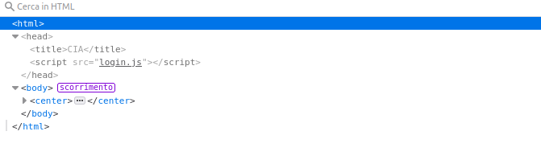
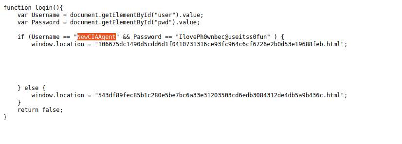
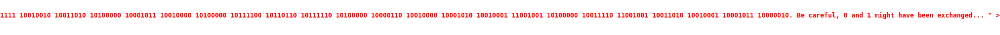

# ph0wn 2021 CIA challenge

- Category: Rookie, Web
- Author: Guillaume, Robin
- Author of the write-up: Gianluca
- Points: 5
- Solved by *26 teams*

## Description

```
Can you enter CIA's smart armoury?

It is located at *URL*

PS. This challenge was created by 2 teenagers during their internship of "3eme" and reviewed by Ph0wn Staff. We are proud of them!
```


## First Step
First thing I face up is a login page with CIA logo which asks us username and password.
Analyzing page I can see that it relies on a page `login.js`, in which I can find correct parameters to login correctly




## Second Step
To find the flag, I have to view page source, where we find a message written in binary format. 



## Third Step
To extract the flag I have to exchange zeros and ones and then convert message from binary to ASCII

## Solution
Flag: `ph0wn{welc0me_to_CIA_youn6_a6ent}.`

Quite interesting was the fact that, after login, with "view page source" button, I was able to find the whole message, while with
"inspect" button I was able to see only part of the flag
