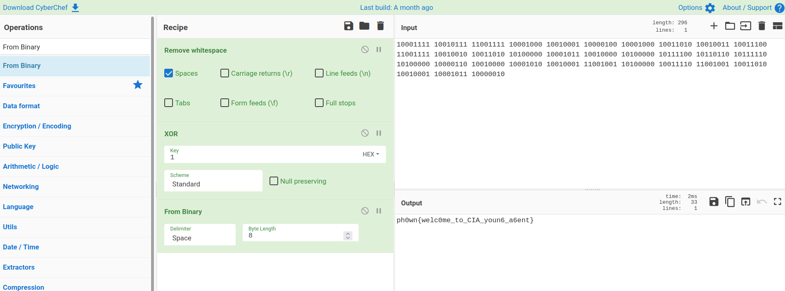

- Connect to the website.
- View source code of the web page. Notice there is a `login.js` script.
- View `login.js`:

```javascript
function login(){
    var Username = document.getElementById("user").value;
    var Password = document.getElementById("pwd").value;

    if (Username == "NewCIAAgent" && Password == "IlovePh0wnbec@useitss0fun" ) {
	window.location = "106675dc1490d5cdd6d1f0410731316ce93fc964c6cf6726e2b0d53e19688feb.html";
	
    } else {
	window.location = "543df89fec85b1c280e5be7bc6a33e31203503cd6edb3084312de4db5a9b436c.html";
    }
    return false;
}
```

- Enter the login credentials `NewCIAAgent:IlovePh0wnbec@useitss0fun` or simply navigate to `106675dc1490d5cdd6d1f0410731316ce93fc964c6cf6726e2b0d53e19688feb.html`
- Again view source code of this page `106675dc1490d5cdd6d1f0410731316ce93fc964c6cf6726e2b0d53e19688feb.html`

```html
<html>
  <head>
    <title>entered CIA Smart Armoury</title>
    <hide "flag isn't there" >
  </head>
  <body>
    <center>
      <h1>You entered the CIA's smart armoury</h1>
      
      <center>
	(c) Entered the CIA
	<br>
	<br>
	<hide "flag isn't there" >

	Congratulations, you entered the CIA's smart armoury. However, I'm sure you're looking for another information...
  </body>
<hide "You're pretty smart if you're reading this message: 10001111 10010111 11001111 10001000 10010001 10000100 10001000 10011010 10010011 10011100 11001111 10010010 10011010 10100000 10001011 10010000 10100000 10111100 10110110 10111110 10100000 10000110 10010000 10001010 10010001 11001001 10100000 10011110 11001001 10011010 10010001 10001011 10000010. Be careful, 0 and 1 might have been exchanged... " >
  </html>
```

- Notice the last part: "10001111 10010111 11001111 10001000 10010001 10000100 10001000 10011010 10010011 10011100 11001111 10010010 10011010 10100000 10001011 10010000 10100000 10111100 10110110 10111110 10100000 10000110 10010000 10001010 10010001 11001001 10100000 10011110 11001001 10011010 10010001 10001011 10000010. Be careful, 0 and 1 might have been exchanged... "

- Go to  [CyberChef](https://gchq.github.io/CyberChef)

1. Remove whitespace. Spaces only.
2. XOR. Key = 1.
3. From Binary



The flag is `ph0wn{welc0me_to_CIA_youn6_a6ent}`
