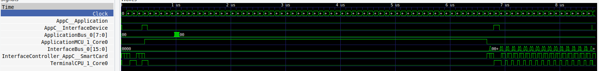
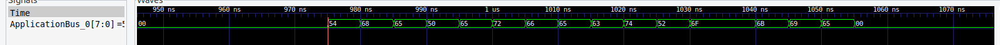
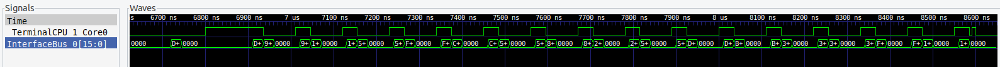

# The challenge

You have heard that the Illuminatis have inserted secrets in smart cards. To know whether there is such as secret in smart cards, you have gently opened the chip, and you have put probes on MCUs and buses, as well as on the interface device (a paiement terminal). And then, you have plugged your smart card.

Soon after, you have noticed that the application bus seems to transfer a 16-byte AES key (ECB mode). After several computations on the application MCU, the smart card seems to leak a secret to the interface.

Help deciphering this secret, and the flag will be yours!
How to proceed

We have saved our probing in VCD format

[spy-on_smartcard.vcd](spy-on_smartcard.vcd)

# The wave

VCD stands for Value Change Dump and it is a [standard format to display digital waveforms][1].
We can open the wave with a VCD viewer - [gtkwave][2] for instance. We get the following:



And yes, there is some activity on the Application Bus at the beginning of the wave, and some activity on the Interface Bus at the end of the wave.

# The key

Zooming of the first part of the wave, we get a 16 bytes sequence on the application bus. Very likely our key.



We can either manually copy it since it is only 16 bytes long, or grep for busApplicationBus_0 in the vcd file for the corresponding binary values and convert in hex. In both cases we end up with a 128 bits key: 0x54686550657266656374526f6f6b6965 which reads "ThePerfectRookie" in ASCII.

# The message

Let's have a look at the last part of the wave containing the message on the interface bus.



The interface bus is a 16 bits bus. Transactions seem qualified by the AppC__SmartCard or TerminalCPU_1_Core0 signals - so we take only the data occurring when TerminalCPU_1_Core0 signal is a logical 1. Here again, either manual copy or grep in the VCD file, filter a bit for zero and duplicate values, and convert in hex.

Our message reads: 0xd24e901e1f505570f727c6ce5d9183bd296c52afdffab4a83af73a53fa551c01

# Putting it all together

We just have to decrypt the message with the key, using AES-ECB. A few lines of python will do the trick:

```
#!/usr/bin/env python3

from Crypto.Cipher import AES

key = bytes.fromhex("54686550657266656374526f6f6b6965")
msg = bytes.fromhex("d24e901e1f505570f727c6ce5d9183bd296c52afdffab4a83af73a53fa551c01")
cipher = AES.new(key, AES.MODE_ECB)
print(key, cipher.decrypt(msg))
```

And we get our flag !

[1]:https://en.wikipedia.org/wiki/Value_change_dump
[2]:https://gtkwave.sourceforge.net
