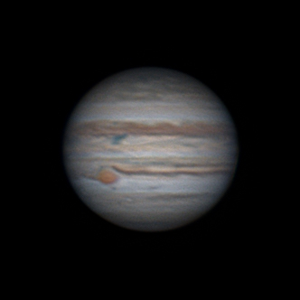
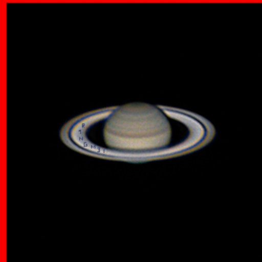
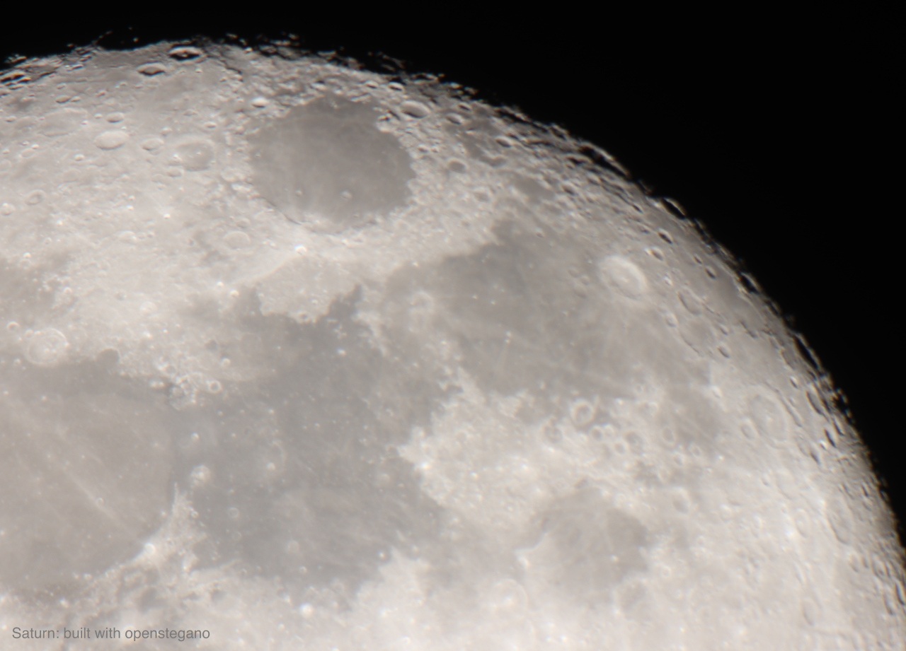
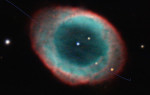

# Astro

- Category: Misc
- Points: 100
- Authors: TuxDePoinsisse

# The challenge

There is more than Jupiter!

Download the file from http://34.140.103.157:9000/jupi.jpg

SHA256: a5bb1fd9bb391630de726136e7b43a17eff15bbba6b09158934653fbb659572b

When you finally obtain something which is not in the solar system, the flag is as follows: ph0wn{x_y} with x being the Messier name of the last astronomical object i.e Mabc, and y being the hidden message.

Good observation :-)

Ps: images where all taken with our telescopes and cameras

This challenge was rated "hard rookie" which is about my level. So I figured out I could try and score some points while the big boys in my team were onto some real serious challenges. It turned out this was a bit more than I could swallow and one of my teammate had to finish for me, but I learned a few things in the process, and got to see some cool astronomy pictures !

# From Jupiter to Saturn

The `jupi.jpg` file is ~75MB big. Imagemagick identifies it as a 332x332 pixel image, and it shows a picture of Jupiter.

```
$ identify jupi.jpg
jupi.jpg JPEG 332x332 332x332+0+0 8-bit sRGB 74.8719MiB 0.000u 0:00.003
$ display jupi.jpg
```



Still, 75MB is way too big for a 332x332 image. Let's have a look at this file.

```
$ binwalk jupi.jpg
DECIMAL       HEXADECIMAL     DESCRIPTION
------------------------------------------------------------------ --------------
0             0x0             JPEG image data, JFIF standard 1.01
25865         0x6509          PC bitmap, Windows 3.x format,, 4999 x 4999 x 24
32657744      0x1F25150       StuffIt Deluxe Segment (data): first one
...
42767810      0x28C95C2       StuffIt Deluxe Segment (data): many
...
75010919      0x4789367       JPEG image data, JFIF standard 1.01
75010949      0x4789385       TIFF image data, big-endian, offset of first image directory: 8
```

So we have our Jupiter JPEG image at the start of the file, then a 4999x4999 BMP image at offset 25865, then some "Stuffit segments", then yet another JPEG image at offset 75010919.

Let's first extract the BMP. Since it is a 4999x4999x24 images, it should be around 75MB in size, so we'll take everything after offset 25865.

```
$ dd if=jupi.jpg of=truc.bmp bs=25865 skip=1
$ display truc.bmp
```

And we get a picture of Saturn. Moreover someone wrote 'R1NGM3!' on Saturn's rings.


```
$ mv truc.bmp saturn.bmp
```

The resulting bmp file is a bit too big since it embeds both the Saturn BMP and the following JPEG, but Imagemagick and The Gimp just issue a warning when opening it and display it correctly.

# From Saturn to the Moon

Let's have a look at the JPEG file hidden in the `jupi.jpg` file. We just dd it out:

```
$ dd if=jupi.jpg of=truc.jpg bs=75010919 skip=1
$ display truc.jpg
```



And we get the Moon, with a comment on the bottom left.

`$ mv truc.jpg moon.jpg`

# Opensteg(an)o

At this stage I was kind of stuck - the reference to Openstegano in the Moon's image hinted that something was hidden in the Saturn image. Opening `saturn.bmp` with The Gimp and trying to play with saturation and colors did not provide much. Fortunately, my team mate Juju came to the rescue, and finished the challenge using the [Openstego][1] tool. A big thank you to him !

# From Saturn to the Lyra constellation

Using Openstego one can move to the next step. The graffiti on Saturn's rings is the password:

```
$ java -jar /usr/share/openstego/lib/openstego.jar extract -sf saturn.bmp -p 'R1NGM3!'
Extracted file: nebuwith.bmp
$ display nebuwith.bmp
```



Google Image identifies this picture as the Ring nebula, inside the Lyra constellation. From [Wikipedia][2], we learn that it is classified as M57 in Messier's catalog. We got the object outside of the solar system and its Messier's number. We are just missing the message.

# The message in the nebula

One more round of openstego is needed to get the final message, this time on the Ring nebula image, and without password.

```
$ java -jar /usr/share/openstego/lib/openstego.jar extract -sf nebuwith.bmp -p ''
Extracted file: message.txt
$ cat message.txt
bip.bip_bip
```

which gives us the final info to score the challenge.

[1]:https://github.com/syvaidya/openstego
[2]:https://en.wikipedia.org/wiki/Ring_Nebula

