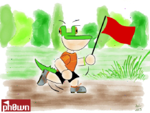
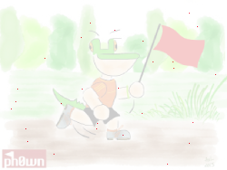
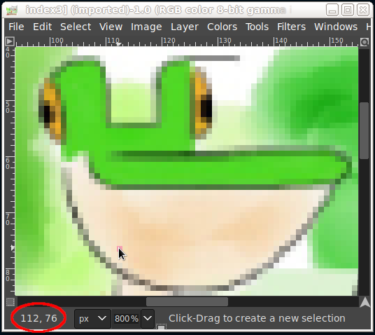
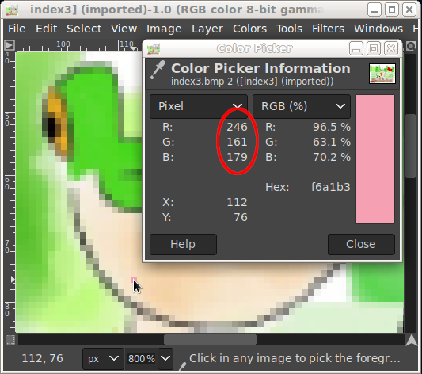

# CTF at the Museum

Author: JuJu (@jolivain)

This Ph0wn 2022 challenge was in the "Misc" category.

For the very short story, you can jump directly to the
[museum.py](code/museum.py) Python script that solved this
challenge. For the longer version, continue reading...

First, a disclaimer: I am not a "web guy".  I usually don't touch those
things.  I sometimes miss those days when `/cgi-bin/` were written in
`sh`, `Perl`...  While browsing the Ph0wn 2022 challenges, I was
really surprised to finally pick this one.  Maybe @SebHz, one of my
team mates, convinced me to pursue the few ideas we had while looking
at this challenge description.


# Part 0x1: First Encounter

The challenge description gave an URL to a virtual web museum.
Opening the URL in a normal browser was showing a room with three
apparently identical framed pictures.  The challenge description said
there was 50 rooms.  There was an input text form at the bottom of the
page, asking for a password to go to the next room.  At the first
connection, the first password was pre-filled with some text gibberish
which was changing at each new session.  When submitting the
pre-filled password, we entered the second room.  The password input
box was then asking for a real password for the third room, with no
other clue.  When trying to enter some random data in the password
input box, a museum guard was shown as a wrong password warning.
Entering a wrong password five times in a row reset the session and
restart at the first room...


# Part 0x2: Poking Around


## A first look at the page content

First this was to look at the page source. Using the command `curl
http://...` or using F12 in the browser to show the DOM inspector.
There was only basic HTML, some CSS, some images for the decoration
and the three bitmap pictures, inlined in html.  The session ID was
recorded in a cookie, for which I don't recall seeing one of those
dreaded GDPR popups.  Nothing really helpful for the challenge...


## A First Look at the Password

The text gibberish mentioned earlier was something like
`MTQyLDM4LDIxNiwxMywy`.  Since we were on a web page, the first thing
that came to mind was a base64 encoding.  We could check that with a
command like:
```
echo MTQyLDM4LDIxNiwxMywy | base64 -d ; echo
142,38,216,13,2
```

Okay... It _was_ base64.  We had 5 coma-separated numbers... No idea
what they could be...

Trying few times in new sessions gave:
```
224,15,189,211,59
201,110,101,108,238
112,76,246,161,179
50,63,74,96,171
...
```

Another observation: numbers seemed to be somewhere in the 8 bit range
(0 to 255 inclusive), but not sure for now...


## A Closer Look at the Pictures

Images were BMP bitmaps, directly encoded in base64 in the HTML. We
could see that in the page source:
```

```
The three pictures could be saved as file, using the "Save Image As..."
entry in the right-click menu of the browser.  For example:

  

We checked the image format with the [ImageMagick][1] identify
command:
```
identify *.bmp
index1.bmp BMP3 250x188 250x188+0+0 8-bit sRGB 141430B 0.000u 0:00.001
index2.bmp BMP3 250x188 250x188+0+0 8-bit sRGB 141430B 0.000u 0:00.001
index3.bmp BMP3 250x188 250x188+0+0 8-bit sRGB 141430B 0.000u 0:00.001
```
Again, the three pictures looked exactly the same... At least on my
dirty and dusty laptop screen...

We tried to confirm the 3 image files were identical, for example with
the command:
```
sha256sum index[1-3].bmp
74dd4aeee56015469a9bd1791f254c7d8aff92a67e35bdaa205374bbcfa74f27  index1.bmp
c2b8484947049230cc297a9daec704d61ba0fefa741007f9909de63430a4be88  index2.bmp
34c0101042711e8cc1575ee4a9a875bf8635ccc249606f87481c035c5e6debeb  index3.bmp
```
Hmmm... not quite identical, after all...  Maybe I should clean my
screen, my glasses and my eyes...

Before cleaning anything, we tried to find differences automatically.
It was more fun.  We used the [ImageMagick][1] `compare` command for
that:
```
compare index1.bmp index2.bmp diff1-2.png
compare index2.bmp index3.bmp diff2-3.png
compare index1.bmp index3.bmp diff1-3.png
```

This produced three images highlighting differences.  In
[`diff1-2.png`](img/diff1-2.png) and [`diff2-3.png`](img/diff2-3.png),
there was indeed several different pixels.

  

However, in [`diff1-3.png`](img/diff1-3.png), there was _exactly_
**ONE** different pixel.


We had a closer look at this pixel in an image editor ([Gimp][2], for
instance).  Zooming, and moving the mouse over this pixel showed its
coordinate was x=112 y=76.



We remembered seeing those numbers somewhere... "112,76", yes, that's
it!  It was one of those decoded base64 passwords!

Checking the color of that very pixel with the color picker showed that
its color was red=246 green=161 blue=179.



This also matched the values we found earlier in a decoded password.

At that time, our theory was:
- In the 3 images, one is an original unmodified image,
- one is modified by randomly changing the color of many pixels,
- one is modified by randomly changing the color of exactly ONE pixel,
- the password to the next room is `x,y,red,green,blue`
  encoded in base64 of the changed pixel.


## Validating our First Theory, Manually

We had then a somewhat solid theory.  We needed to validate it before
going further.  So we just repeated the previous steps: saved the
three images, opened with [Gimp][2], searched for the image with one
pixel visually, found the coordinate and color of this pixel, encoded
in base64. And voila! It just worked! We just validated our theory.

After being really proud of this advance for at least five big
seconds, we recalled that the challenge description mentioned
something like "50 rooms".  Wait: **FIFTY ROOMS?!?!** Hmmm, no way we
could do that manually...


# Part 0x3: Full Scale Automation

Interlude: While we had no real clues on how we could achieve that, we
decided to go to lunch...  Even if it's totally unrelated to this
challenge, it's important to remind that Ph0wn organizers managed to
have some good sandwiches, sodas an stuffs ;) This gave us some time
to think about the next steps of this challenge... `</interlude>`

As I said in the beginning, I'm not really a "web guy".  I'm not
efficient in Javascript or the likes.  However, I usually like to
[automate](https://xkcd.com/1205/) [stuffs](https://xkcd.com/1319/).
I also happen to like [pixels](https://xkcd.com/722/), [**a
lot**](https://xkcd.com/1416/) ;)  I was about to give up and pick
another challenge.  As somebody told me recently to _"never give up"_,
and since I was also feeling _"Python"_ that night, I decided to
continue that way...

So we started to fiddle with [IPython][3], to write the following
code snippets...


## Browser Automation

We decided to go with [Selenium][4] WebDriver Python binding.  It's a
really good package to exactly [do that task in few lines of code][5].

We can open the museum URL with:
```python
from selenium import webdriver

driver = webdriver.Chrome()
driver.get(URL)
```

Then we can get base64 encoded images html elements in an array with:
```python
from selenium.webdriver.common.by import By

b64_imgs = driver.find_elements(By.TAG_NAME, 'img')
```

For each `img` element, we can extract the `src` attribute, strip the
`data:image/bpm;base64,` prefix, then decode the base64 with standard
Python
[`base64.b64decode()`][6], for example:
```python
import base64

img_src = b64_imgs[0].get_attribute('src')
img_src = img_src[len(IMG_PREFIX):]
img_buf = base64.b64decode(img_src)
```


## Basic Image Processing

Now we had the Python byte array of the image, we needed an image
manipulation library. We decided to use [Pillow][7], a fork of PIL,
the Python Imaging Library.

Converting a byte array of the BMP file to a Pillow Image can be done
with a standard Python [io.BytesIO()][8]:
```python
import io
from PIL import Image

img_io = io.BytesIO(img_buf)
img = Image.open(img_io)
```

We were able to get pixel values with calls like:
```python
img.getpixel((x, y))
```


## Finding the Image with One Different Pixel

For this, we decided to load a reference image (known to be
unmodified), then we used a function to count differences:
```python
def diff_count(ref, img):
    d = 0
    for x in range(ref.width):
        for y in range(ref.height):
            if (ref.getpixel((x, y)) != img.getpixel((x, y))):
                d += 1
    return d
```
With this, we could identify which of the three image we needed to
analyze to generate the password to the next room.


## Generating the Password

Once we found the image with only one different pixel, we needed to
find its coordinate and color.  This could be easily achieved with:
```python
def find_diff_pixel(ref, img):
    for x in range(ref.width):
        for y in range(ref.height):
            if (ref.getpixel((x, y)) != img.getpixel((x, y))):
                r, g, b = img.getpixel((x, y))

                return f"{x},{y},{r},{g},{b}"
    return "NotFound"
```

The password could then be generated using the standard Python
[`base64.b64encode()`][9].


## Sending the Password to the Museum

The password could be set to the `key` text input element of the page,
with the code:
```python
key = driver.find_element(By.ID, 'key')
key.clear()
key.send_keys(next_password.decode())
```
Note: the `key.clear()` was needed because the element already
contains some text.

Then, we needed to locate the `submit` button element, and simulate a
click on it:
```python
submit = driver.find_element(By.ID, 'submit')
submit.click()
```


## A First Run in the Museum

With the previous code wrapped in a loop, we were able to give a first
run...  Surprisingly, it worked well..  Until it stopped at room #11
(not surprisingly).  Some images started to be randomly rotated: 90,
180 or 270 degrees...  Damn, it was working so well...


## Rotating Images

Luckily, the choice of the Pillow library paid off.  This library
includes this kind of transformation.  A 90 degrees rotation can be
done using the [`Image.transpose()`][10]:
```python
img = img.transpose(Image.Transpose.ROTATE_90)
```

Then, we just updated the function which find the image containing the
different pixel to brute-force all possible rotations.

Then, we could give another try to the updated program.  It was
running well... Until...  **RHAAaaaa!...**  Now, it's mirroring
operation which was added few rooms later...


## Mirroring Images

This one was also cheap to do, since mirroring is also included in the
Pillow `Image.transpose()` function.  Mirror operation can be done
with code:
```python
img = img.transpose(Image.Transpose.FLIP_LEFT_RIGHT)
```
or:
```python
img = img.transpose(Image.Transpose.FLIP_TOP_BOTTOM)
```

We just added those to the list of possible transformations to brute
force.  Then we could give, yet another try to the program...  Again:
it was going well; it stopped few rooms later due to a new
transformation.  What could we expect?!  We started to hope it was the
last one...


## History (and Transformation) Repeating...

The new image modification added was in fact a pair of transformation
(flip + rotation).  So we added that to our brute-force list for
searching the image with one different pixel: compare to the image,
then rotate, then mirror only, then mirror and rotate.


# Part 0x4: Paint, Change, Flip, Mirror, Repeat...

After running the final [museum.py](code/museum.py) script, the last room
was showing in the password text input the flag:
`ph0wn{p4int_ch4ng3_fl1p_m1rr0r_r3pe4t}`

The resulting code is a bit clumsy and far from being optimal, but it
achieved its purpose to get the flag!

Thanks for this fun challenge!

[1]:https://imagemagick.org/
[2]:https://www.gimp.org/
[3]:https://ipython.org/
[4]:https://www.selenium.dev/
[5]:https://www.selenium.dev/documentation/webdriver/getting_started/first_script/
[6]:https://docs.python.org/3.11/library/base64.html#base64.b64decode
[7]:https://python-pillow.org/
[8]:https://docs.python.org/3.11/library/io.html#io.BytesIO
[9]:https://docs.python.org/3.11/library/base64.html#base64.b64encode
[10]:https://pillow.readthedocs.io/en/stable/reference/Image.html#PIL.Image.Image.transpose

EoF.
