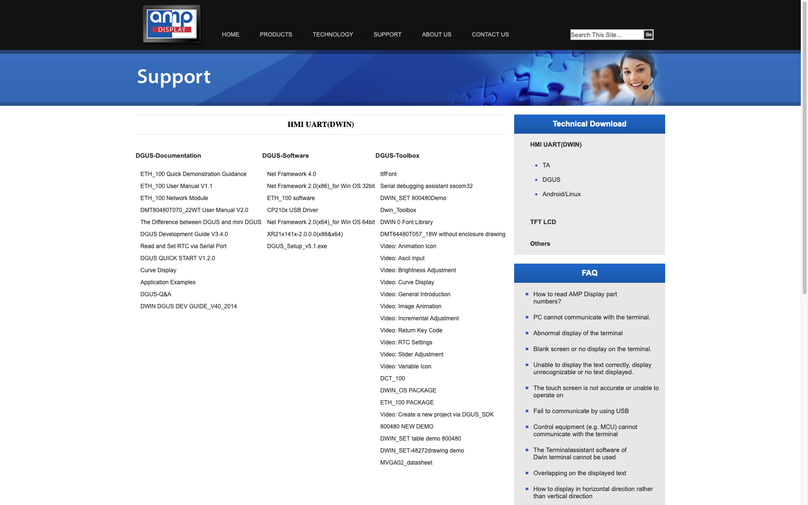
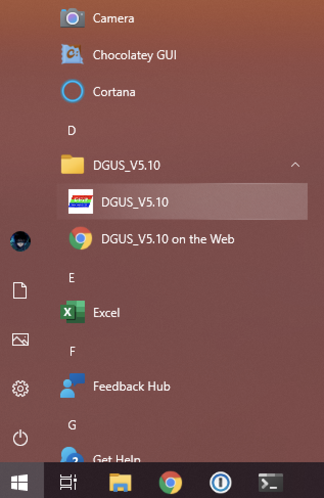
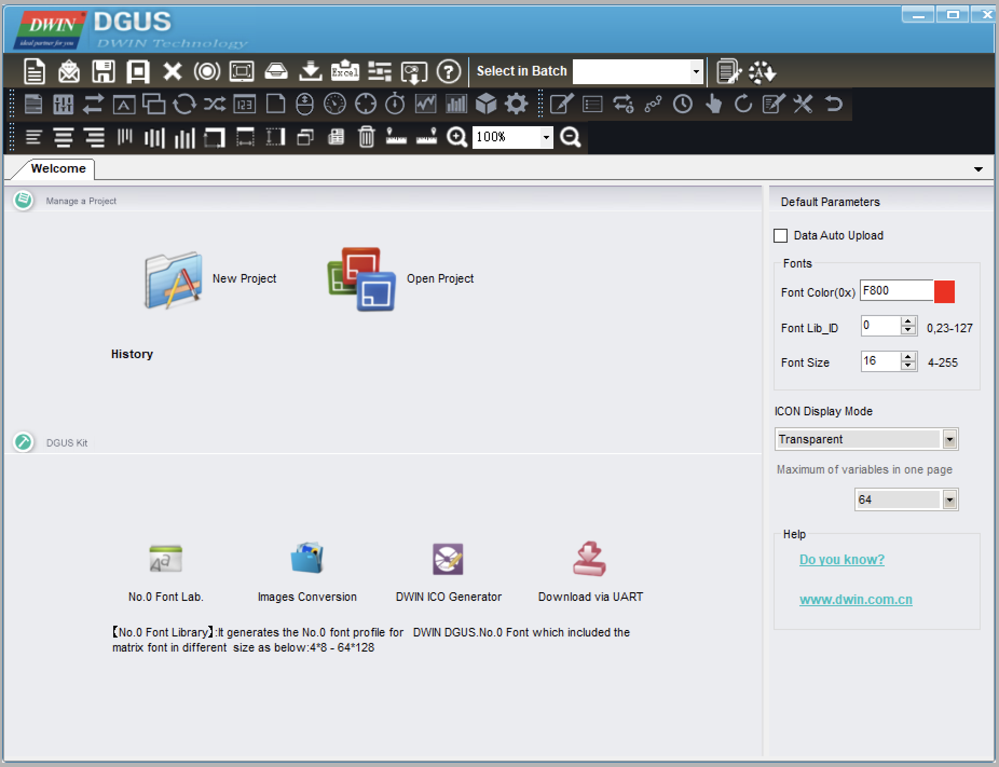
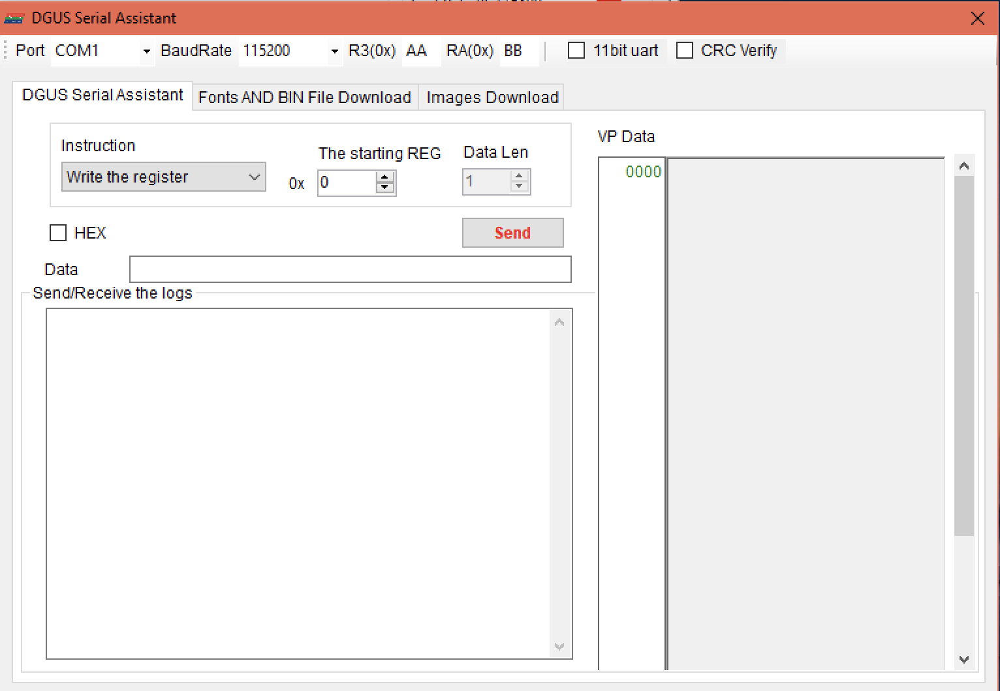
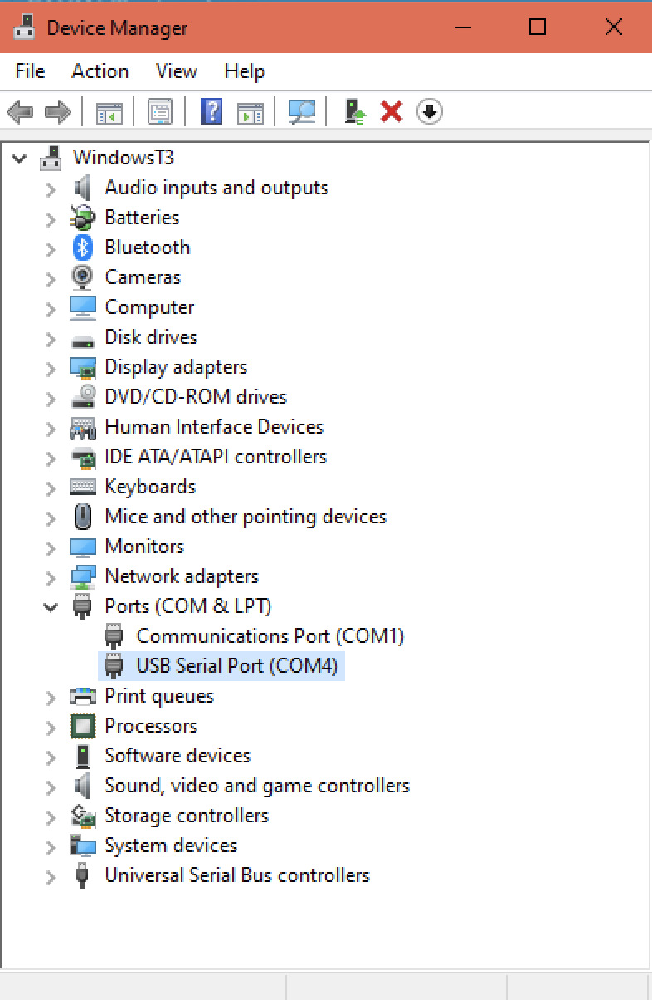
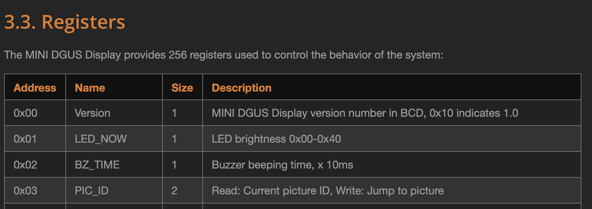
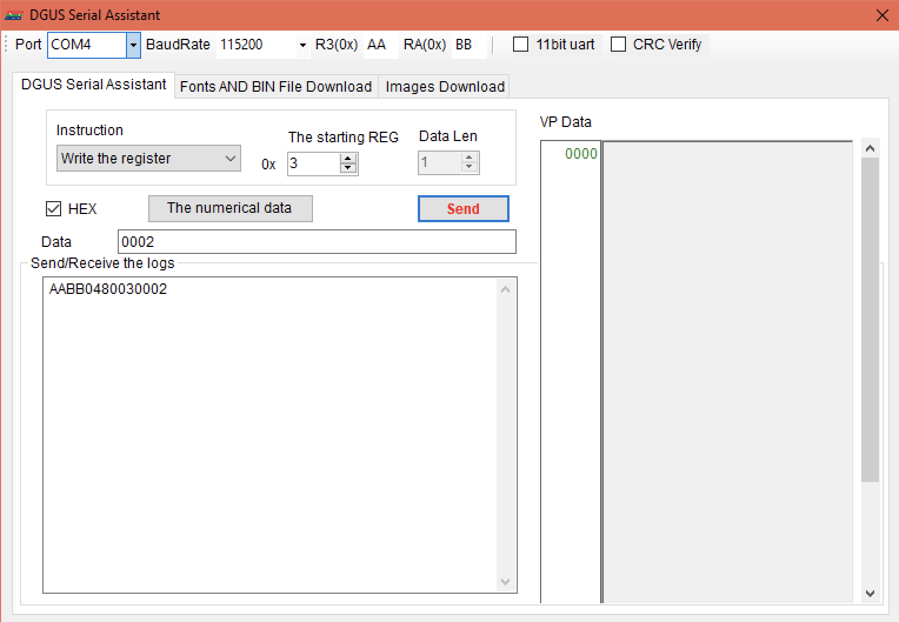
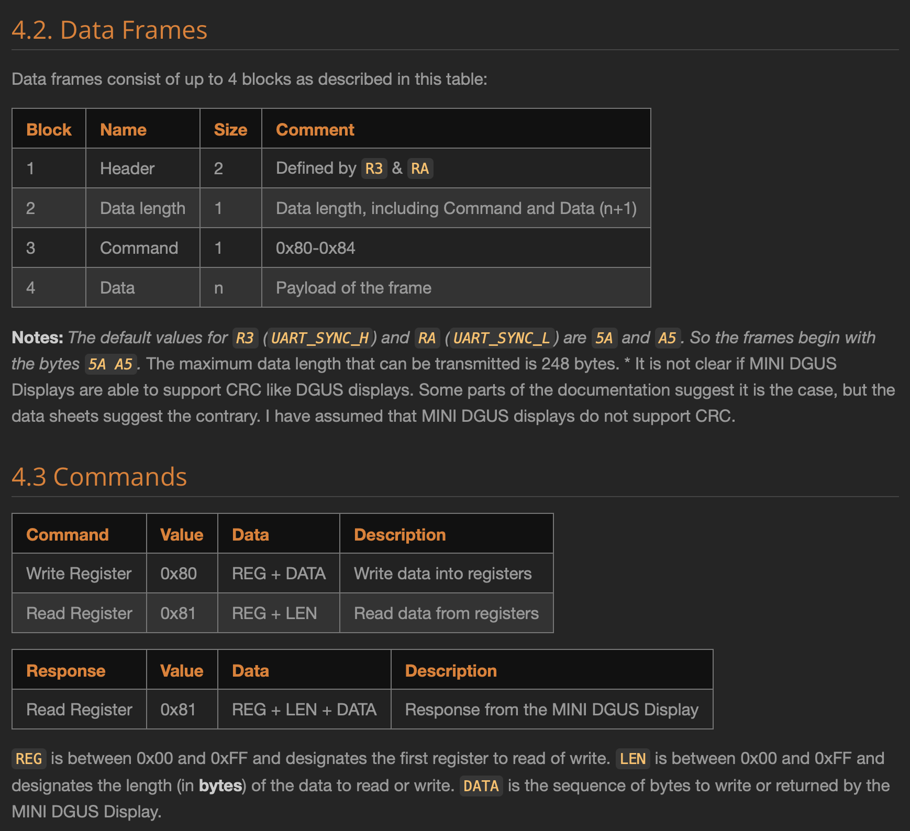
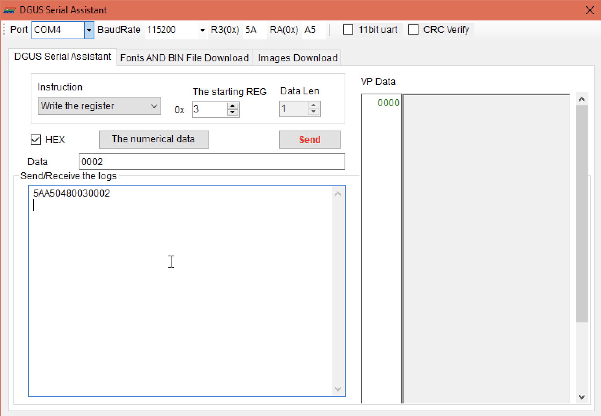
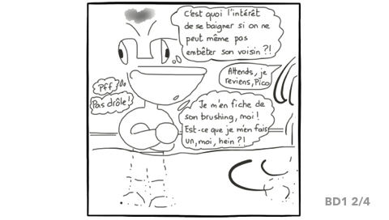

# PicoFind - Level 2

* **Name**: PicoFind - Level 2
* **Difficulty**: Hard
* **Author**: Sebastien Andrivet
* **Flag**: ph0wn{all-crocos-love-britney}

## Description of the challenge

Pico the Croco likes also listening to music when riding his bike. Find his favorite artist. For this level, just power is not enough. You have to talk to the screen with the right words. Be nice with it, no need to dismantle anything.

For information, the model of the screen is either DMT48270M043_05WT or DMT48270M043_02WT and it is developed by DWIN Technologies, a Chinese company in Beijing.

## Solutions

For the level 2, there is no way to display the flag by browsing the comics. You have to find another way. The screen has a serial to USB converter soldered and this is what you have to use.

Connecting a USB cable confirms that something is connected, but there is no prompt, no data sent even when you press on the screen. There are some hints in the description of the challenge:

> DMT48270M043_05WT or DMT48270M043_02WT from DWIN Technologies

A Google search with `DMT48270M043_05WT` and ` DMT48270M043_02WT` gives some hits on AliExpress to buy such LCD displays. There is also a blog article:

<http://sebastien.andrivet.com/en/posts/dwin-mini-dgus-display-development-guide-non-official/>

This document describes in details how the LCD screen is working and mentions also an SDK with (apparently) a link to download it. There are mainly two solutions to solve this challenge:

* A solution using one of the tools of the SDK
* A solution without the SDK by using the infornation in the article and some programming


## Solution 1 - Using SDK tools

If you try to download the SDK from the article, you get a 500 or 404 error. So you have to find it elsewhere. A Google search with "DGUS SDK 5" gives some results . The first one is the blog itself, and the second one is the site [AMP Display](http://www.ampdisplay.com). On this web site, under **Support** there is **Download Center**. On the right side, you choose DGUS and you get a list of downloads:



The SDK is there under the name "[DGUS_Setup_v5.1.exe](http://www.ampdisplay.com/documents/pdf/DGUS_Setup_v5.1.exe.zip)". There are other ways to get the same SDK such as searching for "DGUS_Setup", etc.

If you install the SDK (Windows only), you get the following application in the start menu:



If you start this application, you get the following window:



The interesting item is **"Download via UART**. If you click on the icon, a new application starts:



This is a tool to communicate with the LCD panel. We now have to find how. First, we can determine the port name by looking in Windows Device Manager:



It is COM4 in this case. We now have to study the documentation of the panel. One relevant part is the paragraph 3.3 called **Registers**:



The register `PIC_ID` is at address 03 and is 2 bytes long. Let's try this in the communication tool. We select `COM4` for the port. Under **Instruction**, **Write the register** is already selected. For **Starting REG** we enter `0x03`, the address of `PIC_ID`. Then we enter a value for **Data** in hexadecimal (we check the box **HEX**). Which value? We don't know so let's try with `0002`:



Nothing changes on the LCD panel. We are doing something wrong. Let's go back to the documentation. The paragraph 4.2 **Data Frames** explains how to send frames to the panel: 



We see that we have to send a header of two bytes which are determined by `R3` and `RA`. It is also written that the values are `5A` and `A5` by default. In the communication tool, we have two inputs with `R3` and `RA` but the values are `AA` and `BB`. So let's change those values:



And this time, it works! The page on the LCD panel changes:



If we try with other values, we see the other images and it is easy (but takes some time) to find that the page with the flag is the image number `0x0021`:


<div class="page"/>

## Solution 2 - Without the SDK

Instead of installing the SDK and using a pre-made tool, we can program a small script to communicate with the LCD panel. Again, from the documentation, we see that we need to send a **Write Register** command with register **0x03** and the index of the image on two bytes. The format of the frame is the following:


So, we need to send the following sequence of bytes:

Offset  | Name           | Size  | Value | Comment
--------|----------------|-------|-------| --------
0       | Header         | 2     | 5A A5 |`R3` & `RA`
2       | Data length    | 1     | 04   | Data length
3       | Command        | 1     | 80    | Write Register
4       | Data - REG     | 1     | 03    | Register PIC_ID 
5       | Data - DATA    | 2     | 00 02 | Image ID

This gives the bytes (in Big Endian as explained in the documentation):

`5A A5 04 80 03 00 02`

We can write a small program to send those bytes and increment the value of the image index. For example, in python using [PySerial](https://pyserial.readthedocs.io/en/latest/index.html):

```python
#!/usr/bin/env python
# -*- coding: utf-8 -*-

import serial

BAUDRATE = 115200
COM_PORT = '/dev/tty.usbserial-A50285BI'  # macOS
# COM_PORT = '/dev/ttyS1'  # Linux
# COM_PORT = 'COM4'  # Windows


if __name__ == '__main__':
    with serial.Serial(COM_PORT, BAUDRATE) as ser:
        index = 0
        while True:
            input(f"Press Enter to display image # {index}...")
            frame = b'\x5A\xA5\x04\x80\x03\x00%c' % index
            ser.write(frame)
            index += 1
````

You can quicky press Enter to view all the pictures and find the one with the flag.

