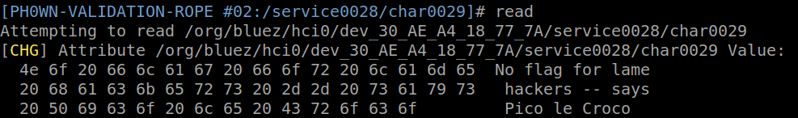
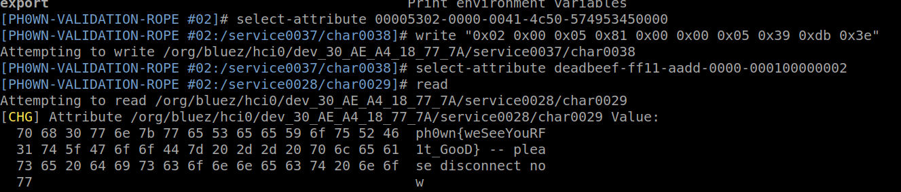

(Author's solution: cryptax)

# Overall strategy to solve

There are basically 2 ways to handle this challenge:

a) Sniff Bluetooth communication between smartphone and jump rope and see what command is sent to initiate a jump session of 1337 jumps.
b) or Reverse the Android app to understand what command is used to initiate such sessions


# Useful tools

On the smartphone, it is interesting to download the following apps:

- [nRF Connect](https://play.google.com/store/apps/details?id=no.nordicsemi.android.mcp)
- [Renpho Fit](https://apkpure.com/renpho-fit/com.renpho.fit)

# Finding the command through disassembly

We disassemble the Renpho Fit application with our favorite disassembler. The command to initiate a jump session with target jumps is located in `countDownNumTargetValue()` of class `Command` (package `com.renpho.fit.ble`).

```java
 public static byte[] countDownNumTargetValue(int arg20) {
        byte v1 = DeviceUtil.intToByte(2);
        byte v3 = DeviceUtil.inToByteTwo(5);
        byte v4 = DeviceUtil.inToByteOne(5);
        byte v5 = DeviceUtil.intToByte(0x81);
        byte v6 = DeviceUtil.inToByteFour(arg20);
        byte v7 = DeviceUtil.inToByteThree(arg20);
        byte v8 = DeviceUtil.inToByteTwo(arg20);
        byte v9 = DeviceUtil.inToByteOne(arg20);
        byte[] v11 = {v1, v3, v4, v5, v6, v7, v8, v9};
        byte[] v18 = CRCCheckUtil.hexStringInputToBytes(DeviceUtil.Bytes2HexString(v11));
        byte[] v10 = {v1, v3, v4, v5, v6, v7, v8, v9, v18[0], v18[1]};
        Log.e("TAG", "HEX=" + DeviceUtil.Bytes2HexString(v10) + ">>>>>>>>>>" + CRCCheckUtil.getOuputHex(DeviceUtil.Bytes2HexString(v11)));
        return v10;
    }
```

Methods such as `inToByteTwo` gets the higher byte of a 2-byte word. This method creates the following hex bytes:
`02 00 05 81 TT TT TT TT`, where TT is 4-byte integer representing the target number of bytes. Those bytes are followed by a 2 byte CRC.

We want to initiate a jump session for 1337 jumps. 1337 = 0x539. So, the command will be `02 00 05 81 00 00 05 39 CRC CRC`.

The CRC16 routine is implemented in `CRCCheckUtil` of `com.repho.fit.utils`. To compute the CRC for our command we have several solutions:

1. Copy paste `CRCCheckUtil` in a standalone program, feed in our command and compute the CRC.
2. Recognize the implementation of `CRCCheckUtil` and compute the CRC of our command on our own, for instance [online](https://crccalc.com/)
3. Insert a Frida hook to display the CRC computations of commands which are sent to the device.

We find out this is **CRC16/MODBUS**, and the CRC16 for our command in `DB 3E`.
The complete command to send is therefore `02 00 05 81 00 00 05 39 DB 3E`.

# Finding where to send the command

We can connect to the device using nRF Connect, or several other tools: Mirage, Bluetoothctl, gatttool...
The device has several services and we understand that:

- Service 00005301000000414c50574953450000 is the one to operate the jump rope
- Service f000ffc004514000b000000000000000 is for over the air firmware update
- the other services are generic ones to describe the device (name, model etc)

So, we will have to send our command to a characteristic inside service `00005301000000414c50574953450000`.
This service has 2 characteristics:

- `00005302000000414c50574953450000`: you can write to this characteristic 
- `00005303000000414c50574953450000`: you can read this characteristic or receive notifications

The service also have one 1 descriptor, whose UUID is `00002902-0000-1000-8000-00805f9b34fb`, which is typically used to request notifications.

# Sending the command

To *send* a command, we will obviously have to write to the only writable characteristic `00005302000000414c50574953450000`.

## Bluetoothctl

For example, with `bluetoothctl`, we can initiate a jump work out session of 1337 jumps:

```
# scan on
[NEW] Device 24:6F:28:7C:05:CA PH0WN-VALIDATION-ROPE #01
...
# connect 24:6F:28:7C:05:CA
# menu gatt
# select-attribute 00005302-0000-0041-4c50-574953450000
# write "0x02 0x00 0x05 0x81 0x00 0x00 0x05 0x39 0xdb 0x3e"
```

## Gatttool

Note that if you use *handles* instead of UUIDs, this must be sent to the *value handle* i.e 0x0010 (not 0x000f).
So, with `gatttool`:

```
gatttool -b 24:6F:28:7C:05:CA -I
[24:6F:28:7C:05:CA][LE]> connect
[24:6F:28:7C:05:CA][LE]> char-write-req 0x0039 0200058100000539db3e
```

## Smartphone nRF Connect

With a smartphone, it's possible to do it as well with nRF Connect app. Send a BYTE ARRAY to the corresponding UUID.


# Reading the flag

The Jump Rope validation server has an additional service, with a strange UUID: `deadbeefff11aadd0000000100000000000`.
This service has one readable characteristic. By default, the characteristic returns `No flag for lame hackers -- says Pico le Croco`.




But after you have written the correct jump command, the characteristic returns the flag: `ph0wn{weSeeYouRF1t_GooD} -- please disconnect now`.




# Misc

## Cancel work out

If you need to cancel the work out session: `char-write-req 0x0010 020005010000000047FC`

```
[24:6F:28:7C:05:CA][LE]> char-read-hnd 0x002a
```

## Finding info about a characteristic

```
# attribute-info  00005302-0000-0041-4c50-574953450000
Characteristic - Vendor specific
	UUID: 00005302-0000-0041-4c50-574953450000
	Service: /org/bluez/hci0/dev_DF_E5_34_0E_42_7D/service000e
	Flags: write-without-response
	Flags: write
```

## Complete script

```
menu gatt
select-attribute 00005302-0000-0041-4c50-574953450000
write "0x02 0x00 0x05 0x81 0x00 0x00 0x05 0x39 0xdb 0x3e"
select-attribute deadbeef-ff11-aadd-0000-000100000002
read
```
