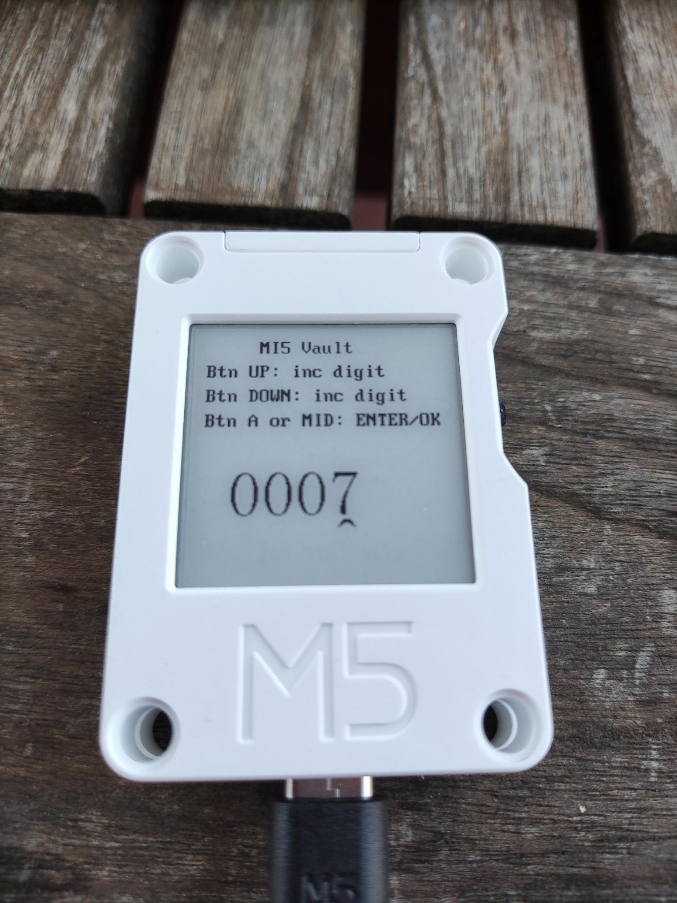
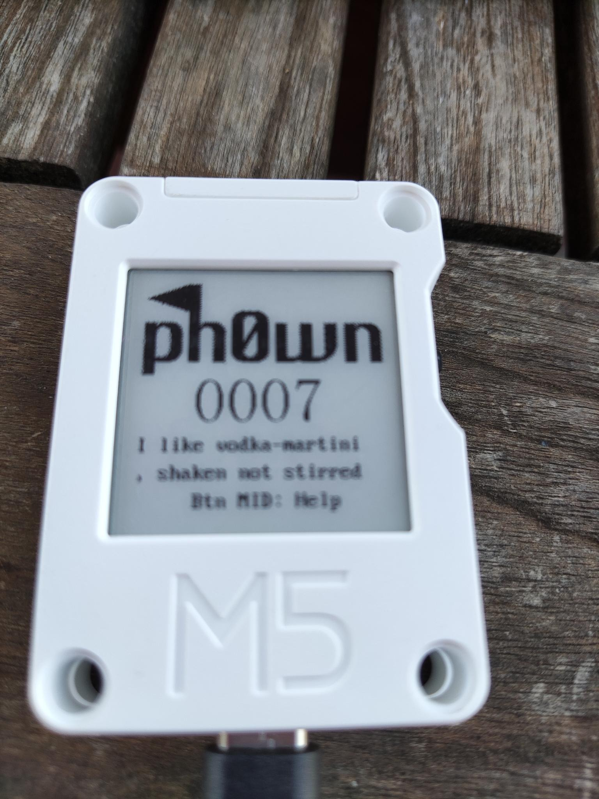
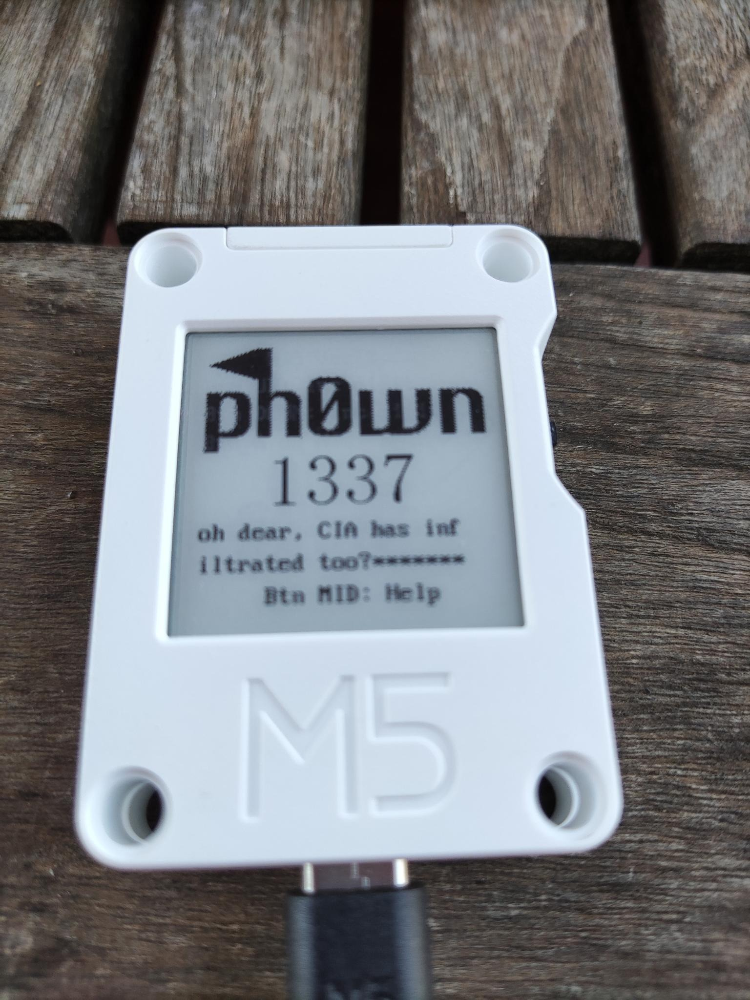
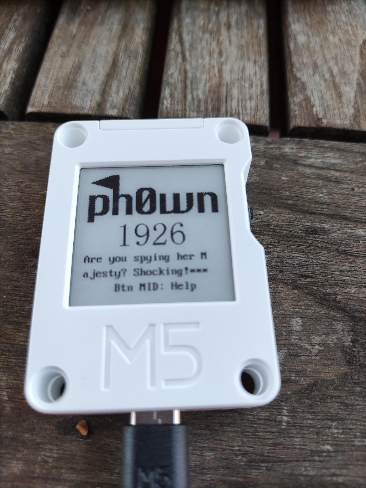

# MI5 Stage 2

- Category: Reverse
- Author: cryptax
- Points: 500
- Solves: 0

# Description

See `./mi5-stage1.md`

# Solution

During stage 1, we noticed the NVS had lots of information and a `ph0wn-challenge` namespace.
Let's read all information related to that namespace `grep -A 10 -i ph0wn dump.nvs`.

We spot a **key** with value 0x44 (68).

```
  Entry 41
  Bitmap State : Written
    Written Entry 41
      NS Index : 6
          NS : ph0wn-challenge
      Type : I32
      Span : 1
      ChunkIndex : 255
      Key : key
      Data (I32) : 68
```

We spot as well:

- `queen` with value `6438` (0x1926)
- `james-bond` with value `7`
- `felix-leiter` with value `4919` (0x1337)

We can try and read values for these on the device.




And others:




The `esp32_image_parser` is able to dump the NVS, but also to *convert a flash dump of an ESP32 to an ELF file*.
That's what we want to do! 


```
./esp32_image_parser.py create_elf ./to-reverse/flash_4M.bin -partition app0 -output ./to-reverse/app0.elf
```

There are many interesting strings (`strings app0.elf`).
This one mentions a flag:

```
[-] flag len is too big
```

This other one say we are writing "secrets" to the EEPROM

```
[+] writeSecret(): wrote %d bytes to EEPROM
```

Apparently, we also read the key we noticed in the NVS:

```
ph0wn-challenge
[+] Reading NVS preferences: key=0x%02x
```

Subliminal message on Pico:

```
Btn MID: help
[+] splashScreen() displayed. Pico is so charming ;)
```

and basically any message displayed on the screen or debug:

```
Btn UP: select account
Btn DOWN: list account
Btn A (top): read accnt
[+] instructionScreen() displayed - RTFM
...
MI5 Vault
Btn UP: inc digit
Btn DOWN: inc digit
Btn A or MID: ENTER/OK
MID/EXT -> ENTER: account[%d]=%1x
...
+] listScreen()
[-] too big bank account nb
[+] accountMenu(): readAddr=%d (%04x)
Ink Init failed
======= ph0wn MI5 challenge setup ========
Failed to initialise EEPROM!
Ink Sprite create failed
[+] Setup finished
```

This is the Queen's secret vault in `1926`

```
secret vault
1926 - HRH Queen
Elizabeth II
```



In between clear messages, we may also notice obfuscated strings:

```
4,t3*?'+*#6%07
4-'+
"+1* 
#%*#e9
6!d=+1d74=-*#d,!6d	%.!70={d
,+'/-*#e
d(-/!d2+ /%i)%60-*-hd7,%/!*d*+0d70-66! +,d !%6hd
d,%7d-*"-(06%0! d0++{Button MID Pressed
```

With `rabin2`, we get the addresses of the strings we want to investigate:

```
$ rabin2 -z app0.elf | more
[Strings]
nth  paddr      vaddr      len size section       type    string
――――――――――――――――――――――――――――――――――――――――――――――――――――――――――――――――
...
5    0x00000378 0x3f400120 23  24   .flash.rodata ascii   [-] flag len is too big
...
10   0x000003fd 0x3f4001a5 44  45   .flash.rodata ascii   [+] writeSecret(): wrote %d bytes to EEPROM\n
...
39   0x000006c5   40  41   .flash.rodata ascii   4,t3*?'+*#6%07\e4-'+\e=+1\e"+1* \e0,!\e#%*#e9
40   0x000006ee 0x3f400496 27  28   .flash.rodata ascii   6!d=+1d74=-*#d,!6d\t%.!70={d
41   0x0000070a 0x3f4004b2 59  60   .flash.rodata ascii   ,+'/-*#e\rd(-/!d2+ /%i)%60-*-hd7,%/!*d*+0d70-66! +,d !%6hd\a\r
42   0x00000746 0x3f4004ee 40  41   .flash.rodata ascii   d,%7d-*"-(06%0! d0++{Button MID Pressed\n
```

We disassemble the binary with `radare2`.

```
$ r2 ./app0.elf
e asm.emu=true
aaa
aae
```

The strings are at the expected place:

```
[0x40082ae4]> f~flag
0x00000000 8 rflags
0x3f400120 24 str.____flag_len_is_too_big
0x3f405ab3 81 str.E___u___s:__s__d_:_i2c_clock_choice_is_invalid__please_check_flag_and_frequency_n
0x3f409a70 67 str.___vd__flagsVECDESC_FL_SHARED__vd__flagsVECDESC_FL_NONSHARED__
```

The flag string is used in `fcn.400d1394`

```
[0x40082ae4]> axt str.____flag_len_is_too_big
...
fcn.400d1394 0x400d13b5 [DATA:r--] l32r a11, str.____flag_len_is_too_big
```

We disassemble the function: `pdf @ fcn.400d1394`.
There are 2 memsets of 21 0x00:

```
0x400d139a      1c5c           movi.n a12, 21              ; narrow move immediate ; a12=0x15
0x400d139c      0c0b           movi.n a11, 0               ; narrow move immediate ; a11=0x0
0x400d139e      ad07           mov.n a10, a7               ; narrow move ; a10=0x3ffc2985
0x400d13a0      25d9b4         call8 fcn.40086134          ; call PC-relative, rotate window by 8
0x400d13a3      a120fb         l32r a10, 0x400d0024        ; load 32-bit PC-relative ; a10=0x3ffc2970
0x400d13a6      1c5c           movi.n a12, 21              ; narrow move immediate ; a12=0x15
0x400d13a8      0c0b           movi.n a11, 0               ; narrow move immediate ; a11=0x0
0x400d13aa      a5d8b4         call8 fcn.40086134          ; call PC-relative, rotate window by 8
```

If flag len is bigger than 40, we print an error message and quit:

```
0x400d13ad      2c88           movi.n a8, 40               ; narrow move immediate ; a8=0x28 loc.XT_STK_A7
0x400d13af      511ffb         l32r a5, 0x400d002c         ; load 32-bit PC-relative ; a5=0x3ffc2e80
0x400d13b2      47b80a         bgeu a8, a4, 0x400d13c0     ; branch if greater than or equal unsigned ; pc=0x400d13c0 -> 0xfdfb1cb1 ; likely
0x400d13b5      b11cfb         l32r a11, 0x400d0028        ; 0x3f400120 ; "[-] flag len is too big" ; load 32-bit PC-relative ; a11=0x3f400120 -> 0x205d2d5b str.____flag_len_is_too_big
```

If the length is correct, we apparently read the EEPROM at a given address:

```
0x400d13c0      b11cfb         l32r a11, 0x400d0030        ; 0x3f400138 ; "Reading at addr=%d (0x%08x) key=0x%02x len=%d...\n"
...
0x400d13cd      25b602         call8 fcn.400d3f30          ; call PC-relative, rotate window by 8 ; fcn.400d3f30(0xfff, 0xfffff000, -1, 0x3ffc2e80, 0x1f3, 0x3ffc2985, -1, -1, -1, -1, 0x0)
```

Some time later, we see an XOR in a loop:

```
0x400d13d5      a117fb         l32r a10, 0x400d0034        ; load 32-bit PC-relative ; a10=0x3ffc2df4
0x400d13d8      6ab2           add.n a11, a2, a6           ; narrow add ; a11=0xfff
0x400d13da      65e020         call8 fcn.400f21e0          ; call PC-relative, rotate window by 8
0x400d13dd      30aa30         xor a10, a10, a3            ; bitwise logical exclusive or ; a10=0xc003ddf4
0x400d13e0      a09074         extui a9, a10, 0, 8         ; extract unsigned immediate ; a9=0xf4
0x400d13e3      a2c9e0         addi a10, a9, -32           ; add immediate ; a10=0xd4
```

What could we possibly XOR with? With a key of course! Remember we found a key in the NVS. 
(Note: if you do understand this, you're in for more reversing of ESP32...)
Now let's head back to the encrypted strings. Rabin told us it is in `0x3f40046d`

```
[0x3f40046d]> pd 1
            ;-- str.4_t3_6_07e4_e1e_1_e0__e_e9:
            ; DATA XREF from fcn.400d17c4 @ 0x400d1823(r)
            0x3f40046d     .string "4,t3*?'+*#6%07\e4-'+\e=+1\e\"+1* \e0,!\e#%*#e9" ; len=41
```

We XOR it with the key:

```
[0x3f40046d]> e io.cache=true
[0x3f40046d]> wox 0x44 @ str.4_t3_6_07e4_e1e_1_e0__e_e9
[0x3f40046d]> ps
ph0wn{congrats_pico_you_found_the_gang!}Are you spying her Majesty? Shocking!I like vodka-martini, shaken not stirredoh dear, CIA has infiltrated too?\x06100+*d\x09\x0d
```

We've got the flag for stage 2: `ph0wn{congrats_pico_you_found_the_gang!}`.
