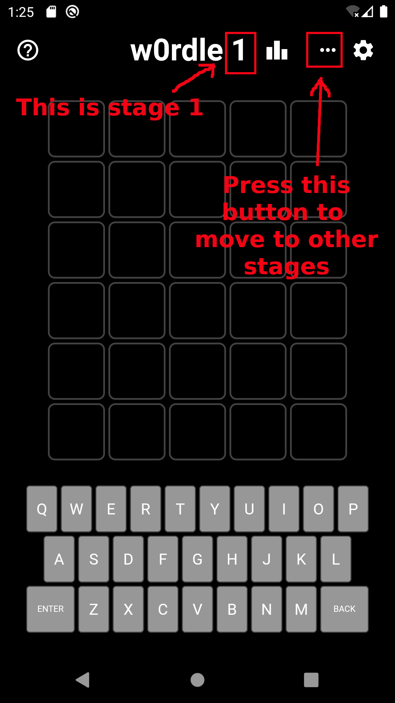
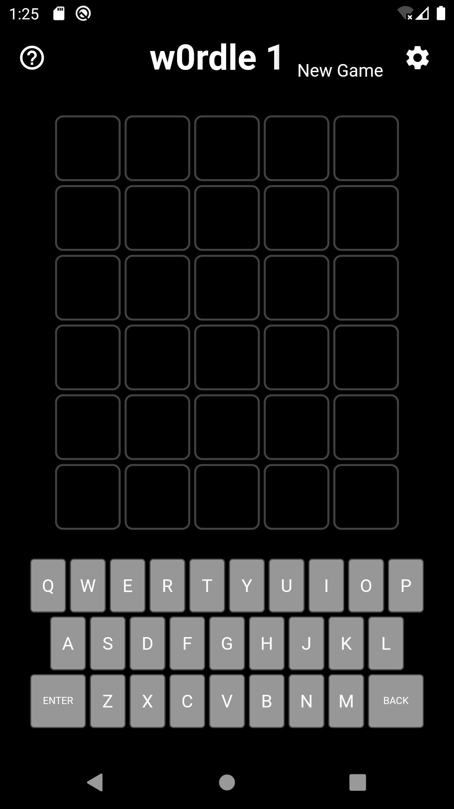
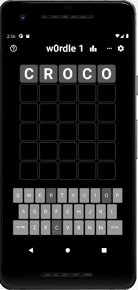
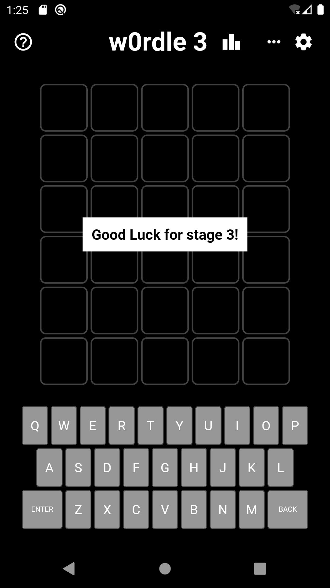

# W0rdle

This Android challenge was proposed at **Ph0wn 2022** with **2** stages.
We are releasing now a **third** stage for those of you who want moaaaar fun ;)
To switch between stages, find the button "New Game", and loop into stages 1 to 3.

{ width=40% }
{ width=40% }

- The app is `w0rdle.apk`. It has been tested on Android Emulator 10. It is not malicious.
- SHA256: `99068666d845bdf2513bca731ad95e4b21f6d0460925beaf881a649ce16a9c2e`
- Flag format: `ph0wn{.............}`
- *Author: cryptax*

Original description:

- Croc'Ado        - "Hey, Pico, I've implemented a new game, called w0rdle"
- Pico le Croco   - "Hi Croco'Ado. Yes, I know wordle. It's a game where you have to guess a 5-letter word. So easy."
- Croc'Ado        - "Ha! U're 2 old and rusty to solve this one :D"
- Pico le Croco   - "Me? Old and Rusty?!"
- Croc'Ado        - "You might find _stage 1_ if U're lucky. It's a Rookie. But you'll neveR find _Stage 2_. N0b0dy knows how to solve it."
- Pico le Croco   - "You brag too much Croc'Ado. Let me show you my skills."

Those teenagers really have no respect. Actually, this w0rdle turns out to be more difficult than expected. Please help Pico le Croco.
He'll reward you with flags :)

## W0rdle 1

W0rdle 1 is *very very simple*. You don't even need to code or read code ;P

{ width=40% }

- [Write-up for stage 1](./writeup-wordle1.md) - it's a write-up so it spoils it!

## W0rdle 2

W0rdle 2 was meant to be difficult... except there was an (unintended) flaw! A smart hack reveals the flag.

- [Write-up for stage2](./writeup-wordle2.md) - it's a write-up so it spoils it!

## W0rdle 3

W0rdle 3 should be as difficult! This challenge was added after Ph0wn 2022. 
Normally, it fixes the flaw of Stage 2 ;-)

{ width=50% }

- No write-up yet. Have you recovered the flag? **Submit your write-up with a Merge Request** :)
