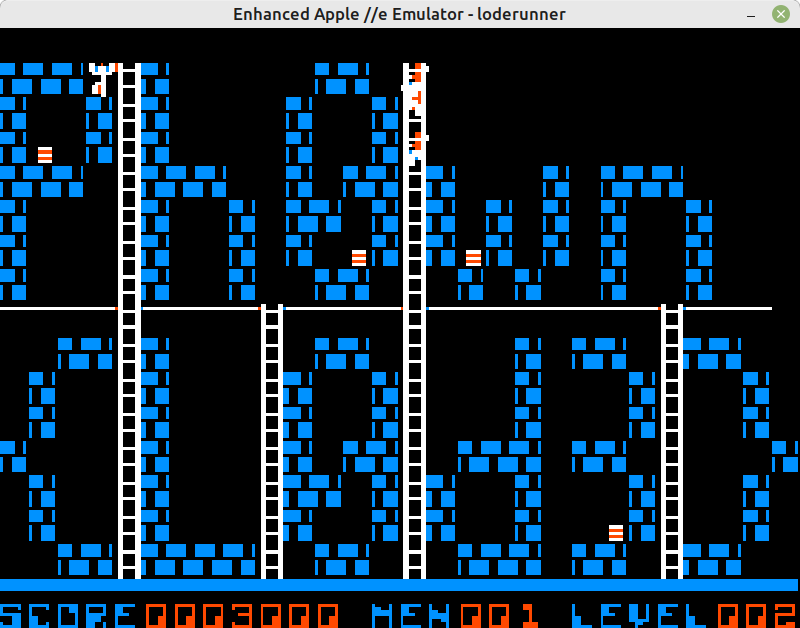

# Lode Runner

- Category: Rookie
- Author: euphoric
- Points: 43
- Solves: 9

# Description

Apple II Lode Runner (1983) is a strategy/puzzle platform game, where the goal is to collect all the gold in a level, to get to the exit at the top of the level. The challenge lies in the level design, and various enemies spread throughout. The only way to combat the enemy is to dig holes in the ground for them to fall into, and get temporarily trapped. There is no jumping. The levels contain only brick 'ground', ladders and overhead bars.The level and enemies are designed to test a layer mentally and physically, with problem solving and quick reactions needed to clear the more dastardly levels.

There are 150 levels. Can you get the flag? Good luck!

-    Keyboard controls for Lode Runner: https://entropymine.com/jason/lr/misc/controls.html
-    Wikipedia https://en.wikipedia.org/wiki/Lode_Runner

# Files

See `./files/loderunner.dsk`

# Solution

On Linux, install [LinApple](https://linapple.sourceforge.net/download.html).
Install the requirements: `sudo apt-get install libsdl1.2-dev libcurl4-openssl-dev zlib1g-dev libzip-dev`
Then, make `cd src; make`, and `sudo make install`.

To play:

- F1 for help
- F3 to load the loderunner disk
- F2 to reset and play the game
- F10 to exit
- ESC pause game

Keyboard:

- J left
- I up
- L right
- U dig left
- O dig right
- To activate Keyboard mode: Ctrl K (in my case only Right Ctrl K works)
- https://entropymine.com/jason/lr/misc/controls.html

As soon as you reach level 2, the flag is displayed:

On level 2 (where the flag is displayed), to win, you need to dig on the left of the ladder. But you don't need to achieve this level, as the flag is displayed.