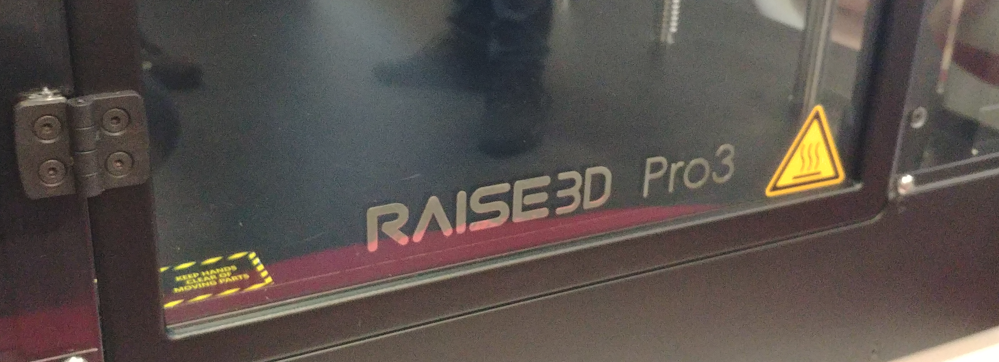

# Unlock Me 1

 
* **Author**: Lionel, TuxDePoinisse

* **Points**: 50
 
## Description
 
A very old secret has been locked for centuries. You might become rich by opening the chest. But for this, you need to design the key that will lead you to fortune! 
Good luck, and maybe you will discover a surprise :-)
 
PS. The chest is next to the big 3D Printer.

When your design is ready to print, book a slot on one of the 2 printers. Don't book a slot before.

 

## Solution

 ###  Design
 
Looking at the pdf, this plan looked pretty clear and I didn't expected complexe geometry requiring a lot of math, so I decided to use my preferred tool [OpenScad](https://openscad.org/)

Let's start start by measuring the key profile. 
 

That's where the problem begins, it was too simple to be true. A lot of measurements are missing from the document. Some guess work will be needed.
Comparing known cotations with other using drag and drop on pinta, I can verify that waht looks the same width is actually the same width  
  
   

   
  
Doing that for all the missing measurement, I manage to get the following measurements.  
  
  

```c
/* width of the profile, lenght of the profile */ 
key_profile = [ [2   ,10  ],
                [2   ,6.5 ],
                [1.5 ,10  ],
                [1.5 ,7   ],
                [1.5 ,4   ],
                [1.5 ,5   ]];
``` 
 
 
Now we need to create a module for exporting a single key profile 

```c
module profile( l , h ){
    diameter=5;
    rotate ([90,0,90]){
       cylinder(d=diameter , h=h, center=true,$fn=20);
       translate([l/2,0,0]) cube([l,diameter,h],center=true);
    }
}
``` 

 

And then to generate several of them and placing it at the correct distance from each other.

 ```c
 function offset(key_profile, i ) =  i > 0 ?  key_profile[i-1][0] + offset(key_profile, i-1 )  : 0;
 
 module full_profile(){
    for ( i = [0 : len(key_profile)-1] ){    
      echo ( offset(key_profile,i)  );
      translate([  offset(key_profile, i ) + key_profile[i][0]/2, 0 , 0]) 
      profile( key_profile[i][1] , key_profile[i][0] );
    }
}
``` 

 
 
We just need to add the rectangular bow and the shaft and not to forget to remove the 3mm hole.

 ```c
difference(){
   union(){
        translate([cylinder_h +cube_x/2,0,0])
        cube([cube_x,cube_y,cube_z],center=true);
        
        translate([cylinder_h/2,0,0])
        rotate ([90,0,90])cylinder( d=cylinder_d , h=cylinder_h, center=true,$fn=20);

        full_profile();
      
   } 
   
    translate([hole_h/2,0,0])
    rotate ([90,0,90])
    cylinder(d=hole_d , h=hole_h, center=true,$fn=20);
}
```

 
 
 
 
 ###  Time to 3d print
 
Openscad generates a .stl file. This cannot be directly used by the 3d printer. We first need to slice it.  
 For that I used [Cura](https://ultimaker.com/fr/software/ultimaker-cura) (sudo apt install cura). Cura propose a list of know 3d printer, I didn't found exactly the one from the ph0wn, but something close enough (Raised3d pro 2)
 
 
 At first I have sliced myself using the default configuration for PLA. I copied the file to a usb drive and went to the Printer.

 Issues: 
- The print only recognize Fat32 partition  
- Nothing came out of the printer.  

With the organizer we started to debug the 3D printer. As every 3d printer enthousiaste knows, that's part of the joy of owning the a 3D printer. 
First, the organizer sliced himself my .stl with its own slicer.  
=> same results, nothing came out of the extruder nozzle.

Then, add a second PLA spool to use the second extruder.  
=> same results, nothing came out of the 2nd extruder nozzle.

After a few debugging attempts, a power cycle reset has been done on the 3d printer.  
=> It solved all the problems.
 
 
I printed my key and miracle, I have been to open the first box.  
 
 
And found the flag  

 

Remark:  
  
 once I manage to get the flag, the organizer told me that the key design was avaialbe on thingiverse, and indeed in the top results for "padlock", the [key](https://www.thingiverse.com/thing:27205) can be found.

# Unlock Me 2


* **Author**: Lionel, TuxDePoinisse
* **Points**: 100


## Description

Now that you opened the first chest (Unlock Me 1), you need to design yourself the key to open the next one.

When your design is ready to print, book a slot on one of the 2 printers. Don't book a slot before.

 
You need to have solved Unlock Me 1 to solve Unlock Me 2!


## Solution

 ###  Design
 
 Here there are no plan to follow, the reference is an existing key.  
 So to create the new key, we need to get the measurement from the key.  
     
 2 methods:  
1.  Try to measure the key: it helps but it is not enough  
 
  
 
2.  Compare with previous the key: it is easier to compare the height of the teeth with this method.  
 
  
 
 Since the design for the part one of the challenge is using parameters, I only need to change
 
```c
key_profile = [ [2   ,10  ],
                [1.5 ,6.5 ],
                [1.5 ,7   ],
                [1.5 ,10  ],
                [1.5 ,4   ],
                [1.5 ,5   ]];
``` 


  
 
  ###  Time to 3d print
 This time no issue to report. The printer was available and I managed to print directly the key.  
   
After opening the 2nd box, there was a treat waiting for me :). I will be honest, I didn't share with the rest of the team.  
  
 
And also the flag, well hidden in the box. Well enough for me to wonder..  
 
