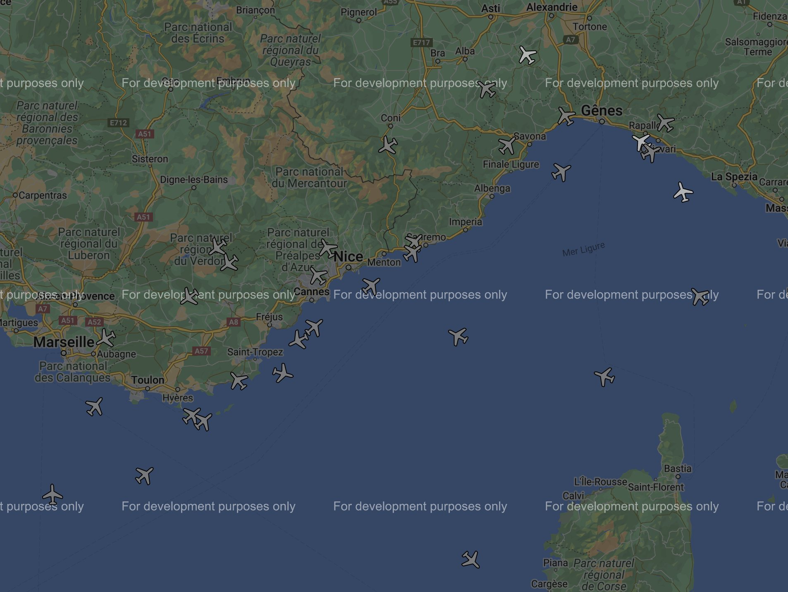

# Flying to Ph0wn

- Category: Web
- Author of the challenge: TuxDePoinsisse
- Author of the writeup: cryptax
- Points: 134
- Solves: 9

# Description

Seems like there is a lot of (ph0wn) air traffic tonight.

Are you a good air controller? If so, you should really have a closer look at these planes.

http://local-address-during-ph0wn:8080 

Note: You may get an "impossible to load ..." when connecting on the webpage, simply click on OK and ignore this error message.

# What you see

Thanks to Fabien's antenna, Tux was able to see planes as far as Pisa, Italy!

