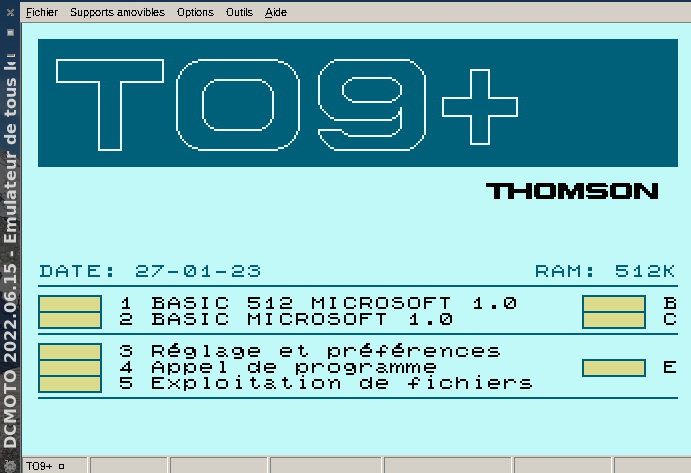
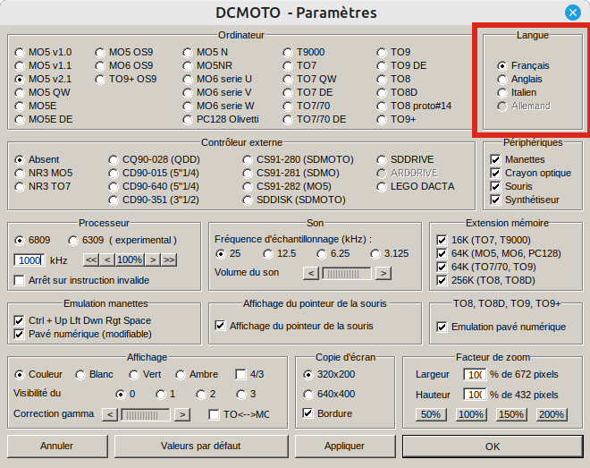
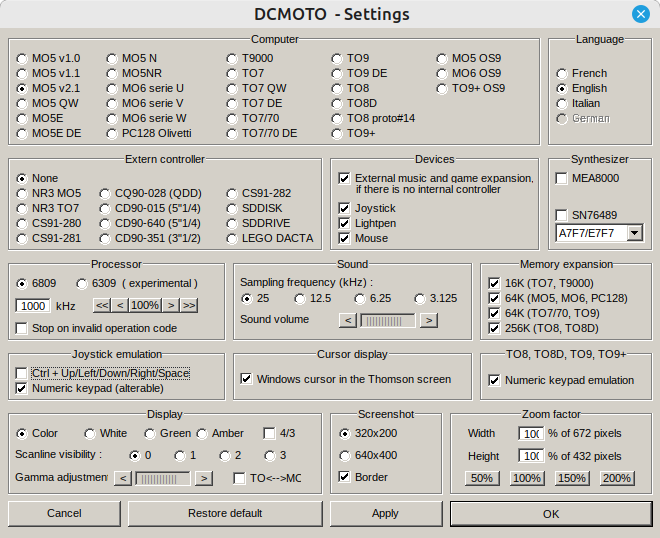
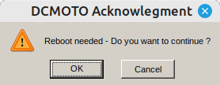
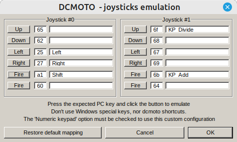
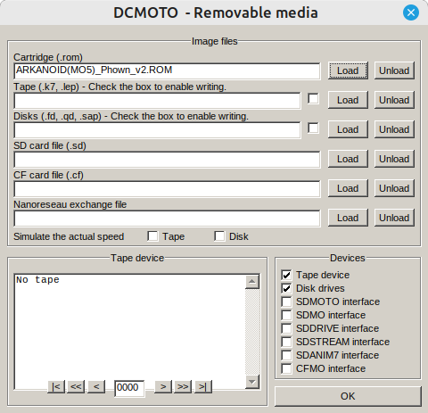
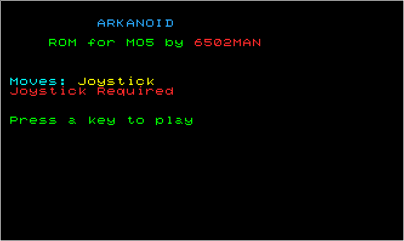
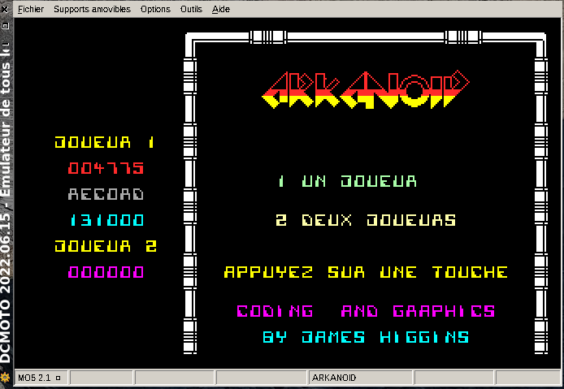
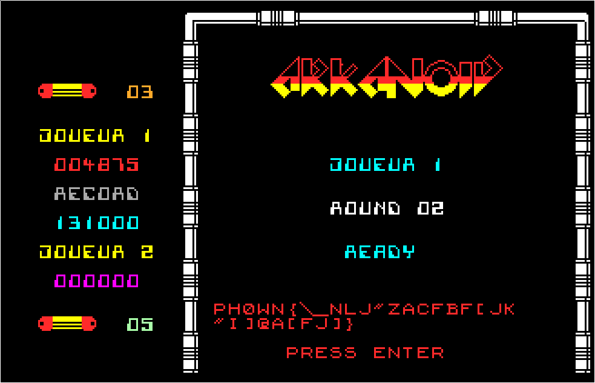

# Arkanoid by 6502man / Cryptax

This Rookie challenge was created by **6502man**. The write-up is by *Cryptax*.

## Description

Challenge description is very brief, we merely get a a ROM `ARKANOID(MO5)_Phown_v2.ROM`.

## Running the game

Arkanoid is an old Thomson MO5 game + the ROM's file name mentions MO5. Actually, the main complexity of this challenge is to manage to run the game!

Run it in the [DCMoto](http://dcmoto.free.fr/) Thomson Emulator.

- Install [DCMoto](http://dcmoto.free.fr/). Download it from [here](http://dcmoto.free.fr/emulateur/prog/dcmoto_20230208.zip). The download user is `dcmoto` and password `thomson`. 
Note. This is a free software, the credentials are used to detect robots.

```
1ec2838dc0970dbb6a67aaef7d792e7876755e310e03ca7203a1dac51ea1d4c4  dcmoto_20230208.exe
```

- Launch DCMoto. On Linux, it works well with Wine: `wine ./dcmoto/dcmoto_20220615.exe`

{ width=70% }

{ width=70% }

### Switching to English

If needed, you can change the language of DCMoto. From the main screen, click on **Options**.
In the upper right corner, select the language of your choice.

{ width=70% }

### Configuration to support MO5 games


Go to **Options**:

- Select **M05 v2.1**
- Devices: make sure *Joystick* is present
- Joystick emulation: select "Numeric keypad (alterable)"
- Memory expansion: leave them all selected.
- Click OK

{ width=70% }

{ width=70% }

### Configure Joystick

Go to **Tools**. You need to configure Left and Right keys of Joystick #0. 
To configure a key, you must press on the select key of your keyboard (keep it pressed), then click on the button, then release the key.

{ width=70% }


### Configure removable media

Go to "Removable Media".
In "cartridge (.rom)", select the Arkanoid ROM.

{ width=70% }

Your screen should change to the following:

{ width=70% }

Then, there is a "Decrunching" screen. Wait. Then the game asks for 1 or 2 players.

{ width=70% }

Wait a little. The game will automatically start.

To play the game:

- Use the keys you configured to move Left and Right.
- 3 Num Pad: Zoom -
- 9 Num Pad: Zoom +
- P pause

## Troubleshooting

If you can't move, go back to Options:

- Try the Joystick emulation option "Ctrl + Up/Left/Down/Right/Space"
- Deselect devices such as Lightpen, music and mouse.
- Perform a Hard Reset

On new Macs, you cannot use wine32. The workaround is to run a VM of Kali, and use wine32 and DCMOTO inside that VM.

The game does not work (yet?) with MAME.

To configure the directory to read ROMs: Options > Select ROM, then configure directories.

## Cheating

It is possible to slow down the game with a lower refresh frequency in DCMoto: Options > Processor.
By default, it is 1000kHz. Try 800 kHz.

## Flag

Complete level 1 to see the flag.

{ width=70% }

\newpage
