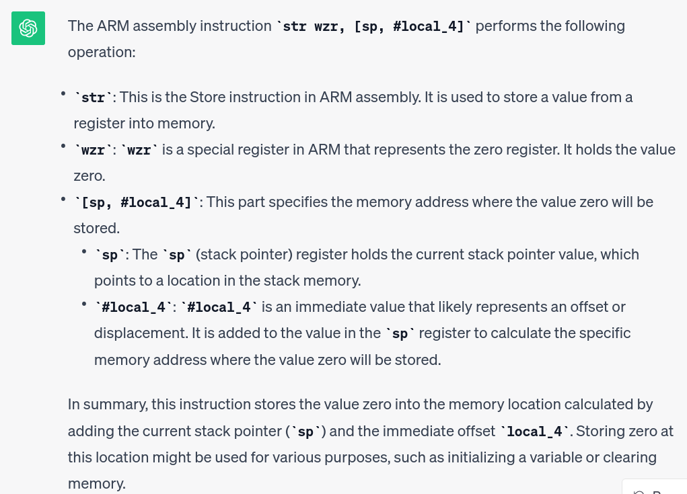
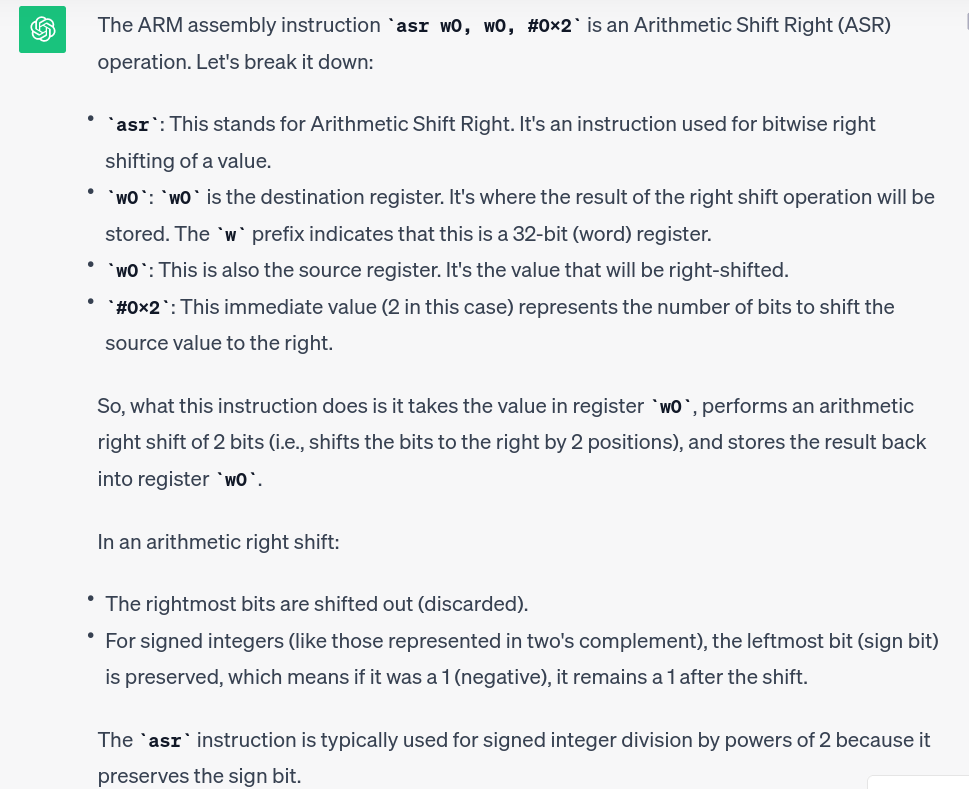

# Chat With Pico - Reverse

We get the assembly output by Ghidra.
ChatGPT can be used to help understand the assembly.

## Preambule

This is the typical routine preambule where registers are pushed on the stack and the stack pointer is updated.

```
stp        x29,x30,[sp, #local_20]!
mov        x29,sp
```

## Loading data

The program loads address 0x00100910 into register x2. The address is computed from `0x100000 + 0x910`

```
adrp       x0,0x100000
add        x1,x0,#0x910
...
ldr        x2,[x1]=>DAT_00100910 
```


The data is saved in a local variable named `local_10`.

```
str        x2,[x0]=>local_10
```

Then, some more data is loaded from address 0x100918, and stored in `local_8`. We only store a single byte (`strb`) from this address.

```
 ldrb       w1,[x1, #0x8]=>DAT_00100918
 strb       w1,[x0, #local_8]
```

The values which are loaded are provided by Ghidra on the right hand side:

- 434F52434F434950h
- 4Fh

Those are the ASCII values of `CORCOCIP` and `O`. If you know a little about ARM, or about Ph0wn's mascot, you'll realize ARM values are in reverse order and that the string is `PICOCROCO`.

## Print message

There is a call to `printf` to display the string "The code to unlock the safe is:"

```
add        x0=>s_The_code_to_unlock_the_safe_is:_
bl         <EXTERNAL>::printf  
```

## Loop

The next instruction `str        wzr,[sp, #local_4]` stores 0 in a local variable named `local_4`. We'll soon understand this is a loop counter, and we are thus initializing it.



Then, we go to `LAB_0010081c` (unconditional branch) where we check if the loop end conditions are met or not. 

The counter is loaded in register w0 and compared to fixed value 8. If the counter is less or equal than 8, the loop will continue (branch back to `LAB_001007ec`). 

```
ldr        w0,[sp, #local_4]
cmp        w0,#0x8
b.le       LAB_001007ec
```

Otherwise, it will print character 0xa, which is `\n` (line break) and end the program.

## Decoding algorithm

Let's go into the content of the loop, which begins at `LAB_001007ec`.

```
ldrsw      x0,[sp, #local_4]
add        x1,sp,#0x10
ldrb       w0,[x1, x0, LSL ]
```

Remember that data was saved in `local_10` which is located at `sp + 0x10`.
So, (1) we load our counter value in register x0, (2) load the data in x1, then (3) we read a single byte from address x1 + x0. This actually means we are getting the x0-th character of our data.

Then, we do some transformation on the byte: (1) we substract 0x3c (=60) and (2) we perform a right shift of 2 bits:

```
sub        w0,w0,#0x3c
asr        w0,w0,#0x2
mov        w1,w0
```

If you don't know the ASR instruction, ChatGPT is there to quite good at understanding assembly.



The final result is stored in `w1`.

Then, the program calls `printf` to display something. The `printf` function begins with a format string, and then the values to be printed.

```
adrp       x0,0x100000
add        x0=>DAT_00100908,x0,#0x908
bl         <EXTERNAL>::printf
```

The format string is located at address 0x100908. Ghidra provides its content on the right side `25h`. Unfortunately, it is truncated and it is really `25h 69h 00h` which is the ASCII for `%i`.
So, the loop prints an *integer*.

Where is the integer? ChatGPT replies the arguments are typically in `w1` but "that depends on the specific format string" (imagine our format string has 0 arguments, or more than 1!). In our case, we have a single argument expected from the format string, so, yes `w1` contains the integer which will be printed.


We don't really need to understand more of the disassembly to work out the expected PIN code, but for the beauty of it, let's explain the remaining lines:

```
ldr        w0,[sp, #local_4]
add        w0,w0,#0x1
str        w0,[sp, #local_4]
```

They simply consist in loading back the value of the counter, incrementing it and storing the new value. 

## Computing the PIN code

The algorithm to apply is the following:

- Load string "PICOCROCO"
- For counter 0 to 8 included, modify each character by substracting 0x3c and right shifting 2 bits
- End

The solution in C:

```c
#include <stdio.h>

#define LEN 9

void main() {
  char pincode[LEN] = "PICOCROCO";
  int i;
    
  printf("The code to unlock the safe is: ");
  for (i=0; i<LEN; i++) {
    printf("%i", (pincode[i] - 60) >> 2);
  }
  printf("\n");
}
```

Will give you code: `The code to unlock the safe is: 531415414`


```python
s = 'PICOCROCO'
for i in range(0,9):
	print((ord(s[i]) - 0x3c) >> 2)
```	

## Solution

`531415414`
