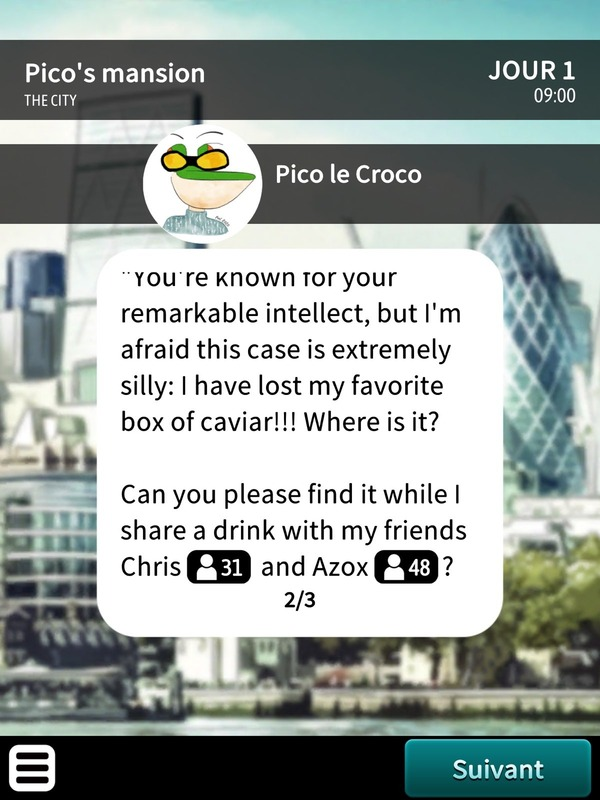

# Chronicles of Caviar by Cryptax

## Description

This challenge consists in a Ph0wn community scenario for the board game "Chronicles of Crime". We are told to load a scenario named "Missing Caviar".

## Playing the game

We are at Pico le Croco's mansion. The story is guided and we are asked to talk to Pico. He tells us he has lost a box of caviar and wants us to find it while he chats with 2 friends, Chris and Azox.

{ width=50% }

Both Chris and Azox are actually Ph0wn CTF players who solved the Ph0wn CTF teaser respectively first and second. They are not useful to find the flag in this scenario, but were added to congratulate them.

### Search the scene

The first thing to do in scenarios of Chronicle of Crime is usually to search the scene. The scene is a 360 image of a luxurious living room. There are several objects: a TV set on the wall, plants, cushions and furniture.

{ width=40% }

We scan the "High tech devices" evidence card for the TV, and there's a message on its back suggesting to connect to 34.76.5.130 on port 9910, with password `CapitaineFlam`. 

{ width=40% }

We try that and get some indications for the flag:

```
$ telnet 34.76.5.130 9910
Trying 34.76.5.130...
Connected to 34.76.5.130.
Escape character is '^]'.
Enter password: CapitaineFlam
The flag is: ph0wn{Found_X}
where X remains to find in the box of caviar
Connection closed by foreign host.
```

### Plants

We have part of the flag. We continue and scan "Plants".
It tells us we have found the box of caviar! Pico is going to be happy.

{ width=40% }

The game suggests we should scan the box, so that's what we do.
But it doesn't seem to work: the game tells us the item "is not present, or not relevant to your case". That's strange.

If we scan the game's special item 05, it instructs us specifically to scan the card created for Ph0wn.

So, what special can this card have? It's a QR code. Let's scan the QR code! And bingo, it gives us the missing part of the flag.

{ width=50% }

We can quit the game, and flag: `ph0wn{Found_cAv1aR_DeLuXX4pic0}`


\newpage
