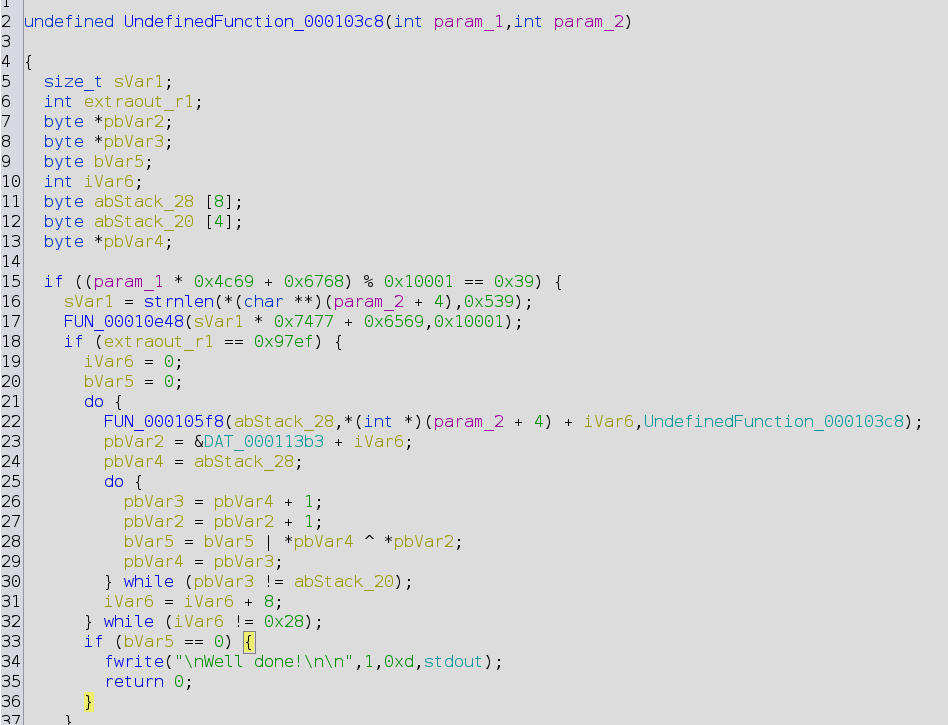

# Light weight but heavy duty by Cryptopathe and Cryptax

This challenge was created by *Cryptopathe* for Ph0wn 2023. The write-up was written by *Cryptax*.

## Description

```
Pico le Croco, in need of securing his luxurious jacuzzi installation, enlisted the services of a renowned cryptographer, who goes by the name Lars Bogdanov, or something along those lines. Can you crack the algorithm designed to protect the jacuzzi's remote control?
```

An ARM32 binary is provided, stripped.

## The hidden hint of the description Hint

The description talks about *Lars Bogdanov*. This is likely a hint, so I searched for "Lars Bogdanov crypto algorithm".
It immediately lists a crypto algorithm named PRESENT, which was designed by *Andrey* Bogdanov and *Lars* Knudsen, as
well as 6 other cryptographers.

[This algorithm](https://www.iacr.org/archive/ches2007/47270450/47270450.pdf) is an "ultra-lightweight block-cipher". It is meant to be suitable for "extremely constrained environments such as RFID tags and sensor networks".

## Reverse

We run the binary, it returns "Game over, try again!".

We list strings of the binary. The only interesting strings are "Game over" and "Well done!". There are possibly some encrypted strings afterwards.

```
$ strings ./lightweightbutheavyduty_armv7
..
Game over, try again!
Well done!
r310f6gc"fs'vwb27#&x9<mi(ly-|}h8=),
p14ea dq%tu`05!$z;>ok*n{/~
```

### Starting from the strings

We throw the binary in Ghidra. The 2 strings are located at `0x10f78` and `0x10f94` respectively. We search cross references for "Well done!". It is only used in `0x1040c`. This is part of a function at `0x103c8`, that Ghidra claims to be *undefined* for some reason.



Ghidra claims the function to be *undefined*, which is strange. We check with Radare2, which has no issue with it and says it is actually the `main`.

```
[0x00010508]> f~Well
0x00010f94 14 str._nWell_done__n_n
0x00010f94 13 str.Well_done_
[0x00010508]> axt 0x00010f94
main 0x104c0 [DATA:r--] ldr r0, str._nWell_done__n_n
(nofunc) 0x10504 [NULL:r--] muleq r1, r4, pc
```

Knowing this, we know that `param_1` is `argc`, and `param_2` is `argv`.

### main

The `main` starts with by a strange computation, which is probably created to obfuscate an argument count.

```c
  if ((argc * 0x4c69 + 0x6768) % 0x10001 == 0x39) {
```

We can quite simply solve the equation by running a quick script such as this one, where we test possible argument counts between 0 and 40 (there's not going to be more than 40 arguments!):

```python
for i in range(0, 40):
  c = (i * 0x4c69 + 0x6768) % 0x10001
  if (c == 0x39):
    print(i)
    break
```	
The answer is **2**. In C, remember that the name of the program is included in the `argv` table, so this means the program expects 1 additional argument.

Then, there is another strange computation. We'll skip it, because similarly to the first one it's probably there just to check arguments and make us lose time.

```c
sVar1 = strnlen(*(char **)(param_2 + 4),0x539);
FUN_00010e48(sVar1 * 0x7477 + 0x6569,0x10001);
if (extraout_r1 == 0x97ef) {
```

In the remaining code of `main`, we identify a loop which ends when `iVar6` is `0x28` (decimal: 40). The loop calls a processing function `FUN_000105f8` on `*(int *)(param_2 + 4) + iVar6`, which is a pointer on part of the input argument. Also, note that we increment `iVar6` by 8.

```c
      iVar6 = 0;
      bVar5 = 0;
      do {
        FUN_000105f8(abStack_28,*(int *)(param_2 + 4) + iVar6,UndefinedFunction_000103c8);
        pbVar2 = &DAT_000113b3 + iVar6;
        pbVar4 = abStack_28;
        do {
          pbVar3 = pbVar4 + 1;
          pbVar2 = pbVar2 + 1;
          bVar5 = bVar5 | *pbVar4 ^ *pbVar2;
          pbVar4 = pbVar3;
        } while (pbVar3 != abStack_20);
        iVar6 = iVar6 + 8;
      } while (iVar6 != 0x28);
```

This is what we understand so far:

1. `iVar6` is an index in the input argument
2. The input argument is expected to be 40 bytes long
3. The processing function, `FUN_000105f8` take 3 arguments. The first one is an array of 8 bytes. The second one is a pointer on part of user input. The third argument is strange: a function pointer.
4. After the call to the processing function, there is some computation that we'll explain afterwards.

After the loop, we check `bVar5`. If it is 0, we are in the success case, otherwise, game over.

```c
      if (bVar5 == 0) {
        fwrite("\nWell done!\n\n",1,0xd,stdout);
        return 0;
      }
    }
  }
  fwrite("\nGame over, try again!\n\n",1,0x18,stderr);
  return 1;
}
```

We can understand `bVar5` better by going back to the computations in the loop. `pbVar2` points to (fixed) data. `pbVar4` points to the first argument which was provided to `FUN_000105f8`. As `FUN_000105f8` does not return any value, it probably updates its first argument. See it as an output argument.

```c
	    pbVar2 = &DAT_000113b3 + iVar6;
        pbVar4 = abStack_28;
        do {
          pbVar3 = pbVar4 + 1;
          pbVar2 = pbVar2 + 1;
          bVar5 = bVar5 | *pbVar4 ^ *pbVar2;
          pbVar4 = pbVar3;
        } while (pbVar3 != abStack_20);
```

Then, we see there is another loop (do..while) where `pbVar4` and `pbVar2` are incremented. The loop ends when `pbVar3`
now points to `abStack_20` which is an array just after `abStack_28`. In other words, the loop ends when all bytes of
`abStack_28` have been processed.

```c
byte abStack_28 [8];
byte abStack_20 [4];
```

The core of the loop is this line:

```c
bVar5 = bVar5 | *pbVar4 ^ *pbVar2;
```

Basically, this performs an XOR between the current byte of `pbVar4` and the one of `pbVar2`. An XOR is a simple
comparison function: it returns 0 if both elements are equal, and a non-zero value if they are different. 
So, `bVar5` will be equal to 0 if all previous bytes of `pbVar4` were equal to those of `pbVar2`.
This is a (constant-time) byte array comparison!

At this point, we know that:

1. `abStack_28` is the expected value
2. We will get in the success case if our input matches the expected value

### Processing function `FUN_000105f8`

We get into `FUN_000105f8` which is clearly horrible or beautifully mathematical (select your version from your point of view!). Quite certain this is an *encryption* algorithm.

```c
uVar36 = (uint)(byte)(&DAT_00010fa4)[(uVar20 | (bVar6 & 7) << 5) >> 4] | uVar20 & 0xf;
uVar33 = (byte)(&DAT_00010fb4)[bVar14] & 0xffffffc0 | (byte)(&DAT_000110b4)[bVar12] & 0x30 | (byte)(&DAT_000111b4)[bVar11] & 0xc | (byte)(&DAT_000112b4)[bVar13] & 3;
uVar23 = (byte)(&DAT_00010fb4)[bVar15] & 0xffffffc0 | (byte)(&DAT_000110b4)[bVar16] & 0x30 | (byte)(&DAT_000111b4)[bVar17] & 0xc | (byte)(&DAT_000112b4)[bVar18] & 3;
uVar31 = (byte)(&DAT_000112b4)[bVar14] & 0xffffffc0 | (byte)(&DAT_00010fb4)[bVar12] & 0x30 | (byte)(&DAT_000110b4)[bVar11] & 0xc | (byte)(&DAT_000111b4)[bVar13] & 3;
```

We inspect `DAT_00010fa4`:

```
00010fa4 c0     ??        C0h
00010fa5 50     ??        50h    P
00010fa6 60     ??        60h    `
00010fa7 b0     ??        B0h
00010fa8 90     ??        90h
00010fa9 00     ??        00h
00010faa a0     ??        A0h
00010fab d0     ??        D0h
00010fac 30     ??        30h    0
```

We throw the values in a browser to see if that's related to a known algorithm:

{ width=70% }

The first link points to [lightweight crypto website](http://www.lightweightcrypto.org/downloads/implementations/present.h) with an implementation of ... PRESENT. Again, PRESENT!

So, `FUN_000105f8` probably implements PRESENT encryption or decryption.

### Recovering the key

Remember the call to `FUN_000105f8`:

```c
FUN_000105f8(abStack_28,*(int *)(param_2 + 4) + iVar6,UndefinedFunction_000103c8);
```

Now we understand that:

1. The first argument is the result of the PRESENT encryption or decryption function.
2. The second argument is the user input.
3. Has to be the key! So, the key is the first byte of the main function! Nice.
4. If the result is equal to the expected result, we are successful. As the flag is not among the strings of the program, this means the expected result is an *encrypted flag*. Consequently, `FUN_000105f8` is an encryption function.

Let's get the key. PRESENT uses 80-bit or 128-bit keys. For lightweight encryption, it's likely to be 80 bits, i.e., 10 bytes.


So, the bytes of the key should be `00 31 80 e0 08 21 9f e5 03 33`

### Recovering the expected ciphertext

The expected ciphertext is located at `0x000113b3 + 1` (there's +1 because we increment `bVar2` before the XOR).

{ width=80% }

The expected length of the input is 40 bytes. This is exactly 5 blocks of 8 bytes. So, the expected output is going to be of 40 bytes too: `47 c8 a2 e0 ba de ...`

### Decrypting the flag

I used this [implementation in Python](http://www.lightweightcrypto.org/downloads/implementations/pypresent.py) but it was written for **Python 2.7**. So, either we port it to Python 3, or we use Python 2.7. I preferred to use a Python 2.7 environment ;-)

We just need to ask it to decrypt or expected ciphertext with the key we found.

```python
# Use Python2.7 for this implementation...
from pypresent import Present 

key = '003180e008219fe50333'
ciphertext = '47c8a2e0bade478e23290dec2a116f4b7a273d9516fe45d1b5fe2e92916e2ef1e3e219b38cd0e687'

# check lengths
assert(len(key) / 2 == 10)
assert(len(ciphertext) / 2 == 40)

# decrypt
cipher = Present(key.decode('hex'))
plaintext = ''
for i in range(0, 80, 16):
    plaintext = plaintext + cipher.decrypt(ciphertext[i:i+16].decode('hex'))

# display
print(plaintext)
```

It returns the flag: `ph0wn{!!n0t-l1ghtweight-crypt0-5killz!!}`

\newpage
