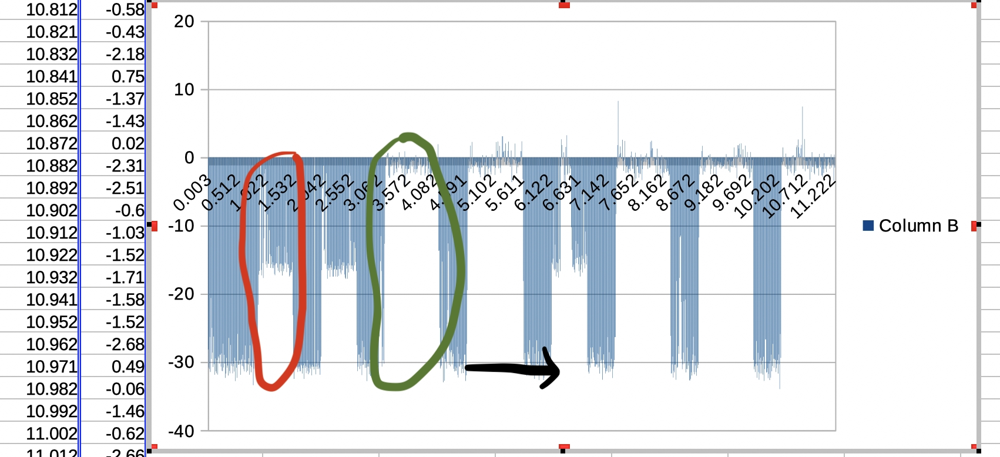

# Magneto by Ludoze

This challenge was created by *Ludoze*.

## Description

Magneto has contaminated my computer with his Nokia 3120... but maybe he sent a magnetic message on it? Retrieve it, and become a real X-Pico!

 
## Magnetism?
A laptop is provided, but it is forbidden to use it or to connect to it ...

Since the name of the challenge is "magneto", the first idea is to listen to the magnetic field emitted by the laptop. For this, we have first installed the [Physics toolbox](https://play.google.com/store/apps/details?id=com.chrystianvieyra.physicstoolboxsuite) Android app on our ph0wn.

(The current version of physicstoolboxsuite couldn't save the trace on our phone, so we had to downgrade to version 2020.11.19)

Once started, we select "Magnetometer": we can visualize the magnetic field around. Then, we can put the phone around to figure out where the magnetic field seems to change over time. Progressively, we note that the middle top part of the keyboard seems to lead to a regular change in the magnetic field. 

{ width=70% }

Thus, we put the phone on the laptop, and start recording the magnetic field using the app. From the previous image, it is quite clear that the field has three main position: a top one, a middle one, and a low one, which is short. The high one is the longest. A first idea is obviously that the high one corresponds to a "1", the middle one to a "0" and the low one is the separator between 0 and 1.


## Analyzing the csv file

In the app, we visually noticed that the "z" component is the most significant one: we thus decided to focus on it. In the following image, one can notice that there are two different schemes: the one circled in  red, and the one circled in green:

- The one in green has a quite constantly high magnetic field
- The one in red has an average magnetic field, even if high peaks can sometimes be noticed.
- There is around one second between two schemes (black arrow)



So, if we try to summarize the analysis: basically, the magnetic field goes between 0 and -30, -25 or lower being a value representing the separator, -15 being close to a "0" and 0 or a bit less being probably a "1" (or the opposite).

## Coding a CSV analyzer

We assume we have four columns in the CSV: time, x-magnetic, y-magnetic, z-magnetic and xyz-magnetic. We just need column time and z. We can make the following Java program to analyze the CSV. With Data being an object with two double fields (time and value).

```java
public class Analyzer {
    public static int ONE_MIN_VALUE = -5;
    public static int SEPARATOR_MAX_VALUE = -28;
    public static int TIME_BETWEEN_2_VALUES = 1;
    public static int MIN_NUMBER_OF_ONE = 20;

    public static void main(String[] args) {
        if (args.length < 1) {
            System.out.println("Usage: java Analyzer file.csv");
            System.exit(0);
        }

        String pathToCsv = args[0];
        ArrayList<Data> dataList = new ArrayList<>();

        try (BufferedReader br = new BufferedReader(new FileReader(pathToCsv))) {
            String line;
            boolean firstLine = true;
            while ((line = br.readLine()) != null) {
                if (firstLine) {
                    firstLine = false;
                } else {
                    String[] values = line.split(",");
                    double time = Double.parseDouble(values[0]);
                    double value = Double.parseDouble(values[3]);
                    dataList.add(new Data(time, value));
                }
            }
        } catch (IOException e) { e.printStackTrace();}

        int foundSep = 0; int foundOne = 0; double initTime = 0;
        String binary = "";
        for (Data sep : dataList) {
            System.out.println("New sep: ( " + sep.time + " , " + sep.value + " )");
            if ((foundSep == 0) && (sep.value < SEPARATOR_MAX_VALUE)) {
                System.out.println("Found sep 0");
                foundSep = 1;
                foundOne = 0;
                initTime = sep.time;
            } else if (foundSep == 1) {
                System.out.println("Sep 1");
                if (sep.value > ONE_MIN_VALUE) {
                    foundOne++;
                    System.out.println("foundOne ++ ; foundOne=" + foundOne);
                }
                if ((sep.value < SEPARATOR_MAX_VALUE) && (sep.time - initTime > TIME_BETWEEN_2_VALUES)) {
                    System.out.println("Separator Found with time > " + TIME_BETWEEN_2_VALUES);
                    if (foundOne > MIN_NUMBER_OF_ONE) {
                        binary = binary + "1";
                    } else {
                        binary = binary + "0";
                    }
                    foundOne = 0;
                    initTime = sep.time;
                }
            }

        }
        System.out.println("binary=" + binary);
    }
}
```

By executing this file on our CSV file, we obtain:
```
binary=00110111001101000011010000100011001110010011100100110111001101000011010000110100001100100011001000110010001101100011011000110110001101100011001100110011001101100011011000100011
```

Finalement, we obtain the following String:
`744#99744422266663366#`


## Getting the flag

This is definitely not a flag ... but we have a clue in the description: Magneto has used a Nokia 3120 phone (or ph0wn :-))


7 means "p", "44" means h, etc.

Finally, we get the flag: `ph xpicomen`


\newpage
