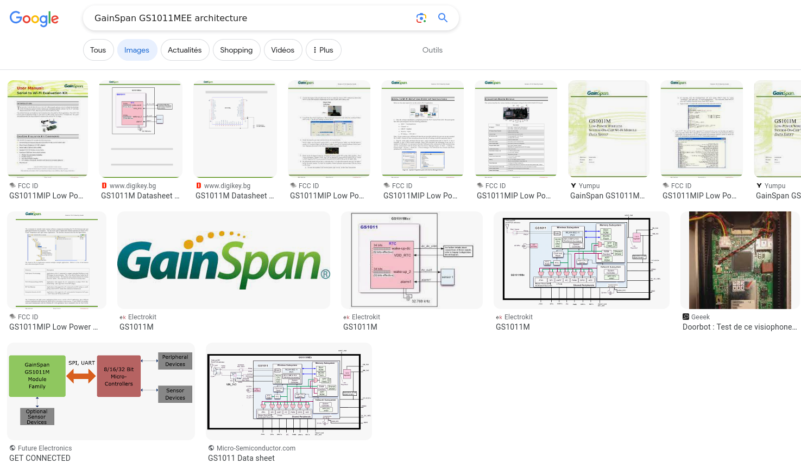
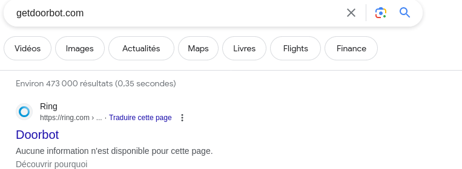

# OSINT by Ludoze, Cryptax and Boguette

This challenge was created by *Ludoze* and *Cryptax*. The write-up was created from *Boguette*'s feedback and written by *Cryptax*.

## Description

This is a Hardware OSINT challenge: we have a PCB and must figure out to what device it corresponds. To flag, one must discover the name of the device and its product name.

```
Your task is to uncover the common name of the device and its commercial name, both in lowercase.

For instance, if this card belonged to a Tesla, the flag would be:
`ph0wn{car_tesla}`
```


## Investigation

On one side, we see the name GainSpan, and the chip's reference: GS1011MEE.
Boguette searched on Internet a reference.



Among the results, there is an article on [DoorBot](https://www.geeek.org/doorbot-test-avis-944/). The article gives lots of additional information, and points to a URL on www.getdoorbot.com which no longer exists.

So, we use [WayBack Machine to access the page](https://web.archive.org/web/20140625090124/http://www.getdoorbot.com/pages/terms-of-use).

Besides, any request to www.getdoorbot.com usually redirects now to ring.com



So the company name is *Ring*, and the product name is *Doorbot*.
The flag is `ph0wn{ring_doorbot}`.

\newpage
