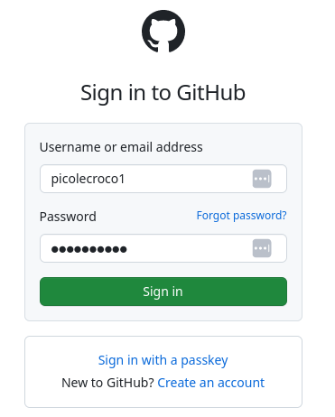
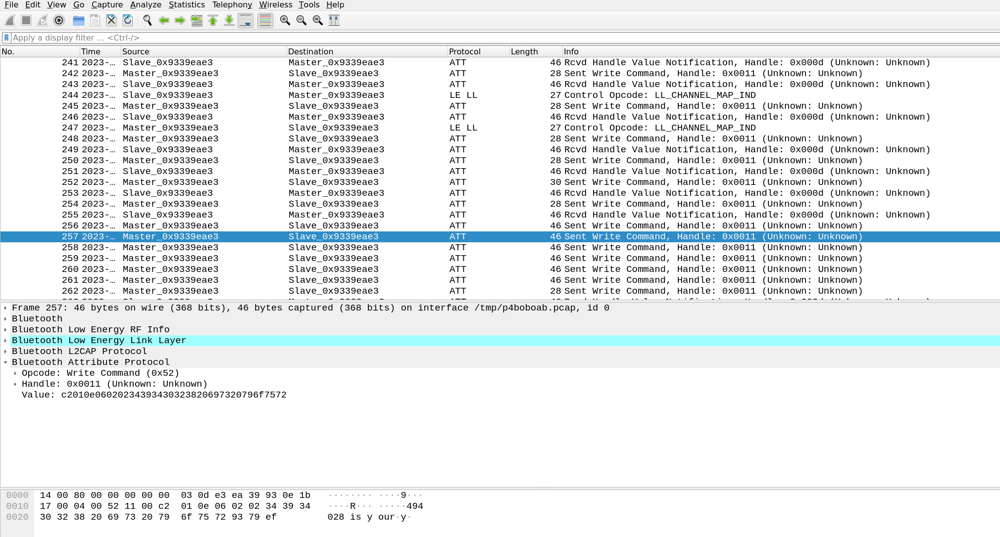
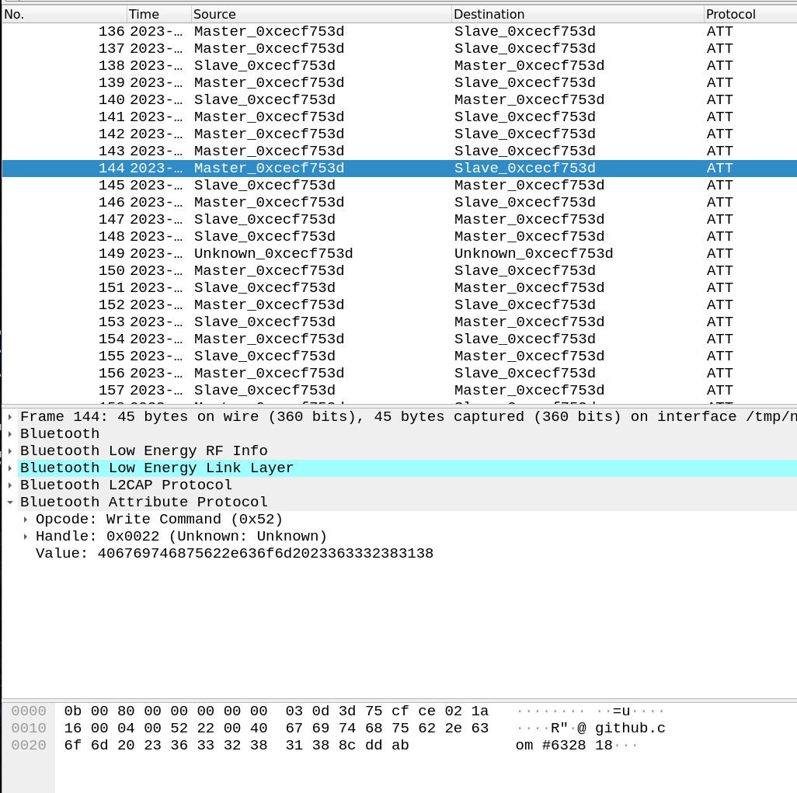

# Picowatch by Romain Cayre

This challenge was created by *Romain Cayre*.

## Description

```
Pico le croco is working on a very confidential hacking project... and you are curious !
Hopefully, he just left his office to get a coffee. He left his phone locked on the desk and his new Bluetooth Low Energy smartwatch in a locked drawer... 
If you are smart enough, you may find a way to get access to this secret project before he comes back !
```

A picture of Pico's office is also available, and shows Pico's credentials on a post it (how careless!):

```
Compte Github 1
- login: picolecroco1
- pass: cr0cr0dil3

Compte Github 2
- login: picolecroco2
- pass: p1c0tipic0t4
```
## Solution

To solve the challenge:

1. Configure a Bluetooth Low Energy sniffer to monitor BLE connections

Multiple tools can be used: 
  - TI-CC1352-R1 with sniffle
  - nrf52840 dongle (pca10059) flashed with injectable firmware + mirage
  - nrf51 development kit (pca10028) with nrfsniffer and wireshark plugin
  - ubertooth one
  - microbit v2 with btlejack
  
2. Login with the credentials of a victim account on GitHub (`picolecroco1` or `picolecroco2`)

{ width=40% }

3. Click on the **Send SMS** button triggering the 2-FA


4. Analyze the Bluetooth Low Energy traffic and identify the content of the 2-FA SMS transmitted by the smartphone to the smartwatch using the BLE connection.
- on both smartwatches, traffic is *not* encrypted
- on the first smartwatch (HBand), the SMS is transmitted using a sequence of Write Command targeting handle 0x0011:



```
Packet 256:
0000   0c 00 80 00 00 00 00 00 03 0d e3 ea 39 93 02 1b   ............9...
0010   17 00 04 00 52 11 00 c2 01 06 06 01 00 67 69 74   ....R........git
0020   68 75 62 00 00 00 00 00 00 00 00 2c 7f d3         hub........,..

Packet 257:
0000   14 00 80 00 00 00 00 00 03 0d e3 ea 39 93 0e 1b   ............9...
0010   17 00 04 00 52 11 00 c2 01 0e 06 02 02 34 39 34   ....R........494
0020   30 32 38 20 69 73 20 79 6f 75 72 93 79 ef         028 is your.y.

Packet 258:
0000   00 00 80 00 00 00 00 00 03 0d e3 ea 39 93 02 1b   ............9...
0010   17 00 04 00 52 11 00 c2 01 0e 06 04 02 74 69 63   ....R........tic
0020   61 74 69 6f 6e 20 63 6f 64 65 2e f5 14 ea         ation code....

Packet 259:
0000   13 00 80 00 00 00 00 00 03 0d e3 ea 39 93 02 1b   ............9...
0010   17 00 04 00 52 11 00 c2 01 0e 06 05 02 0a 0a 40   ....R..........@
0020   67 69 74 68 75 62 2e 63 6f 6d 20 24 f9 43         github.com $.C

Packet 260:
0000   16 00 80 00 00 00 00 00 03 0d e3 ea 39 93 0e 1b   ............9...
0010   17 00 04 00 52 11 00 c2 01 07 06 06 02 23 34 39   ....R........#49
0020   34 30 32 38 00 00 00 00 00 00 00 83 92 46         4028.........F

Packet 261:
0000   22 00 80 00 00 00 00 00 03 0d e3 ea 39 93 02 09   "...........9...
0010   05 00 04 00 52 11 00 d8 00 85 d8 4a               ....R......J
```

- on the second smartwatch (mobility lab), the SMS is transmitted using a sequence of Write Commands on the handle 0x0022:



```
Packet 141:
0000   16 00 80 00 00 00 00 00 03 0d 3d 75 cf ce 0e 1b   ..........=u....
0010   17 00 04 00 52 22 00 cd 00 4c 12 01 12 00 47 01   ....R"...L....G.
0020   00 00 69 53 4d 53 3a 36 33 32 38 39 a4 fd         ..iSMS:63289..

Packet 142:
0000   0c 00 80 00 00 00 00 00 03 0d 3d 75 cf ce 0e 1b   ..........=u....
0010   17 00 04 00 52 22 00 31 38 20 69 73 20 79 6f 75   ....R".18 is you
0020   72 20 47 69 74 48 75 62 20 61 75 de b9 33         r GitHub au..3

Packet 143:
0000   15 00 80 00 00 00 00 00 03 0d 3d 75 cf ce 0e 1b   ..........=u....
0010   17 00 04 00 52 22 00 74 68 65 6e 74 69 63 61 74   ....R".thenticat
0020   69 6f 6e 20 63 6f 64 65 2e 0a 0a 2a cf fd         ion code...*..

Packet 144:
0000   0b 00 80 00 00 00 00 00 03 0d 3d 75 cf ce 02 1a   ..........=u....
0010   16 00 04 00 52 22 00 40 67 69 74 68 75 62 2e 63   ....R".@github.c
0020   6f 6d 20 23 36 33 32 38 31 38 8c dd ab            om #632818...
```

5) Extract the 6 digits 2-FA code and use it to login on the github account.
6) Clone the picowatch private repository and read the flag.

\newpage
