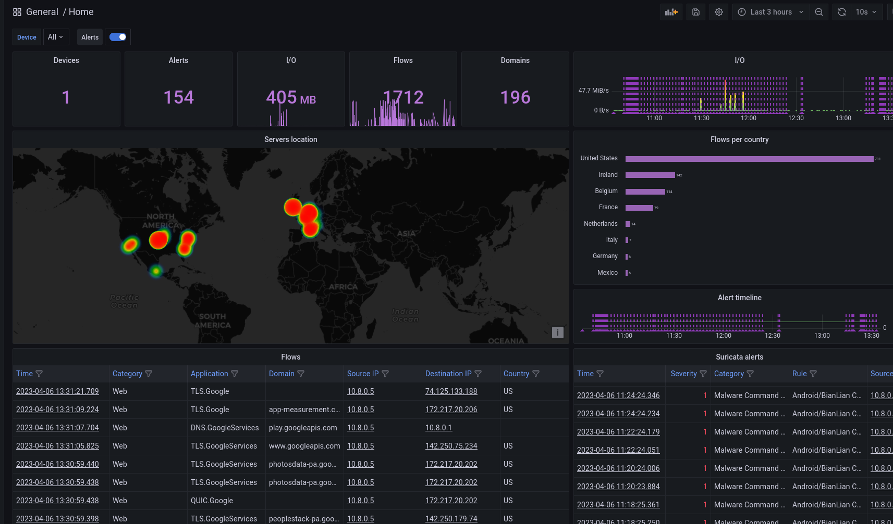
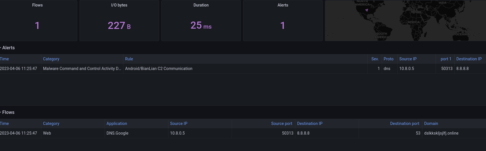
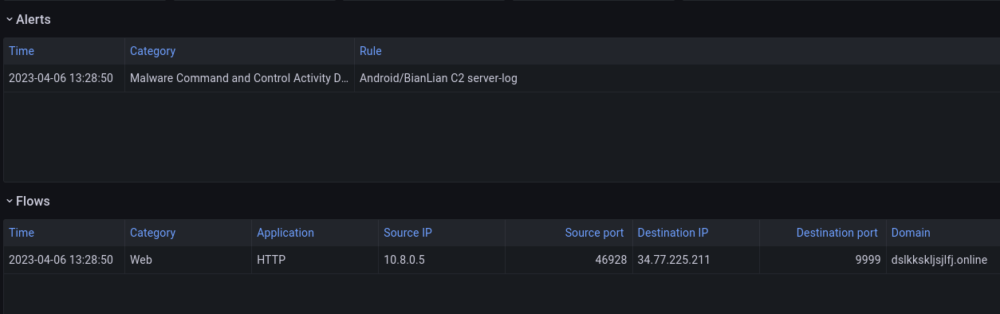
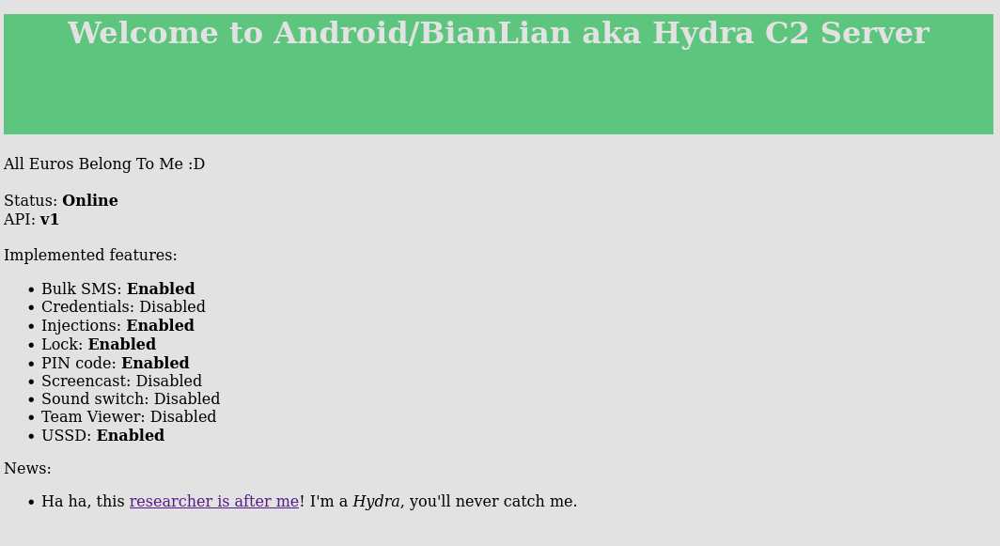

# PiRogue by Cryptax

## Description

The challenge tells us that 

```
several customers of "Bank Pico de Monaco" have been reporting bank credential theft. The customers connect their laptops & smartphones to a PiRogue WiFi. 
You have access to the Grafana interface of PiRogue.

In both cases, the credentials are `admin/PiRogue`.
Please investigate the case.
```

In addition, we are told we should not modify the configuration of Grafana, and that we need to be connected to the Ph0wn WiFi.

## Investigation with Grafana

We connect to the Grafana interface (port 3000) with the supplied credentials.
We are greeted with a dashboard
We notice a device is generating several alerts about Android/BianLian:

- Android/BianLian C2 Domain
- Android/BianLian C2 server-log



We click on one of these alerts and see it corresponds to a DNS request to `dslkkskljsjlfj.online`



If we click on the other alert, we see it goes to HTTP `34.77.225.211` on port `9999`



::: info

- The source IP address 10.8.0.5 is a local address on the PiRogue WiFi network.
- The destination IP address, 34.77.225.211, is an ephemeral IP address which is no longer related to Ph0wn CTF.

Both addresses were different on the day of Ph0wn CTF.

:::

So, we have a smartphone, infected with Android/BianLian, which is discussing with a remote C2.

## Remote C2

We try to discuss with the C2: `curl http://34.77.225.211:9999` redirects to `/static/welcome.html`



::: info

The C2 was designed to *look like* the real C2 except implemented features were a mere *facade* and there was no malicious payload ;)

In the real Android/BianLian C2, there is no such web page. This one was crafted explicitly to hint Ph0wn participants.

:::

We are at the right place (BianLian C2) and there are several hints: various features, and a link pointing to a [researcher's blog post](https://cryptax.medium.com/android-bianlian-payload-61febabed00a) on BianLian.

Note, if we google for "Androi BianLian C2", we get pages such as:

- [https://www.fortinet.com/blog/threat-research/android-bianlian-botnet-mobile-banking](https://www.fortinet.com/blog/threat-research/android-bianlian-botnet-mobile-banking)
- [https://www.virusbulletin.com/conference/vb2022/abstracts/hunting-androidbianlian-botnet/](https://www.virusbulletin.com/conference/vb2022/abstracts/hunting-androidbianlian-botnet/)
- [https://www.bleepingcomputer.com/news/security/bianlian-android-banking-trojan-upgraded-with-screen-recorder/](https://www.bleepingcomputer.com/news/security/bianlian-android-banking-trojan-upgraded-with-screen-recorder/)


The welcome page says we are using a v1 API, and that Bulk SMS, injections, lock, pin code and USSD features are enabled.
If we go to the researcher's web page, there is a paragraph "Malicious Injections" with a screenshots
of a communication with the C2: `POST /api/v1/device`

We try that URL:

```
$ curl http://34.77.225.211:9999/api/v1/device
<!doctype html>
<html lang=en>
<title>405 Method Not Allowed</title>
<h1>Method Not Allowed</h1>
<p>The method is not allowed for the requested URL.</p>
```

Oops, we tried a GET. Let's try a POST.

```
$ curl -X POST http://34.77.225.211:9999/api/v1/device
{"message":"Bad Request - Client expected to be an Android phone"}
```

This is probably because we are using our laptop, not a real Android smartphone. We can usually fake this with a User Agent.

Let use this one for example: `Mozilla/5.0 (Linux; U; Android 2.2; en-gb; Nexus One Build/FRF50) AppleWebKit/533.1 (KHTML, like Gecko) Version/4.0 Mobile Safari/533.1`

```
$ curl -X POST -H 'User-Agent: Mozilla/5.0 (Linux; U; Android 2.2; en-gb; Nexus One Build/FRF50) AppleWebKit/533.1 (KHTML, like Gecko) Version/4.0 Mobile Safari/533.1'  http://34.77.225.211:9999/api/v1/device
{"message":"You are not authorized"}
```

The message changed, this time we are not *authorized*. Actually, we inspect the POST request in the blog post, we see there is an `Authorization: 9bac5f66096bb7f` header.

```
$ curl -X POST -H 'Authorization: 9bac5f66096bb7f' -H 'User-Agent: Mozilla/5.0 (Linux; U; Android 2.2; en-gb; Nexus One Build/FRF50) AppleWebKit/533.1 (KHTML, like Gecko) Version/4.0 Mobile Safari/533.1'  http://34.77.225.211:9999/api/v1/device
{"stockInjects":["bank.picolecroco.mc"],"success":true}
```

The blog post also shows a request to `/storage/injects/inj/APPNAME/index.html`. So we try it for Bank Pico.


```
curl -H 'Authorization: 9bac5f66096bb7f' -H 'User-Agent: Mozilla/5.0 (Linux; U; Android 2.2; en-gb; Nexus One Build/FRF50) AppleWebKit/533.1 (KHTML, like Gecko) Version/4.0 Mobile Safari/533.1'  http://34.77.225.211:9999/storage/injects/inj/bank.picolecroco.mc/index.html
<!doctype html>
<html lang=en>
<title>Redirecting...</title>
<h1>Redirecting...</h1>
<p>You should be redirected automatically to the target URL: <a href="/static/index.html">/static/index.html</a>. If not, click the link.
```

We try the redirection:

```
curl http://34.77.225.211:9999/static/index.html
...
   <p class="flag">
    Flag: ph0wn{Pico_is_soooo_grateful_$you_saved_his_bank$}
    </p>
	<br><br><br>
	<div class="button-div">
		<button type="button" class="submit-button" onclick="next()" id="submitBtn1"><span>Login</span></button>
		<input id="type_injects" value='banks' type="hidden" required>
		<input id="closed" value='close_activity_injects' type="hidden" required>
	</div>
</form>


</div>
</body>
</html>
```

and we get the flag.

## Alternative

We can also see in the blog post that the C2 understands requests to http://34.77.225.211:9999/api/v1/device/check

```
$ curl -H 'Authorization: 9bac5f66096bb7f' -H 'User-Agent: Mozilla/5.0 (Linux; U; Android 2.2; en-gb; Nexus One Build/FRF50) AppleWebKit/533.1 (KHTML, like Gecko) Version/4.0 Mobile Safari/533.1'  http://34.77.225.211:9999/api/v1/device/check
{"locked":false,"settings":{"hide_icon":true,"zip_file_url":"http:\\/\\/dslkkskljsjlfj.online\\/storage\\/zip\\/o0fnU9hd9i2BnXKhALsU7xmmxAz4Y2XSmerCX9Zd.zip","zip_version":""},"showScreen":false,"stockInjects":["bank.picolecroco.mc"],"success":true}
```

We can retrieve the ZIP file:

```
$ curl -H 'Authorization: 9bac5f66096bb7f' -H 'User-Agent: Mozilla/5.0 (Linux; U; Android 2.2; en-gb; Nexus One Build/FRF50) AppleWebKit/533.1 (KHTML, like Gecko) Version/4.0 Mobile Safari/533.1'  http://34.77.225.211:9999/storage/zip/o0fnU9hd9i2BnXKhALsU7xmmxAz4Y2XSmerCX9Zd.zip
<!doctype html>
<html lang=en>
<title>Redirecting...</title>
<h1>Redirecting...</h1>
<p>You should be redirected automatically to the target URL: <a href="/static/o0fnU9hd9i2BnXKhALsU7xmmxAz4Y2XSmerCX9Zd.zip">/static/o0fnU9hd9i2BnXKhALsU7xmmxAz4Y2XSmerCX9Zd.zip</a>. If not, click the link.
```

We head to the redirected URL

```
$ curl -H 'Authorization: 9bac5f66096bb7f' -H 'User-Agent: Mozilla/5.0 (Linux; U; Android 2.2; en-gb; Nexus One Build/FRF50) AppleWebKit/533.1 (KHTML, like Gecko) Version/4.0 Mobile Safari/533.1'  http://34.77.225.211:9999/static/o0fnU9hd9i2BnXKhALsU7xmmxAz4Y2XSmerCX9Zd.zip --output thezip.zip
```

And get the contents of the zip:

```
$ unzip thezip.zip -d /tmp/thezip
Archive:  thezip.zip
  inflating: /tmp/thezip/icons/bank.picolecroco.mc.png  
  inflating: /tmp/thezip/inj/bank.picolecroco.mc/bank.picolecroco.mc.png  
  inflating: /tmp/thezip/inj/bank.picolecroco.mc/index.html
```

The flag is in the HTML file:

```
grep ph0wn /tmp/thezip/inj/bank.picolecroco.mc/index.html
    Flag: ph0wn{Pico_is_soooo_grateful_$you_saved_his_bank$}
```
\newpage
