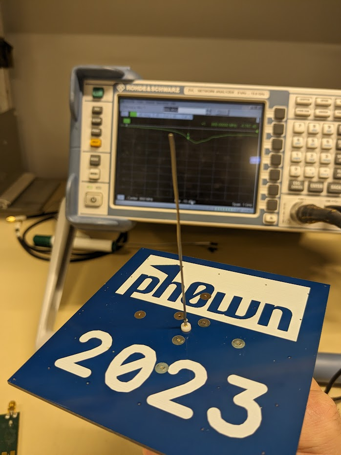
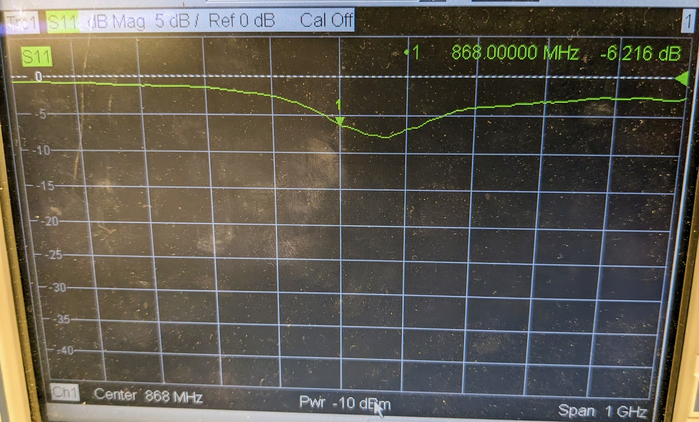
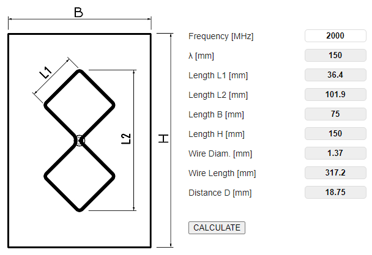
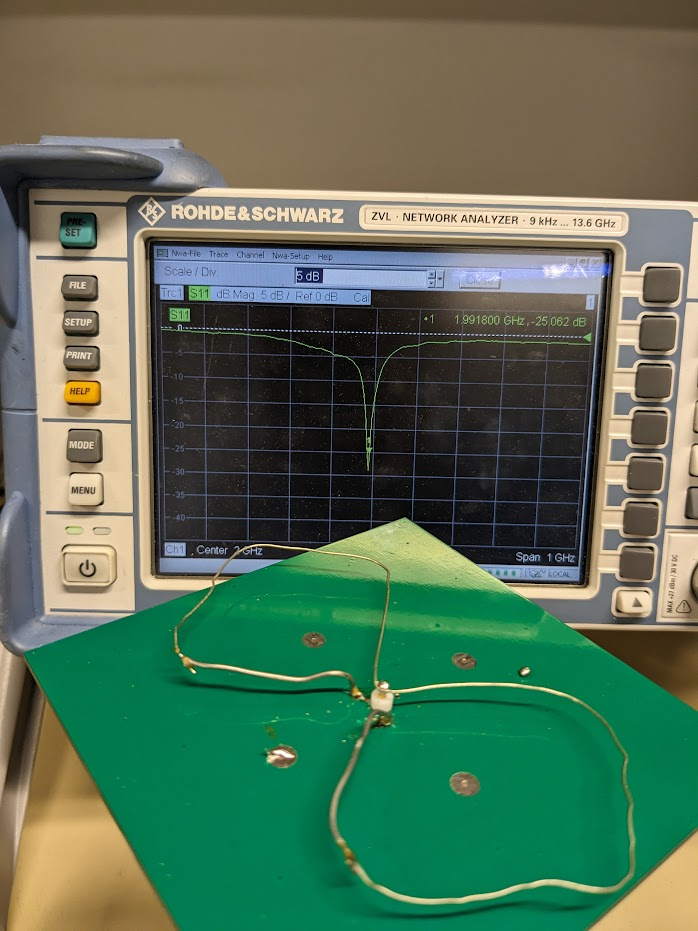
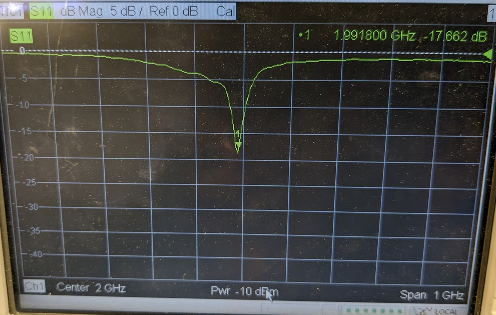
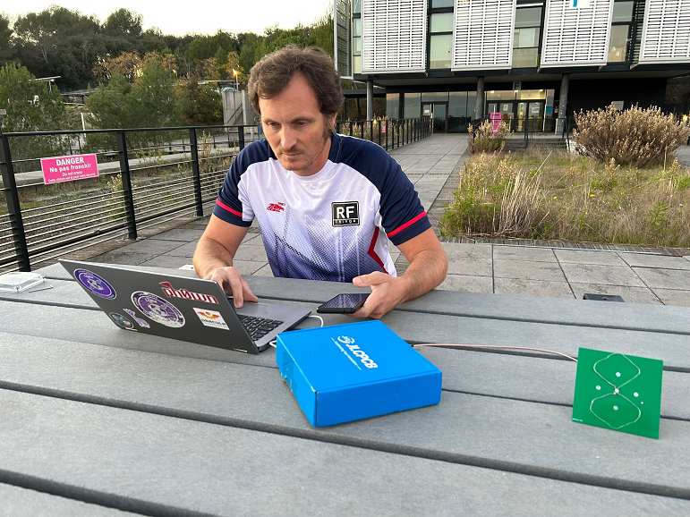
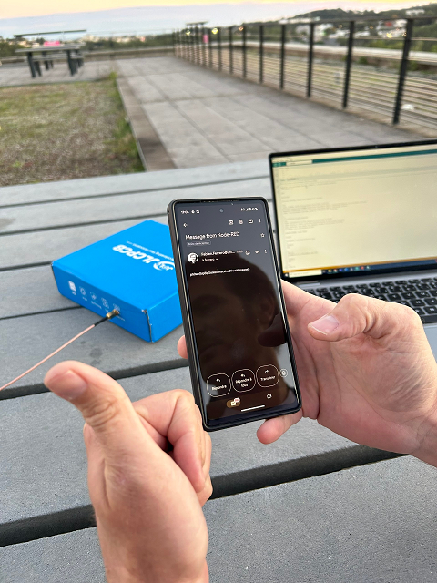

# Satellite by Fabien

The satellite challenges were created by Fabien.
This write-up is also published [here](https://github.com/FabienFerrero/PEIP2_Arduino_Exemple/blob/master/Tutorial/readme.md).

## Satellite 1

For this first step, you are asked to create a 868Mhz antenna with 100*100mm ground plane.

```
Your ultimate goal (in stage 2) is to communicate with the satellite EchoStar XXI.

In a first step, transmit to a terrestrial gateway at 868Mhz.
Crocodiles have no antenna, but they have brains, a PCB board and a solder iron. Tune your antenna with the VNA.
When it's matched, borrow the terrestrial terminal, use the serial port and send over your email address to receive the flag.

Send your email adress over the air to get your flag.
```

The wire length should be a quarter wavelength. @868MHz, the wavelength is 345mm, so a quarter-wavelength is 86mm.

{ width=50% }

The antenna can be tuned with the VNA by adjusting the length :



The antenna is then connected to the terrestrial terminal using a USB connector.
When you open the Serial monitor (115200, Both NL & CR), the terminal asks for your email address.
After providing it, it is sent a packet to the University LoRaWan network, and you will receive the flag on your email.

## Satellite 2

In this second challenge, you are asked to create a 2000MHz directive antenna with a 100*100 ground plane.

Several online calculators can be used : 

- [https://www.changpuak.ch/electronics/bi_quad_antenna_designer.php](https://www.changpuak.ch/electronics/bi_quad_antenna_designer.php)
- [https://buildyourownantenna.blogspot.com/2014/07/double-biquad-antenna-calculator.html](https://buildyourownantenna.blogspot.com/2014/07/double-biquad-antenna-calculator.html)

{ width=60% }

The middle of the wire is soldered to the signal pin of the SMA connector.
Both ends of the wire are soldered to the ground plane using the available holes in the ph0wn PCB.


{ width=50% }

As you notice, the ground plane is smaller, so you need to fine-tune the antenna with the VNA.
A reflection coefficient lower than -10dB is required on this antenna.



The antenna is then connected to the space terminal.
When you open the Serial monitor (115200, Both NL & CR), the terminal asks for your email address.

The module is configured to use only 10dBm output power to reach the Satellite. You will need a good antenna!

```
AT+PTH=1?   // To get access to EM2050 Echostar Modem
AT+JOIN  // To join the network
AT+SEND=1,0,8,0,your@email.address   // To send a packet with your email address as a payload, the Echostar server will send you an email with the Flag
```



After providing it, it is sent a packet to the Echostar GEO satellite, and you will receive the flag in your email.



\newpage
