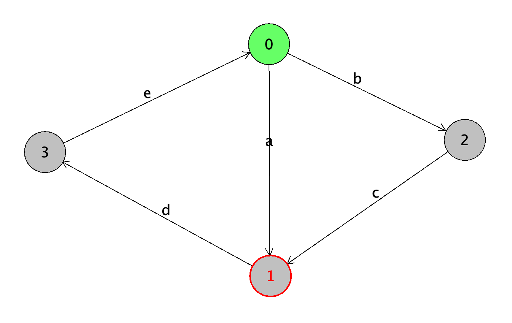

# Stage 1
you are provided with a reachability graph whose transitions have a specific label. This reachability graph features all **possible** execution paths. Said differently, all labels in the graph can be executed by the system, that is they are all reachable. So, to know whether a label is reachable or not, a simple "grep" can be used on the graph file to know whether the label is reachable or not.


```bash
$ grep -c "SpeedSensor/currentSpeed=currentSpeed-speedIncrement"
70626
grep -c "Maincontroller/Pic0L0vesCh0c0late" test2i.aut
0
```

You can easily write a loop that iterates over all provided labels to get the flag...


# Stage 2
Here, the challenge is to know whether all paths finally fo through the provided label, starting from the initial state (state 0).

The first step is to really understand what liveness of labels means.

For instance, lets us consider the following graph:




In this graph, label "d" satisfies the liveness condition because all paths in the graph pass through "d." However, this is not the case for label "b" since the path "ade..." (which continues infinitely) never goes through "b."

One way to address this challenge is to identify an appropriate algorithm to check whether a given label is "live." A straightforward approach would be to compute all possible paths and terminate each path when it re-enters a previously encountered state. If a path does not include the label in question, then liveness is not satisfied. For example, in the case of path "ade," once we return to state "0," we can repeat the "ade" sequence indefinitely without encountering "b." Therefore, "b" is not live in this graph.

```pseudo
Algorithm: CheckLiveness(label, graph)
Input: A label and a directed graph with states and paths
Output: Boolean value indicating if the label is live

1. Initialize visitedPaths as an empty set
2. For each path P in graph:
    a. If P contains label:
        return true  // Label is live
    b. If a state in P has already been visited:
        terminate this path
3. If no path contains the label:
    return false  // Label is not live
```

However, while enumerating all possible paths works well for small graphs, this computation can become highly intensive for larger graphs. Although the input graph we are dealing with is not considered exceptionally large, the straightforward approach without optimizations is likely impractical within a reasonable time frame.

Thus, the objective is to find a faster algorithm to solve this liveness challenge. The idea is rather to tag states of the graph with a "live a" tag when all outgoing paths from this state have been proved as live for label "a".

To do this, we recursively investigate all path starting from each state, from the initial state and then selecting next states as the one directly reachable from the previous one. We below provide an extract of the solution (written in Java)


```java
Path initialPath = new Path(initialState);
HashSet<Integer> provedAsLived = new HashSet<>();
return isLivenessSatisfied(tag, initialPath, provedAsLived);

public boolean isLivenessSatisfied(String tag, Path p, HashSet<Integer> provedAsLived) throws GraphException {
        State s = p.currentState;
	if (s.outputTransitions.size() == 0) {
            return false;
        }
        int foundValid = 0;
        for (Transition tr : s.outputTransitions) {
            //
            if (tr.tag.startsWith(tag)) {
                // Tag found in a transition starting from current state
                foundValid ++;
            } else {
                // We figure out if the next state has already been proved as live. 
                // If yes, we can avoid investigating the continuation of this path
                // since it is live.
                State nextState = tr.destinationState;
                if (provedAsLived.contains(nextState.id)) {
                    foundValid++;
                } else {
                    if (p.contains(nextState.id)) {
                        // state already met in path: so, the label was not found
                        return false;
                    } else {
                        // We must look (recursively) in all the paths starting from the state
                        // at the destination of the current transition
                        State currentState = p.currentState;
                        p.add(nextState.id);
                        p.currentState = nextState;
                        if (!isLivenessSatisfied(tag, p, provedAsLived)) {
                            return false;
                        }
                        foundValid++;
                        p.currentState = currentState;
                        p.remove(nextState.id);
                    }
                }
            }
        }

        // Liveness is valid if and only if all paths starting from current state
        // contain the label
        boolean ret = (foundValid == s.outputTransitions.size());

        // If the liveness is satisfied for this state,
        // we mak the state as live
        if (ret) {
            provedAsLived.add(p.currentState.id);
        }

        return ret;
    }
```

Then, one just need to write a graph loader (from AUT format), and to iterate over the tags to obtain the flag:

```java
String result = "";
for(String tag: tags) {
    boolean isSatisfied = g.isLivenessSatisfied(tag.trim());
    System.out.println("RESULT> Liveness of " + tag + ": " + isSatisfied);
    if (isSatisfied) { result += "T";
    } else {result += "F";}
}
System.out.println("FLAG: ph0wn{" + result + "}");
```
