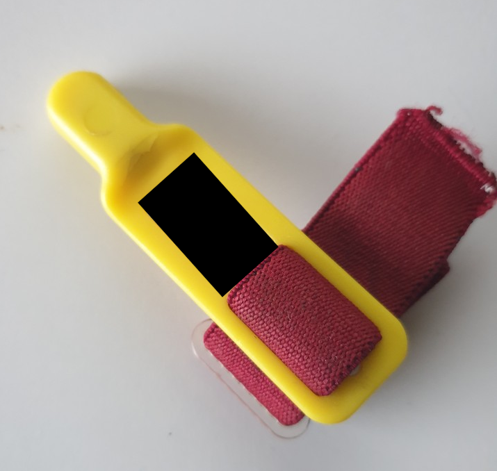
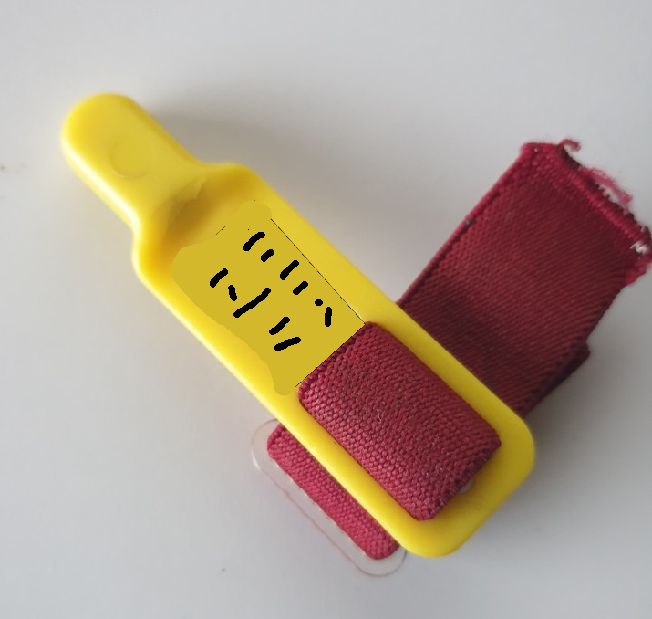

# Initial identification

The challenge involves identifying an unknown object. The provided photo contains a hand-made black rectangle, likely used to obscure text that would otherwise aid in identifying the object.

 

Injecting the image into tools such as Google Lens or analyzing it with ChatGPT does not provide any clear hints.

# Solving the challenge

One idea to tackle this: imagine a fake text for the object. The actual content of the text probably doesn’t matter to Google Lens, but the presence of text on a yellow background likely plays a significant role in identifying it.

To test this hypothesis, we forged a new image:

 

When this altered image was injected into Google Lens, one of the first suggested links pointed to an object with a shape very similar to the provided one: a Sportident SI-Card 9.

However, after reviewing the characteristics of the Sportident SI-Card 9, there were some differences: the SI-Card 9 features a different color for the body compared to the head, and has a visible plastic junction between the two parts.

A brief exploration of the Sportident website led us to the SI-Card 5: 

[SI-Card 5](https://www.sportident.fr/doc_sportident/papers_-public/1_si_base_products/1_control-cards/si-card5/sportident-card5_fr.pdf)

Moreover, the website of sportident specifies that SI-Cards are all passive.

Finally, the flag is: ph0wn{sportident_sicard5_passive}.
