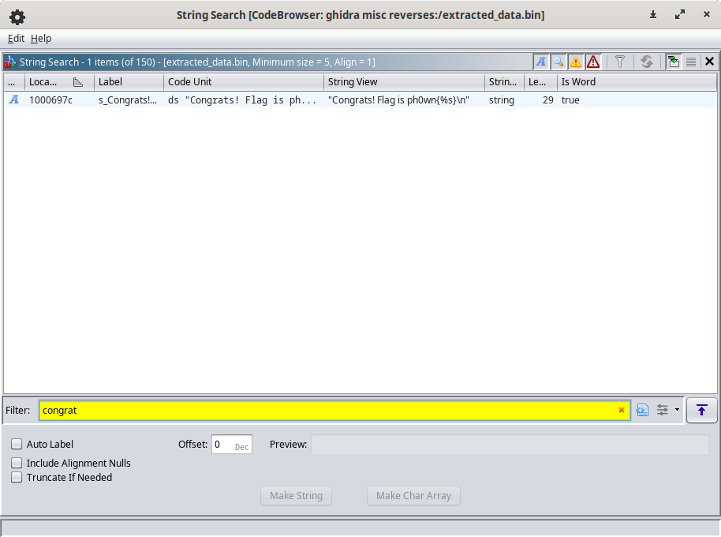

# Running it

Let's connect to the serial console of a Rasspberry Pi Pico: `picocom -b 115200 /dev/ttyACM0`

```


      ______     +------------+
   __//_||_\__   |  Pico      |
  |     ||    |__| Car Status |
  '--(_)--(_)-'  +------------+

Lights: OFF Motor: OFF
-----------------------
 1. Turn lights ON
 2. Start engine
 
Enter your choice:
```

We can turn on/off the lights, but we can't start the engine: "Ouch! The engine stalled!!!".
There is no apparent flag.

# Dump the firmware

1. Boot it in BOOTSEL mode (TODO: on the board, there will be a special thing to do!)
2. Dump the firmware

```
sudo $PICO_SDK_PATH/../picotool/build/picotool save firmware.uf2
Saving file: [==============================]  100%
Wrote 68096 bytes to firmware.uf2
```

# Reconnaissance

This is a UF2 file + base address is 0x10000000

```
$ file firmware.uf2 
firmware.uf2: UF2 firmware image, family Raspberry Pi RP2040, address 0x10000000, 133 total blocks
```

The strings of the file show the strings of the loader (`Pico PCB Loader`), the strings of the Pico PCB challenge (`Amnesia. Something is hidden deep down in my memory but I cant understand it.`) and the strings of this challenge: the ASCII art car, but also reveals an apparently hidden menu, and a promising flag congratulation string:

```
$ strings firmware.uf2
...
=== H1dden Pic0 Menu ===
Password (* to END): 
Congrats! Flag is ph0wn{%s}
Ouch! The engine stalled!!!
VROOOOOOOOOOOOOM! You started the engine!
```

# UF2 Format

Ask ChatGPT to extract the binary inside the UF2.

```
$ python3 parse_uf2.py 
Extracted data saved to extracted_data.bin
```

# Reversing the binary with Ghidra

The device is a Raspberry Pico with a ARM *Cortex* M0. It is *32 bits* and *Little Endian*. Import `extracted_data.bin` in Ghidra using:

- Language: ARM:LE:32:Cortex 
- Options, Base Address: **0x10000000**

Have Ghidra analyze the binary with the default options. Once the analysis is finished, search for the Congrats string (Search > For Strings > Search



It is located at 0x1000697c, and is used by `FUN_10000578` at 0x10000584 and 0x1000059a. Go to that function.
It is the main function. 

A few tips to reverse it:

- Rename the strings (congrats, vroum, access denied...) in the decompilation window with help from the disassembly window. For example, the assembly shows that the congrats string is at 0x1000697c. Hover over `DAT_xxx` values and spot the one that points to 0x1000697c: `DAT_10000628`. Rename it.

```
        1000059a 40 46           mov        r0=>s_Congrats!_Flag_is_ph0wn{%s}_1000697c,r8    = "Congrats! Flag is ph0wn{%s}\n"
        1000059c 03 f0 58 fd     bl         FUN_10004050                                     undefined FUN_10004050()
```

- Recognize the `printf` function that prints "Access denied". Rename the function.

```c
     else {
        FUN_10003ff0(DAT_10000630_access_denied);
      }
```

- Recognize the function that prints the menu. For that, you can search for a string such as `Enter your choice` (0x1000692c) and navigate to its caller (FUN_10000420 at 0x100000480). Or: from the main, spot the part that displays the menu and switches depending on the choices: 1 and 2... and 3.

```
        100005fa 32 28           cmp        r0,#0x32
        100005fc c5 d0           beq        LAB_1000058a
        100005fe 33 28           cmp        r0,#0x33
        10000600 d7 d0           beq        LAB_100005b2
        10000602 31 28           cmp        r0,#0x31
        10000604 f6 d1           bne        LAB_100005f4
```


# Hidden menu

At some point, you should notice the `=== H1dden Pic0 Menu ===` string and work out from reversing that there is a third menu accessed by entering `3`. You might want to try it out to help your reversing.

```
=== H1dden Pic0 Menu ===
Password (* to END):
```

The password is unknown. If your password is incorrect you get the error "Access denied!".
If your password is too long (more than 21 characters), you get the same error.

```
=== H1dden Pic0 Menu ===
Password (* to END): 0123456789012345678901
Access denied!
```


Normally, there are only 2 menus, but a third menu can be selected by entering `3`.

```c
      if (choice != '2') break;
      if (*pcVar1 == '\x01') {
        FUN_10004050(s_congrats,auStack_30);
        *DAT_10000620 = '\0';
        FUN_100028c8(auStack_30,0,0x16);
      }
      else {
        FUN_10003ff0_printf(s_stalled);
      }
    }
    if (choice == '3') {
```

# Reversing with Ghidra (continued)

- Understand that the function that prints the hidden menu and waits for the input password is `FUN_100004f8`. Rename it to `read_password`.
- Understand that we expect the user input to be of length 0x15 (21)
- Understand that the code compares two buffers and will display "VROOOOOOOOOOOOOM! You started the engine!" if they are equal. This is obviously our goal. It will display "Access denied!" if they are different.

The decompiled code we have looks like this:

```c
      res = read_password(user_input,0x16);
      FUN_10000560(buf,user_input,0x45,0x16);
      if ((res == 0x15) && (res = FUN_1000654c(buf,&local_60,0x15), res == 0)) {
        FUN_10003ff0_printf(DAT_10000638_vroum);
        *DAT_10000620 = '\x01';
      }
```

Navigate to `FUN_10000560`. It should be easy to work out the function performs an XOR with key.


From there, working out the rest should be easy: we perform an XOR with key 0x45 on the password supplied by the user, and we compare it to an expected value. This expected value (local_60) is initialized with `DAT_1000062c`.

`DAT_1000062c` points to 0x100069f4 which is initialized with values `33 37 2a 30 ... 2a` (hex)


# Uncovering the flag

We extract the encrypted bytes: 

```
$ hexdump -v -e '/1 "%02X"' extracted_data.bin | grep -ob '33372A30' | head -n1 | awk -F: '{print int($1/2)}' | xargs -I{} dd if=extracted_data.bin bs=1 skip={} count=21 2> /dev/null | hexdump -v -e '/1 "%02X"'
33372A30281A26372A262A27202431362824372C2A
```

We XOR the hexstring with 0x45. There are many ways to do that, with a programming language, with CyberChef etc.

```python
s = '33372A30281A26372A262A27202431362824372C2A'
''.join([chr(x ^ 0x45) for x in list(bytes.fromhex(s))])
```

The resulting string is `vroum_crocobeatsmario`.


To retrieve the flag, either you continue the final reversing steps, or perhaps simpler you run the program:

- Select the hidden menu (`3`)
- Enter the password. Pay attention to end it with character `*` (it is not echoed)
- Second menu becomes "Read Flag". Select it
- Get the flag

```
== H1dden Pic0 Menu ===
Password (* to END): vroum_crocobeatsmario
VROOOOOOOOOOOOOM! You started the engine!

      ______     +------------+
   __//_||_\__   |  Pico      |
  |     ||    |__| Car Status |
  '--(_)--(_)-'  +------------+

Lights: ON Motor: ON
-----------------------
 1. Turn lights OFF
 2. Read Flag

Enter your choice: 2
Congrats! Flag is ph0wn{vroum_crocobeatsmario}
```

