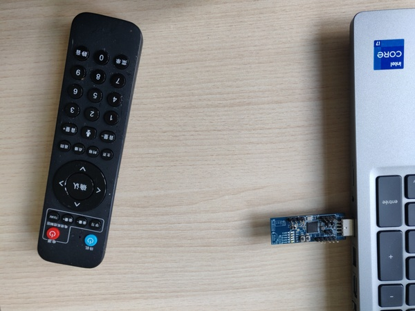

Since he received his new Picobox Revolution, Pico is a big fan of the audio command feature embedded in the remote control. 

Indeed, Pico Inc. has included in his new Picobox remote control a whole new RF remote control solution based on a TLSR8278 chip, which can be used to transmit audio commands over the air to control the Picobox.

While he was working on his challenge, Pico used this feature to remember the flag, and hopefully you were able to sniff the RF communication and get a PCAP file. Unfortunately, it is encrypted, and you don't really know how to decode the audio stream...

Your mission is to extract the flag from the audio stream stored in the remotecontrol.pcap file. You have to identify the protocol and exploit a well-known vulnerability to break the pairing process and retrieve the encryption key. Finally, you have to reverse engineer the audio codec to extract the audio stream.

An aerial view of the Picobox Revolution remote control is available in *picobox.jpg*.

.

Datasheet: http://chal.ph0wn.org:9000/TLSR8278_datasheet.pdf
