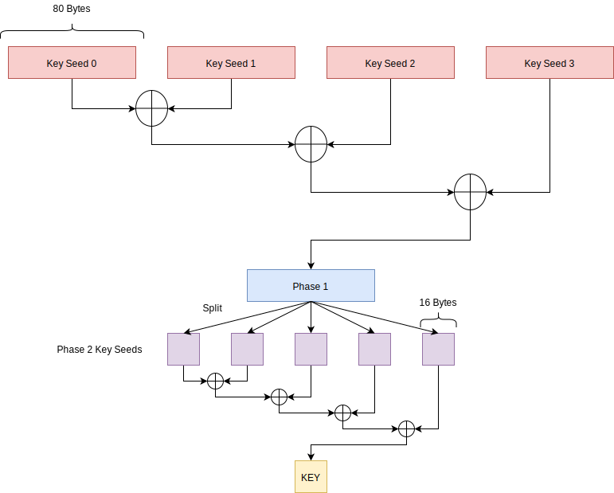

# Identifying the protocol

The challenge indicates that a fancy RF protocol is used for the wireless communication between the Picobox Revolution and its remote control, and the first step is to identify what this protocol is. 
In the challenge description, the chip used by the remote control is indicated: it's a [TLSR8278](https://wiki.telink-semi.cn/wiki/chip-series/TLSR827x-Series/), a RF chip from Telink. By looking at [the datasheet](https://wiki.telink-semi.cn/doc/ds/DS-TLSR8278-E_Datasheet%20for%20Telink%20BLE%20+%20IEEE%20802.15.4%20Multi-Standard%20Wireless%20SoC%20TLSR8278.pdf), we can see that it supports three main protocols: Bluetooth Low Energy, ZigBee and RF4CE. 

If we open the PCAP file "remotecontrol.pcap" in wireshark, we can see that the traffic is identified as 802.15.4, but is not dissected as ZigBee. We can conclude that the protocol in use is probably [RF4CE](https://wiki.telink-semi.cn/wiki/solution/RCU/RF4CE/), a lightweight variant of ZigBee designed for Remote Control. 

We can also note that "Picobox Revolution" is a reference to the "Freebox Revolution", a well-known set-top-box in France provided by the Free mobile operator. Its remote control was one of the first device to use this RF4CE technology. 

# Analyzing the PCAP file

The [WHAD framework](https://whad.io) includes support for RF4CE and provides a set of tools facilitating the traffic analysis.
Once installed, you can use the *wplay* command to display and dissect the packets captured from the PCAP file:
```
$ wplay remotecontrol.pcap
```

However, we can see that a lot of packets are encrypted:
```
[...]
[ decrypted=False, timestamp=3184946, channel=15, rssi=-57, is_fcs_valid=True, lqi=148 ]
<Dot15d4FCS  fcf_reserved_1=0 fcf_panidcompress=True fcf_ackreq=True fcf_pending=False fcf_security=False fcf_frametype=Data fcf_srcaddrmode=Short fcf_framever=0 fcf_destaddrmode=Short fcf_reserved_2=0 seqnum=66 fcs=0x7abb |<Dot15d4Data  dest_panid=0x269a dest_addr=0x3f15 src_addr=0x7ca0 |<RF4CE_Hdr  channel_identifier=0 reserved=1 protocol_version=1 security_enabled=enabled frame_type=vendor mic=0xd041f61a frame_counter=1927094 |<RF4CE_Vendor_Hdr  profile_id=0xc0 vendor_id=4417 |<RF4CE_Vendor_MSO_Hdr  command_code=214 |<Raw  load='\\x81\x08\\xd8&o\\xdb\x1d\\xb6;a\\x99;\\xa7\\x85\\x93\\x89\\x96\\xd4X\x10\\xc1\t"\x08%\\x9b\\xccv\x02o\\x80\\xafF[\\x96]\x01\\xec\\xeb\\xdaq3\x05콶\\x84\\x83\x0e\\xbb\\xd3\\xc5}K\x13\t\\x9e\\xf0\\xbe+gh\\xfcy\\xb6\\xa2\\xbb\\x81oD\x03\x08`速d\\xcc\\xcd\\xffKB\\x98\\x82p\\xd2e' |>>>>>>

[ decrypted=False, timestamp=3184999, channel=15, rssi=-19, is_fcs_valid=True, lqi=255 ]
<Dot15d4FCS  fcf_reserved_1=0 fcf_panidcompress=False fcf_ackreq=False fcf_pending=False fcf_security=False fcf_frametype=Ack fcf_srcaddrmode=None fcf_framever=0 fcf_destaddrmode=None fcf_reserved_2=0 seqnum=66 fcs=0xaed4 |>

[ decrypted=False, timestamp=3185956, channel=15, rssi=-56, is_fcs_valid=True, lqi=148 ]
<Dot15d4FCS  fcf_reserved_1=0 fcf_panidcompress=True fcf_ackreq=True fcf_pending=False fcf_security=False fcf_frametype=Data fcf_srcaddrmode=Short fcf_framever=0 fcf_destaddrmode=Short fcf_reserved_2=0 seqnum=67 fcs=0x8c5e |<Dot15d4Data  dest_panid=0x269a dest_addr=0x3f15 src_addr=0x7ca0 |<RF4CE_Hdr  channel_identifier=0 reserved=1 protocol_version=1 security_enabled=enabled frame_type=vendor mic=0x9d8875f8 frame_counter=1927095 |<RF4CE_Vendor_Hdr  profile_id=0xc0 vendor_id=4417 |<RF4CE_Vendor_MSO_Hdr  command_code=154 |<Raw  load='\\xd79\\xff\x15|Ú\tsB\\xc2\\xd2[\\xca%o\\x84 \\xd5\\xd3.S\\xae\\xae\x12\\xd3v\\x99X\x1a\\xbdRѩ\\xca\x07\\x9c\\xd5!\\xf3\\xc3\\xc1\\xe9\\xe1̮\\xba,\\xc8\x16m\\xd7\x1f\\x97\\xc1~ 4<eVy+\\xa8\\xde>2\\xca\\xd5]\\xb3\r\x10\\x98jV\\xae\\xd5\\xc4.\\x84\x1a2\\xd5\\xd7\\xd7\\xcb' |>>>>>>

[ decrypted=False, timestamp=3186010, channel=15, rssi=-19, is_fcs_valid=True, lqi=255 ]
<Dot15d4FCS  fcf_reserved_1=0 fcf_panidcompress=False fcf_ackreq=False fcf_pending=False fcf_security=False fcf_frametype=Ack fcf_srcaddrmode=None fcf_framever=0 fcf_destaddrmode=None fcf_reserved_2=0 seqnum=67 fcs=0x27c5 |>

[ decrypted=False, timestamp=3186948, channel=15, rssi=-57, is_fcs_valid=True, lqi=148 ]
<Dot15d4FCS  fcf_reserved_1=0 fcf_panidcompress=True fcf_ackreq=True fcf_pending=False fcf_security=False fcf_frametype=Data fcf_srcaddrmode=Short fcf_framever=0 fcf_destaddrmode=Short fcf_reserved_2=0 seqnum=68 fcs=0xd5df |<Dot15d4Data  dest_panid=0x269a dest_addr=0x3f15 src_addr=0x7ca0 |<RF4CE_Hdr  channel_identifier=0 reserved=1 protocol_version=1 security_enabled=enabled frame_type=vendor mic=0x784c93 frame_counter=1927096 |<RF4CE_Vendor_Hdr  profile_id=0xc0 vendor_id=4417 |<RF4CE_Vendor_MSO_Hdr  command_code=158 |<Raw  load='T\\x9dhYT\\xfd\\x86\x15\\xb2\\xdbR\x1e\\xf6\x004\\x81\x07Cd\\xb1H\\x90d\\xdan\x140\\xc0\\xdc\x1as\\xc7(/\\xe9\\xe5\x16p+\\xe0\\xda\\xd6S\\x91J\x00\\xa6\\xfev,\\xe0\\x81j<\\xda\\xcdda[2\\x9c\\xf5S\\xd6\\xc8\\xebAD=\n\\xfe4\n\\x9b\\x81]\\x96\x12\\x8c\\x8f\x04\\xb0\x0b\\xed@\\xa5\\xeb' |>>>>>>

[...]
```

We need to find a way to retrieve the encryption key. If we search on the internet for "rf4ce security", we can find two blogposts from River Loop Security, discussing the security of RF4CE protocol:

- [Article 1: RF4CE Protocol Introduction](https://riverloopsecurity.com/blog/2019/08/rf4cept1/)
- [Article 2: RF4CE Security Overview](https://riverloopsecurity.com/blog/2019/08/rf4ce-security-overview/)

In the second article, an attack is described allowing to retrieve the encryption key from the traffic captured during the pairing process. Indeed, if we are able to extract the seeds transmitted over the air, we can derive the key according to the following scheme:

.

In our case, we captured the following seeds:

```
[...]

[ decrypted=False, timestamp=444957, channel=15, rssi=-19, is_fcs_valid=True, lqi=255 ]
<Dot15d4FCS  fcf_reserved_1=0 fcf_panidcompress=False fcf_ackreq=True fcf_pending=False fcf_security=False fcf_frametype=Data fcf_srcaddrmode=Long fcf_framever=0 fcf_destaddrmode=Long fcf_reserved_2=0 seqnum=19 fcs=0xf496 |<Dot15d4Data  dest_panid=0xffff dest_addr=c4:19:d1:ae:35:0d:70:02 src_panid=0x269a src_addr=c4:19:d1:59:d2:a7:92:c5 |<RF4CE_Hdr  channel_identifier=0 reserved=1 protocol_version=1 security_enabled=disabled frame_type=command frame_counter=9557 |<RF4CE_Command_Hdr  command_identifier=key_seed |<RF4CE_Cmd_Key_Seed  key_sequence_number=0 seed_data='~\\x8aR\\x8e\\x96\\xda\\xc48^\x013\\xe1t\\x89\\xa0\\x82v\\xc7\x1f\\x96H\\xd5\\xf5\x16\\x87\\xc4Q\\xcf\\xf5\x0c\\xc20\\xb8?\\xe5\x18\x7f+MՇ\x0b\x01YG\\x8c\\xa0\x10\\x96\\xb4\\xdf\x10\\x95\\xa8ۉ]\\xfa\\xd4j\\x99\\x9e\\xd9g\\xa4\\xbe\x00Ev\\x96\\x80\x19\\x85\\xc4Fw\\x8b\\xfe\\x8fo' |>>>>>

[ decrypted=False, timestamp=445011, channel=15, rssi=-49, is_fcs_valid=True, lqi=176 ]
<Dot15d4FCS  fcf_reserved_1=0 fcf_panidcompress=False fcf_ackreq=False fcf_pending=False fcf_security=False fcf_frametype=Ack fcf_srcaddrmode=None fcf_framever=0 fcf_destaddrmode=None fcf_reserved_2=0 seqnum=19 fcs=0xa297 |>

[ decrypted=False, timestamp=446513, channel=15, rssi=-19, is_fcs_valid=True, lqi=255 ]
<Dot15d4FCS  fcf_reserved_1=0 fcf_panidcompress=False fcf_ackreq=True fcf_pending=False fcf_security=False fcf_frametype=Data fcf_srcaddrmode=Long fcf_framever=0 fcf_destaddrmode=Long fcf_reserved_2=0 seqnum=20 fcs=0x8ff4 |<Dot15d4Data  dest_panid=0xffff dest_addr=c4:19:d1:ae:35:0d:70:02 src_panid=0x269a src_addr=c4:19:d1:59:d2:a7:92:c5 |<RF4CE_Hdr  channel_identifier=0 reserved=1 protocol_version=1 security_enabled=disabled frame_type=command frame_counter=9558 |<RF4CE_Command_Hdr  command_identifier=key_seed |<RF4CE_Cmd_Key_Seed  key_sequence_number=1 seed_data='\\xb0\\xca\\xd7l\x05\\xea\\xd7\\xef7:\\xc5\\xf0@Ud\\xe9\\xb4SS\\xf2~*0i\\xf1\\xcbU\\xeb2\x08\x1b\\xe1\\xe90\x1cw\\xaf\\x8d"\\xc8\\xc2y\\xfc\\x9el\x0c\\xb3\x06\r\\xd68np\x18\\xa2\\xc1\x06%\\xdd\x05\\x910\\xf2]0S\\xfc\\xc7X\x17\\xbb\\xac\x0b0\x15\\xe6N\\xc2;\\xd8' |>>>>>

[ decrypted=False, timestamp=446567, channel=15, rssi=-49, is_fcs_valid=True, lqi=176 ]
<Dot15d4FCS  fcf_reserved_1=0 fcf_panidcompress=False fcf_ackreq=False fcf_pending=False fcf_security=False fcf_frametype=Ack fcf_srcaddrmode=None fcf_framever=0 fcf_destaddrmode=None fcf_reserved_2=0 seqnum=20 fcs=0x1de3 |>

[ decrypted=False, timestamp=447228, channel=15, rssi=-19, is_fcs_valid=True, lqi=255 ]
<Dot15d4FCS  fcf_reserved_1=0 fcf_panidcompress=False fcf_ackreq=True fcf_pending=False fcf_security=False fcf_frametype=Data fcf_srcaddrmode=Long fcf_framever=0 fcf_destaddrmode=Long fcf_reserved_2=0 seqnum=21 fcs=0x3eca |<Dot15d4Data  dest_panid=0xffff dest_addr=c4:19:d1:ae:35:0d:70:02 src_panid=0x269a src_addr=c4:19:d1:59:d2:a7:92:c5 |<RF4CE_Hdr  channel_identifier=0 reserved=1 protocol_version=1 security_enabled=disabled frame_type=command frame_counter=9559 |<RF4CE_Command_Hdr  command_identifier=key_seed |<RF4CE_Cmd_Key_Seed  key_sequence_number=2 seed_data='\x1eW\\xc7f\\xbf\\xbb\\xb7^\\xa9*\\xe2\\xfa`B\\xaf\\xdb,\\xb7B\\xbf\\xf1\x17\\xc7j\\xa1,\x1b8$\x14\\xe8\\xfc\\xe7x\\xbf\\xf2\\xff|\\xa0z\x0f;\\xa1\\xba]\\xa9\\xdf\x17b\\xd1\\xc0Y\\xd0(U\\x8a\\xb3\\x88%\x1d\\xb0\\xbe1tQ:\\xa2\\xc9\\xe4\\xf8\\x8ci\\xc2\\xf6q\\\\xf3(Mw' |>>>>>

[ decrypted=False, timestamp=447282, channel=15, rssi=-49, is_fcs_valid=True, lqi=176 ]
<Dot15d4FCS  fcf_reserved_1=0 fcf_panidcompress=False fcf_ackreq=False fcf_pending=False fcf_security=False fcf_frametype=Ack fcf_srcaddrmode=None fcf_framever=0 fcf_destaddrmode=None fcf_reserved_2=0 seqnum=21 fcs=0x94f2 |>

[ decrypted=False, timestamp=447981, channel=15, rssi=-19, is_fcs_valid=True, lqi=255 ]
<Dot15d4FCS  fcf_reserved_1=0 fcf_panidcompress=False fcf_ackreq=True fcf_pending=False fcf_security=False fcf_frametype=Data fcf_srcaddrmode=Long fcf_framever=0 fcf_destaddrmode=Long fcf_reserved_2=0 seqnum=22 fcs=0xf61d |<Dot15d4Data  dest_panid=0xffff dest_addr=c4:19:d1:ae:35:0d:70:02 src_panid=0x269a src_addr=c4:19:d1:59:d2:a7:92:c5 |<RF4CE_Hdr  channel_identifier=0 reserved=1 protocol_version=1 security_enabled=disabled frame_type=command frame_counter=9560 |<RF4CE_Command_Hdr  command_identifier=key_seed |<RF4CE_Cmd_Key_Seed  key_sequence_number=3 seed_data='\\x9b\\x8d`+\x7f\\xebH\\xf8\\xbeqLf\\g\x06\\xf5\\xf4\\xc9I\\xf6\\xd6\\xea\x10\\xa3\\x9c\\x8f\x12@ō\x7fF%\\x9bq\\xdc\\xdd\x08\\xceOWs\\xeb{\\xe78\\x8c)M\\xe6\\x8b\x0cW\\x84\\xb6\\xfc\x12\\xb0\\xea\\xa2\\xca &\\xe7\\xa4\\xec}\\x8e\\x97\\xc9\\xcfK\\xa0g\\xd6E\\xa7\\xc5s\\xb4' |>>>>>

[...]
```

Based on this capture, we should be able to retrieve the key by applying the derivation scheme on these seeds. We can easily run this attack using *WHAD*, thanks to the *wanalyze* CLI tool:
```
$ wplay --flush remotecontrol.pcap | wanalyze 
[✓] key_cracking → completed
  - key:  17f2dd2d8f1c1d463e74d08f5c94d5db
```

Once the key has been retrieved, we can decrypt the traffic using the option *-d* (decrypt) and the option *-k* (key):
```
$ wplay --flush remotecontrol.pcap -d -k 17f2dd2d8f1c1d463e74d08f5c94d5db 
```

# Extracting the audio stream

Once decrypted, we can see that the capture includes an audio stream, encoded using an ADPCM codec with a sample rate of 16,000 Hz and a resolution of 16 bits. We can identify it thanks to the [RF4CE scapy dissector implemented in WHAD](https://github.com/whad-team/whad-client/blob/main/whad/scapy/layers/rf4ce.py), or by reading the source code of the [Telink RF4CE SDK](https://wiki.telink-semi.cn/tools_and_sdk/RF4CE/RF4CE_SDK.zip) after downloading it on the [Telink website](https://wiki.telink-semi.cn/).
```
[...]
[ decrypted=False, timestamp=1770098, channel=15, rssi=-57, is_fcs_valid=True, lqi=144 ]
<Dot15d4FCS  fcf_reserved_1=0 fcf_panidcompress=True fcf_ackreq=True fcf_pending=False fcf_security=False fcf_frametype=Data fcf_srcaddrmode=Short fcf_framever=0 fcf_destaddrmode=Short fcf_reserved_2=0 seqnum=197 fcs=0x722f |<Dot15d4Data  dest_panid=0x269a dest_addr=0x3f15 src_addr=0x7ca0 |<RF4CE_Hdr  channel_identifier=0 reserved=1 protocol_version=1 security_enabled=enabled frame_type=vendor mic=0x337343d2 frame_counter=1925689 |<RF4CE_Vendor_Hdr  profile_id=0xc0 vendor_id=4417 |<RF4CE_Vendor_MSO_Hdr  command_code=audio |<RF4CE_Vendor_MSO_Audio  sequence_number=1 audio_cmd_id=start_req length=9 |<RF4CE_Vendor_MSO_Audio_Start_Request  sample_rate=16000 resolution_bits=16 mic_channel_number=1 codec_type=ADPCM packet_size=84 interval=10 channel_number=3 duration=10 |>>>>>>>

[ decrypted=False, timestamp=1770152, channel=15, rssi=-19, is_fcs_valid=True, lqi=255 ]
<Dot15d4FCS  fcf_reserved_1=0 fcf_panidcompress=False fcf_ackreq=False fcf_pending=False fcf_security=False fcf_frametype=Ack fcf_srcaddrmode=None fcf_framever=0 fcf_destaddrmode=None fcf_reserved_2=0 seqnum=197 fcs=0x1924 |>

[ decrypted=False, timestamp=1771033, channel=15, rssi=-20, is_fcs_valid=True, lqi=255 ]
<Dot15d4FCS  fcf_reserved_1=0 fcf_panidcompress=False fcf_ackreq=True fcf_pending=False fcf_security=False fcf_frametype=Data fcf_srcaddrmode=Short fcf_framever=0 fcf_destaddrmode=Long fcf_reserved_2=0 seqnum=38 fcs=0x59d3 |<Dot15d4Data  dest_panid=0xffff dest_addr=c4:19:d1:ae:35:0d:70:02 src_panid=0x269a src_addr=0x3f15 |<RF4CE_Hdr  channel_identifier=0 reserved=1 protocol_version=1 security_enabled=enabled frame_type=vendor mic=0x74896efa frame_counter=9576 |<RF4CE_Vendor_Hdr  profile_id=0xc0 vendor_id=4417 |<RF4CE_Vendor_MSO_Hdr  command_code=audio |<RF4CE_Vendor_MSO_Audio  sequence_number=10 audio_cmd_id=start_rsp length=1 |<RF4CE_Vendor_MSO_Audio_Start_Response  best_channel=15 |>>>>>>>

[ decrypted=False, timestamp=1771087, channel=15, rssi=-56, is_fcs_valid=True, lqi=148 ]
<Dot15d4FCS  fcf_reserved_1=0 fcf_panidcompress=False fcf_ackreq=False fcf_pending=False fcf_security=False fcf_frametype=Ack fcf_srcaddrmode=None fcf_framever=0 fcf_destaddrmode=None fcf_reserved_2=0 seqnum=38 fcs=0x8cf1 |>

[ decrypted=False, timestamp=1791985, channel=15, rssi=-54, is_fcs_valid=True, lqi=148 ]
<Dot15d4FCS  fcf_reserved_1=0 fcf_panidcompress=True fcf_ackreq=True fcf_pending=False fcf_security=False fcf_frametype=Data fcf_srcaddrmode=Short fcf_framever=0 fcf_destaddrmode=Short fcf_reserved_2=0 seqnum=198 fcs=0xa70c |<Dot15d4Data  dest_panid=0x269a dest_addr=0x3f15 src_addr=0x7ca0 |<RF4CE_Hdr  channel_identifier=0 reserved=1 protocol_version=1 security_enabled=enabled frame_type=vendor mic=0x91e4d544 frame_counter=1925690 |<RF4CE_Vendor_Hdr  profile_id=0xc0 vendor_id=4417 |<RF4CE_Vendor_MSO_Hdr  command_code=audio |<RF4CE_Vendor_MSO_Audio  sequence_number=2 audio_cmd_id=data_notify length=84 |<RF4CE_Vendor_MSO_Audio_Data_Notify  header=1342242816 samples='\\x90\x00\x00\x00\x00\x00\x00\x00\\x90\\x91\\x91\\x91\\x91\\x91\\xb2\\xc3\\xc4\\xd5\\xf5\\x8f\\x8a\\x88\x08\x08\x00\x00\x18\x18\x00\x00\x01\x01\x11\x01!!!12Q\x10iZ|G\\x80\x08\\x88\\x80\\x88\\x80\\x88\\x88\\x88\t\\x89\\x90\\x98\\x98\\x98\\x99\\x9a\\x9b\\x99\\x99\\xa9\\x99\\x99\x19\\x99\\xa9\t\\x99\\x99\\xb9\\x91\x19\x1a\\x99\t' |>>>>>>>

[ decrypted=False, timestamp=1792039, channel=15, rssi=-19, is_fcs_valid=True, lqi=255 ]
<Dot15d4FCS  fcf_reserved_1=0 fcf_panidcompress=False fcf_ackreq=False fcf_pending=False fcf_security=False fcf_frametype=Ack fcf_srcaddrmode=None fcf_framever=0 fcf_destaddrmode=None fcf_reserved_2=0 seqnum=198 fcs=0x8216 |>

[ decrypted=False, timestamp=1792605, channel=15, rssi=-54, is_fcs_valid=True, lqi=156 ]
<Dot15d4FCS  fcf_reserved_1=0 fcf_panidcompress=True fcf_ackreq=True fcf_pending=False fcf_security=False fcf_frametype=Data fcf_srcaddrmode=Short fcf_framever=0 fcf_destaddrmode=Short fcf_reserved_2=0 seqnum=199 fcs=0x7863 |<Dot15d4Data  dest_panid=0x269a dest_addr=0x3f15 src_addr=0x7ca0 |<RF4CE_Hdr  channel_identifier=0 reserved=1 protocol_version=1 security_enabled=enabled frame_type=vendor mic=0xf75ebf76 frame_counter=1925691 |<RF4CE_Vendor_Hdr  profile_id=0xc0 vendor_id=4417 |<RF4CE_Vendor_MSO_Hdr  command_code=audio |<RF4CE_Vendor_MSO_Audio  sequence_number=3 audio_cmd_id=data_notify length=84 |<RF4CE_Vendor_MSO_Audio_Data_Notify  header=1342242697 samples='\t\\x99\\x99\\x90\\x90\x00\x00\x1a\t\\x90\x19\\x90\t\x10\\x99\t\\x91\x10\x19\\x91\\x99\\x91\x10\\x99\x01\\x90\x01\x19\t\\x91\x10\x00\x19\x00\x19\t\x00\\x91\\x90\x01\\x91\x00\\x91\\x90\\x91\x10\x10\\x91\x00\x19\x19\x19\x01\t\x10\x19\x00\x10\x00\t\x00\x00\x01\\x99\x01\x19\x00\x11\t\x19\x19)\x19:|\x07\\xb8\\x90\x08' |>>>>>>>

[ decrypted=False, timestamp=1792659, channel=15, rssi=-19, is_fcs_valid=True, lqi=255 ]
<Dot15d4FCS  fcf_reserved_1=0 fcf_panidcompress=False fcf_ackreq=False fcf_pending=False fcf_security=False fcf_frametype=Ack fcf_srcaddrmode=None fcf_framever=0 fcf_destaddrmode=None fcf_reserved_2=0 seqnum=199 fcs=0xb07 |>

[ decrypted=False, timestamp=1793260, channel=15, rssi=-54, is_fcs_valid=True, lqi=164 ]
<Dot15d4FCS  fcf_reserved_1=0 fcf_panidcompress=True fcf_ackreq=True fcf_pending=False fcf_security=False fcf_frametype=Data fcf_srcaddrmode=Short fcf_framever=0 fcf_destaddrmode=Short fcf_reserved_2=0 seqnum=200 fcs=0x14c9 |<Dot15d4Data  dest_panid=0x269a dest_addr=0x3f15 src_addr=0x7ca0 |<RF4CE_Hdr  channel_identifier=0 reserved=1 protocol_version=1 security_enabled=enabled frame_type=vendor mic=0xf58af576 frame_counter=1925692 |<RF4CE_Vendor_Hdr  profile_id=0xc0 vendor_id=4417 |<RF4CE_Vendor_MSO_Hdr  command_code=audio |<RF4CE_Vendor_MSO_Audio  sequence_number=4 audio_cmd_id=data_notify length=84 |<RF4CE_Vendor_MSO_Audio_Data_Notify  header=1342832521 samples='\\xb0\\x90\\xab\x03\x0e8\x19\x0b\\x8e\\xda\x18\\xb8\x15\x02\\x82\\xb8\\xbb\\xab\\xac\\x84s@\x10\\x91\x0c\\x829\\x84P\tȉ\x11\\xa17\\x80\x08\\x991\x1d"p\x10*;\n\\x8e\\x93\\x9430Y\r\\xab\\xa3"\\x93!ә\\xe2\x00\x12Q\\x91\x01\\x9c;(0kC\n\\xd0\n\x00i\x08#\\x9b' |>>>>>>>
[...]
```

We can automatically extract it from the decrypted traffic using *wanalyze* with the traffic analyzer named *"audio.raw_audio"* and the *--raw* option to get the raw bytes:
```
$ wplay --flush remotecontrol.pcap -d -k 17f2dd2d8f1c1d463e74d08f5c94d5db | wanalyze --raw audio.raw_audio > stream.wav
```

# Retrieving the flag

Once we have the audio stream, all we have to do is to listen to the recording, that provides a sequence of digits and letters similarly to a number station:
**7 0 6 8 3 0 7 7 6 e 7 b 7 2 6 6 3 4 6 3 3 3 3 1 7 3 6 2 7 2 3 0 6 b 3 3 6 e 7 d**

It looks like a hexadecimal string. Once converted in UTF-8, it indicates the flag:
```
$ python3 -c 'print(bytes.fromhex("706830776e7b726634633331736272306b336e7d").decode("utf-8"))'
ph0wn{rf4c31sbr0k3n}
```
