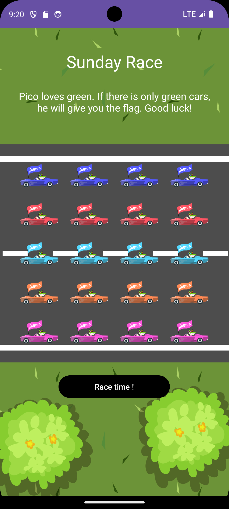
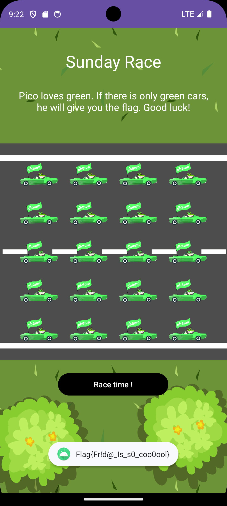

# Reconnaissance

We install the application in an Android emulator. It is the "Sunday Race" application, and the application says we'll get a flag if all cars are green.



There are 20 cars, and at least 6 colors, so we'd be extremely lucky to get that.

# Decompiling the app

This year, there was a [JEB workshop](https://pnfsoftware.com) at Ph0wn, so we use JEB to decompile the application.

The main activity of the application is `chall.ph0wn.raceroller.MainActivity`. The app looks very simple: a single activity. The app was obviously written in *Kotlin*.

```java
import kotlin.Metadata;
import kotlin.collections.CollectionsKt;
import kotlin.jvm.internal.DefaultConstructorMarker;
import kotlin.jvm.internal.Intrinsics;
import kotlin.random.Random;
import kotlin.text.Charsets;
import kotlin.text.StringsKt;
```

The `onCreate()` method sets up a list of 20 car images:

```java
this.carImages = CollectionsKt.listOf(new ImageView[]{this.findViewById(id.car1), ...
```

When the button is clicked, 20 random integers are generated, stored in an array and converted to the right image resource. The function which generates the random value is `randomRaceValue()`.

If we array contains 20 times the value 5 (which probably stands for green), a flag is decrypted:

```java
for(int v4 = 0; true; ++v4) {
    if(v4 >= 20) {
        String s = MainActivity.Companion.generateKey();
        Toast.makeText(this, MainActivity.Companion.decryptFlag(this.encryptedFlag, s), 0).show();
        break;
    }

	if(arr_v[v4] != 5) {
        break;
    }
}
```	

The encrypted flag is a base64 encoded string:

```java
 public MainActivity() {
        this.encryptedFlag = "rRX0o5VF6Rlz6aHlL+qH9jUtobYXmVcVAfq72Z4nOGA=";
    }
```

The decryption algorithm uses AES-ECB.

```java
private final String decryptFlag(String s, String s1) {
    String s2;
    try {
        Cipher cipher0 = Cipher.getInstance("AES/ECB/PKCS5Padding");
        byte[] arr_b = s1.getBytes(Charsets.UTF_8);
        Intrinsics.checkNotNullExpressionValue(arr_b, "this as java.lang.String).getBytes(charset)");
        cipher0.init(2, new SecretKeySpec(arr_b, "AES"));
        byte[] arr_b1 = cipher0.doFinal(Base64.getDecoder().decode(s));
        s2 = "Erreur de dechiffrement";
        Intrinsics.checkNotNull(arr_b1);
        return new String(arr_b1, Charsets.UTF_8);
    }
    catch(Exception unused_ex) {
		return s2;
    }
}
```		

The AES key is `arr_b`, which corresponds to the second argument `s1`.
So, it's actually `s`, from `generateKey`:

```java
String s = MainActivity.Companion.generateKey();
```

# Solution Options

The decompilation of `generateKey` is obscure on purpose. Either we can try and make sense out of it, or we can try another way. 

## Option 1: Understand generateKey

Both options are possible. The first one is probably the hardest but yet feasible because we can quickly noticed `generateKey` is riddled with junk code:

```java
// junk code
int[] arr_v = new int[10];
for(int v1 = 0; v1 < 10; ++v1) {
    arr_v[v1] = (int)(Math.random() * 100.0);
}

// useful
Collection collection0 = new ArrayList(4);
for(int v2 = 0; v2 < 4; ++v2) {
    collection0.add(Character.valueOf(((char)("7529".charAt(v2) + 3))));
}

// junk code
int v3 = 0;
int v4 = 0;
while(v4 < 10) {
	int v5 = arr_v[v4];
    int v6 = (v4 + 3) * v5;
    ++v4;
    v3 += v6 - v5 / v4;
}
```			

## Option 2: Frida

In the second option, we are to "cheat" and have `randomRaceValue()` always return 5 (green).

```java
public final int randomRaceValue() {
	return Random.Default.nextInt(1, 7);
}
```

This can easily be done with a Frida hook. The function to hook is `randomRaceValue()`. It is in the inner `Companion` class of the `MainActivity`:

```javascript
'use strict';

console.log("[*] Pic0 raceroller challenge");
Java.perform(function() {
    var companion = Java.use("chall.ph0wn.raceroller.MainActivity$Companion");
    companion.randomRaceValue.implementation = function() {
    console.log("Hooking randomCarValue()");
    return 5;
    }

});
```

We launch a Frida server in the emulator, install the application, and launch the Frida script: `frida -U -l raceWin.js -f chall.ph0wn.raceroller`


