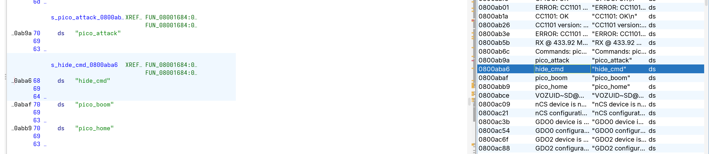
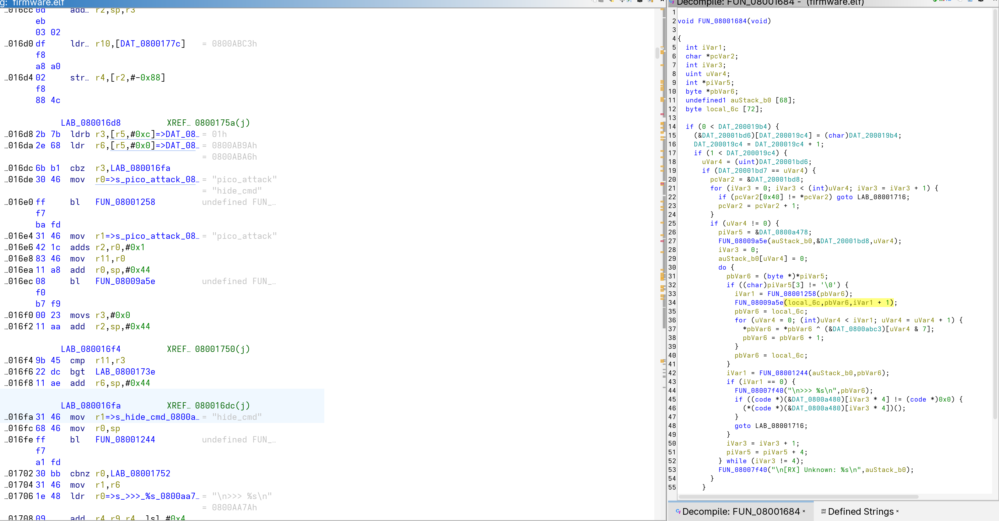
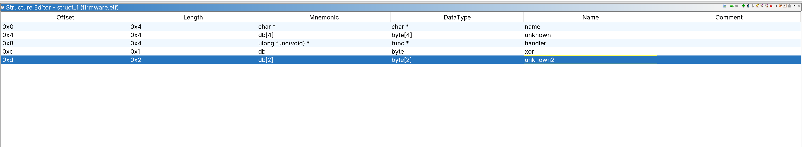
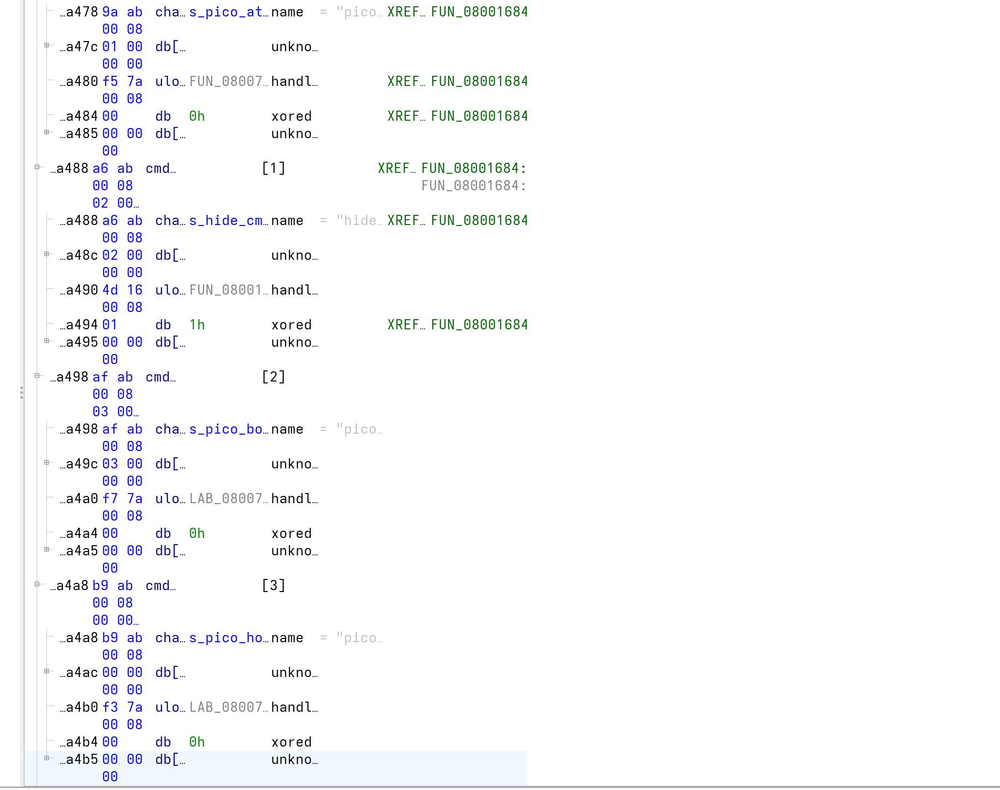
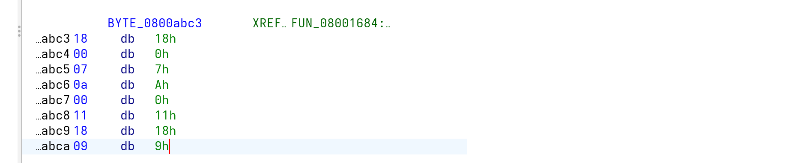
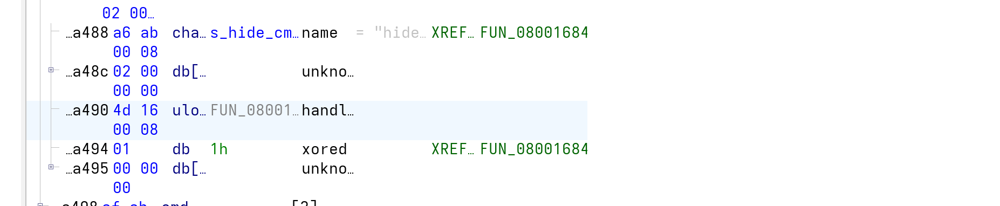
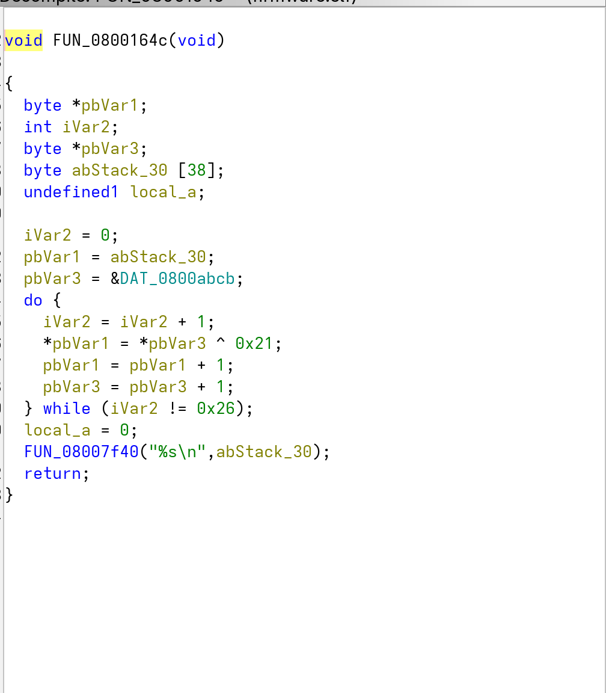
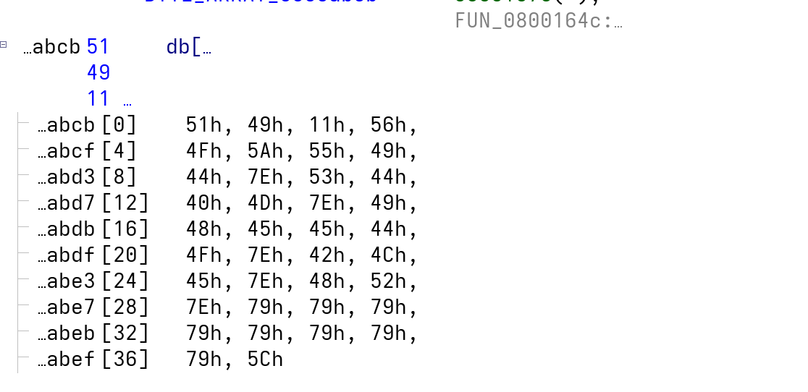

# Stage 1 Solution

## Introduction

For this challenge, two artifacts are provided: an R&D firmware (non-release build, not stripped) and a stolen confidential PDF document partially describing the device's communication protocol. The goal is to reverse the firmware to uncover an undocumented hidden command.

This is a pure static reverse engineering challenge. The entire solve was performed with **Ghidra**.

## Finding the Hidden Command

### Step 1 — String enumeration

Loading the firmware in Ghidra/IDA, a string enumeration reveals the known commands (`pico_attack`, `pico_boom`, `pico_home`) alongside a suspicious outlier: `hide_cmd`.



### Step 2 — Analyzing the command dispatcher

Following the XREF on `hide_cmd` leads to the command dispatcher. The `[RX] Unknown: %s` format string, consistent with the PDF's description of the serial protocol, confirms the function's role.



Here is the decompiled code produced by Ghidra:

```c
void FUN_08001684(void)
{
    // ...
    if (uVar4 != 0) {
        piVar5 = &DAT_0800a478;
        FUN_08009a5e(auStack_b0, &DAT_20001bd8, uVar4);
        iVar3 = 0;
        auStack_b0[uVar4] = 0;
        do {
            pbVar6 = (byte *)*piVar5;
            if ((char)piVar5[3] != '\0') {           // obfuscation flag at +12
                iVar1 = FUN_08001258(pbVar6);
                FUN_08009a5e(local_6c, pbVar6, iVar1 + 1);
                pbVar6 = local_6c;
                for (uVar4 = 0; (int)uVar4 < iVar1; uVar4 = uVar4 + 1) {
                    *pbVar6 = *pbVar6 ^ (&DAT_0800abc3)[uVar4 & 7]; // XOR key
                    pbVar6 = pbVar6 + 1;
                }
                pbVar6 = local_6c;
            }
            iVar1 = FUN_08001244(auStack_b0, pbVar6);
            if (iVar1 == 0) {                         // command match
                FUN_08007f40("\n>>> %s\n", pbVar6);
                if ((code *)(&DAT_0800a480)[iVar3 * 4] != (code *)0x0) {
                    (*(code *)(&DAT_0800a480)[iVar3 * 4])();  // call handler
                }
                goto LAB_08001716;
            }
            iVar3 = iVar3 + 1;
            piVar5 = piVar5 + 4;                      // stride: next entry
        } while (iVar3 != 4);                         // 4 commands total
        FUN_08007f40("\n[RX] Unknown: %s\n", auStack_b0);
    }
    // ...
}
```

Reading the decompiled code reveals a table of 4 entries (loop terminates at `iVar3 != 4`), each entry being a struct with the following layout:

| Offset | Field | Description |
|--------|-------|-------------|
| +0 | `char *` | Pointer to the command string (`*piVar5`) |
| +8 | `code *` | Handler function pointer (`&DAT_0800a480` = base `0x0800a478` + **8**, called as `(*(code *)(&DAT_0800a480)[iVar3 * 4])()`) |
| +12 | `byte` | Obfuscation flag (`piVar5[3]`, since `piVar5` is `int*` → 3×4 = **12**) |

In C, this struct can be written as:

```c
struct pico_command {
    const char *cmd;        // +0
    uint32_t    unknown;    // +4  (not accessed in this function)
    void      (*handler)(void); // +8
    uint8_t     xored;      // +12
    uint8_t     pad[3];     // +13 (alignment)
};
```

The obfuscation flag is the key insight: when it is **non-zero**, the `cmd` field (the command name string) is XOR-decoded in-place using the key at `DAT_0800abc3` before being compared to the user input. The three known commands have a zero flag and their `cmd` field is stored as plaintext, `hide_cmd` is the only entry whose `cmd` field is XOR-encoded.

### Step 3 — Defining the struct in Ghidra

Defining this struct in Ghidra makes the data view and decompiled code immediately readable:



By applying the type on `DAT_0800a478`, the structure becomes directly visible in the firmware data view:



Here we can confirm that only the `hide_cmd` entry has its `xored` flag set, meaning only its `cmd` field is XOR-encoded. We therefore expect a XOR decoding using the key at `DAT_0800abc3`, which is 8 bytes long.

### Step 4 — Extracting the XOR key

Navigating to `DAT_0800abc3` in the data view reveals the 8 bytes of the XOR key:



```
key = [ 0x18, 0x00, 0x07, 0x0A, 0x00, 0x11, 0x18, 0x09 ]
```

Since `hide_cmd` is the XOR-encoded form of the actual command stored in the binary, the real command string is recovered by XOR-decoding it with the key :

```python
key     = [0x18, 0x00, 0x07, 0x0A, 0x00, 0x11, 0x18, 0x09]
encoded = b"hide_cmd"
decoded = bytes(b ^ key[i % 8] for i, b in enumerate(encoded))
print(decoded)  # the hidden command
```

The output is `pico_rum`. This is not a flag in itself, but confirms the existence of an undocumented secret command accepted by the device.

## Retrieving the Flag

### Step 6 — Finding the hidden handler

Now that the struct is applied, the `pico_rum` entry is fully visible in the data view. Its `xored` flag is set to `0x01` and its `handler` field points to `FUN_0800164c`, the function that executes when the command is triggered:



### Step 7 — Analyzing the handler

Decompiling `FUN_0800164c` reveals a straightforward decoding loop: it reads 38 bytes (`0x26` iterations) from `DAT_0800abcb`, XORs each byte with the constant `0x21`, and prints the result as a string:



The decoding scheme is simpler than the previous one, a single-byte key with no rotation.

### Step 8 — Decoding the flag

Navigating to `DAT_0800abcb` exposes the 38 raw encoded bytes:



Applying the same logic:

```python
encoded = bytes([
    0x51, 0x49, 0x11, 0x56,
    0x4F, 0x5A, 0x55, 0x49,
    0x44, 0x7E, 0x53, 0x44,
    0x40, 0x4D, 0x7E, 0x49,
    0x48, 0x45, 0x45, 0x44,
    0x4F, 0x7E, 0x42, 0x4C,
    0x45, 0x7E, 0x48, 0x52,
    0x7E, 0x79, 0x79, 0x79,
    0x79, 0x79, 0x79, 0x79,
    0x79, 0x5C
])
decoded = bytes(b ^ 0x21 for b in encoded)
print(decoded.decode())
```

The decoded string is `ph0wn{the_real_hidden_cmd_is_XXXXXXXX}`. The 8 `X` characters are a placeholder whose value was recovered in the previous section: the flag is **`ph0wn{the_real_hidden_cmd_is_pico_rum}`**
