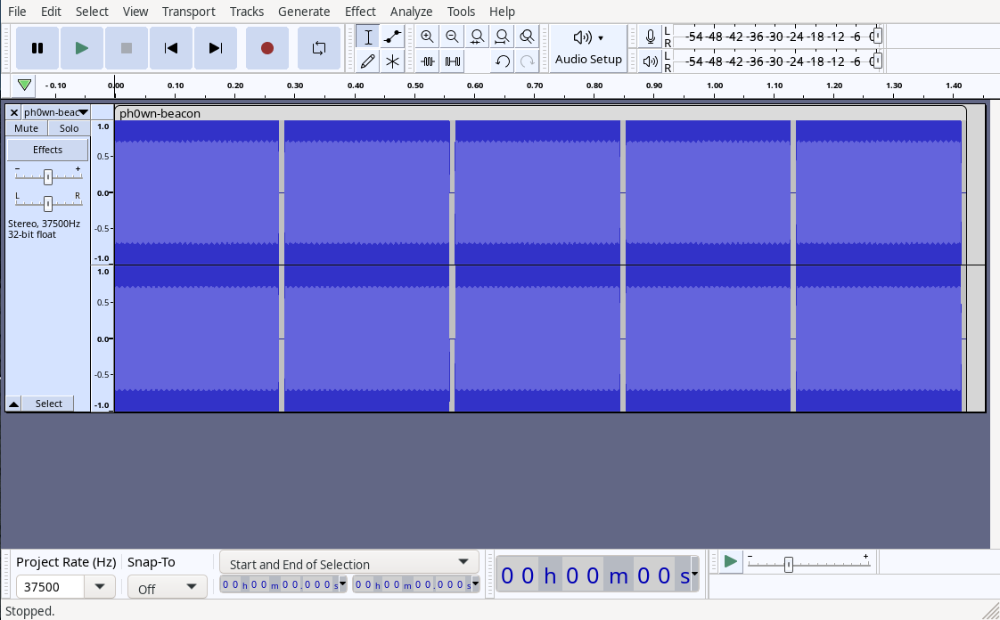
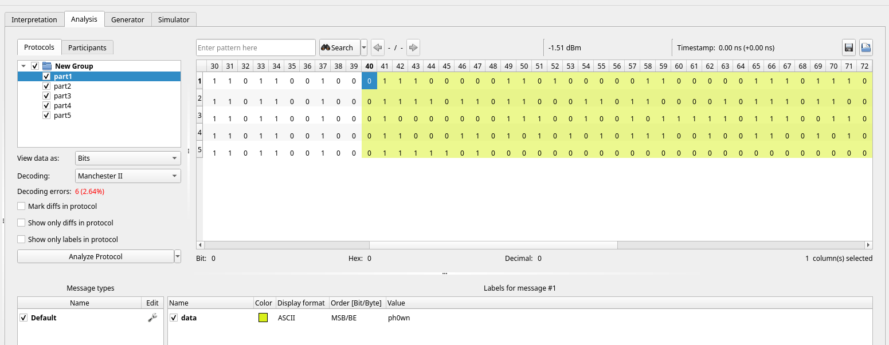
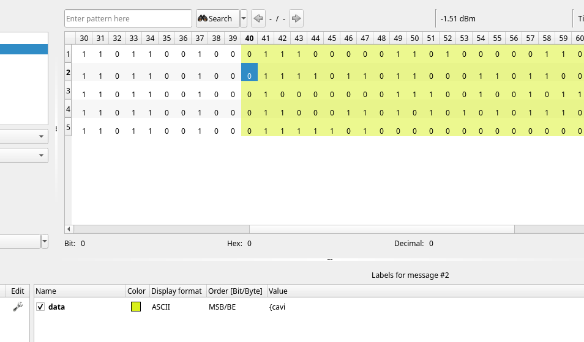

Reading the `ph0wn-beacon.wav` with Audacity (`sudo apt install audacity`), we clearly identify 5 different chunks:

We cut each part in a separate WAV file with **File > Export > Export as WAV**.

We read each WAV with Universal Radio Hacker (URH) (`pip install urh`).
In the documentation, page 8 Table I we read:

"Bits 25 to 112 form the unique code in each beacon" 

And in Table III for user protocol, we see there is a "data" field that user's can use between bits 40 and 83.

In URH, we open each WAV (it's possible to open as a folder), then we switch to *Analysis* Tab. We select bits 40 to 83 included and we select:

- decoding: Manchester II
- display format: ASCII
- order: leave MSB/BE

The 5 WAV form the flag:

- ph0wn
- {cavi
- @r_se
- cUreD
- }

The flag is `ph0wn{cavi@r_secUreD}`.
